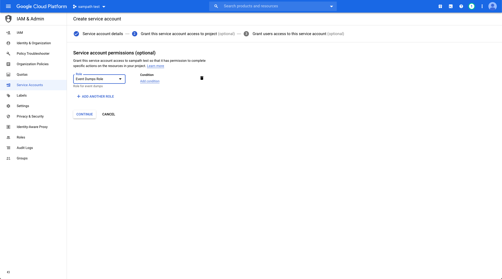
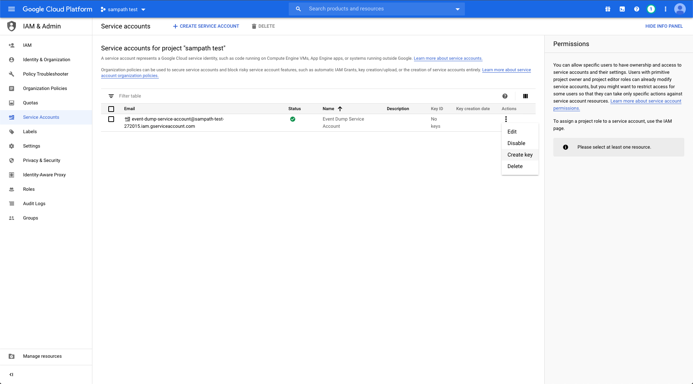
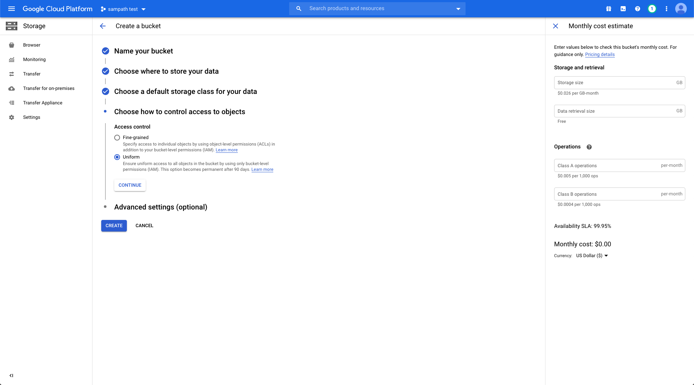

# Events Backup Bucket Permissions

For RudderStack to backup events to cloud provider buckets, we need the following requirements based on each cloud storage provider.

### Amazon S3

* Create a bucket in [S3](https://aws.amazon.com/s3/) service.  
* Create a new customer managed [policy](https://docs.aws.amazon.com/IAM/latest/UserGuide/tutorial_managed-policies.html) with the following json

```text
{
    "Version": "2012-10-17",
    "Statement": [
        {
            "Effect": "Allow",
            "Action": [
                "s3:PutObject",
                "s3:AbortMultipartUpload"
            ],
            "Resource": "arn:aws:s3:::{BUCKET_NAME}/*"
        }
    ]
}
```

* Create a new group and add the above created policy to this group
* Create a new [user](https://docs.aws.amazon.com/IAM/latest/UserGuide/id_users_create.html) in [Identity and Access Management \(IAM\)](https://console.aws.amazon.com/iam) with programmatic access and add the user to the above created group.
* Download the access keys and share `Access key ID` and `Secret access key` with the rudder team.
* The rudder team can inject the above `Access key ID` and `Secret access key` to the rudder-server which is required for authenticating the rudder-server to send events dump to S3. 


### Google Cloud Storage

* Create a role with the following permissions : 1. Storage.objects.create 2. storage.objects.get You might be required to add each permission one by one.


* Create a service account as follows :- 1. Give a name to this service account 2. Add the role created above. 3. Create key with key type json and save the file locally.








* Create a bucket with uniform bucket access control. Once, the bucket is created. Add permissions : - Go to “Permissions” tab - Add member with the above created service account - Add role with the above created role. 



  


* Send the downloaded json file to the rudder team. We will inject these service account json file to the rudder-server which is required  for authenticating the rudder-server to send events dump to gcs.

