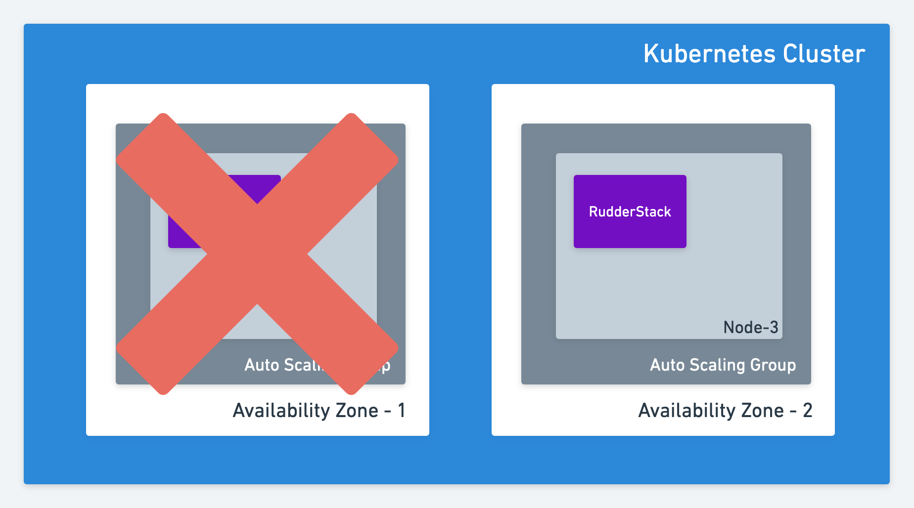
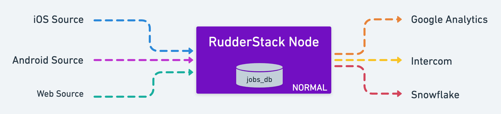
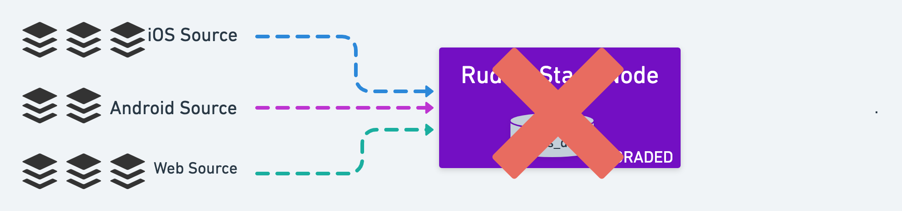

# High Availability

Any service can go down because of a hardware failure or a software bug. This document explains the engineering design and the deployment model that makes RudderStack highly available despite any failures or bugs.

## Hardware Failures

We leverage Kubernetes and auto-scaling groups to handle hardware failures and stay highly available.

To recover from node failures, we recommend provisioning the nodes with an auto-scaling group. 

This is how a standard RudderStack production deployment looks like:

### Deploying RudderStack in a Single Availability Zone

If the node hosting RudderStack goes down, Kubernetes will automatically schedule it on another available node. If you have an auto-scaling group and Kubernetes is not able to schedule RudderStack, a new node is created and RudderStack is scheduled.

This is equivalent to the standard High Availability setup where an infrastructure team creates an extra backup node to switch the master using a heartbeat mechanism.

### Deploying RudderStack in Multiple Availability Zones

There could be instances of data center failures, where a complete availability zone can go down. If you want RudderStack to be resilient to such failures, your Kubernetes cluster should span multiple availability zones.

## Software Failures

RudderStack can switch between different running modes to stay resilient in case of software failures.

If RudderStack is not available, our web and mobile SDKs cache the events on the customer device and retry till they are delivered to the RudderStack server.

### RudderStack Server Running Modes

RudderStack supports two running modes - **normal and degraded** 

#### Normal Mode

In the normal mode, RudderStack receives events and forwards them to the destinations as usual.

#### Degraded Mode

If RudderStack keeps crashing while processing the events, it enters the degraded mode after a threshold number of restarts is reached.

In the degraded mode, RudderStack receives events and stores them. It will not forward to destinations. 


In this mode, all your events are completely safe and will be sent to destination maintaining the order.



If RudderStack crashes in degraded mode, we request you to send us the crash reports to identify and fix the issue.


## Alerting in RudderStack

RudderStack has an in-built alerting service that will raise an alert when the server enters `degraded` mode. The alerting service supports integrations with PagerDuty and VictorOps. You can configure this to be alerted when an unexpected issue occurs with the RudderStack server.

Please refer to our [alerting guide](https://docs.rudderstack.com/administrators-guide/alerting) to know more about the various configuring alerts in RudderStack.

## Client SDK Caching

There may arise a scenario where the RudderStack service is down because of an unexpected issue, and is not reachable for the SDKs. In such a situation, the web and the mobile SDKs will then cache the events in the local storage. The pending events will be retried with a backoff and delivered once the service is available again.

Even during an unexpected downtime, all your events are safe and will be delivered to your destinations without fail.

## Contact Us

If you want to know more about the RudderStack High Availability feature, please feel free to [contact us](mailto:%20contact@rudderstack.com). You can also [request a demo](https://rudderstack.com/request-a-demo/) to see RudderStack in action.

