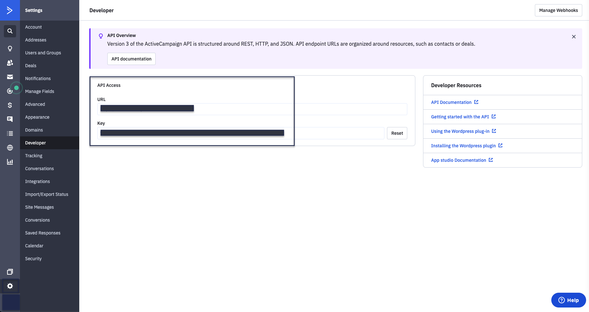

# ActiveCampaign

[**ActiveCampaign**](https://www.activecampaign.com/) is a popular marketing automation and CRM platform that lets you drive effective customer engagement and retention. With ActiveCampaign's all-in-one email marketing and growth platform, you can easily monitor your customers' product behavior and use the insights to design and drive highly personalized customer experiences.

This document guides you in setting up ActiveCampaign as a source in RudderStack. Once configured, RudderStack automatically ingests your specified ActiveCampaign data, which can then be routed to your data warehouse destination supported by RudderStack.


**All the Cloud Extract sources support sending data only to a data warehouse destination.**


## Getting Started

To set up ActiveCampaign as a source on the RudderStack dashboard, follow these steps:

* Log into your [**RudderStack dashboard**](https://app.rudderlabs.com/signup?type=freetrial).

* Then, click on the **Directory** option on the left navigation bar and go to **Cloud Extract** under **Sources**. From the list of sources, click on **ActiveCampaign**.

* Assign a name to your source, and click on **Next**.

### Specifying Connection Credentials

* Next, click on the **Create Credentials from Scratch** option, as shown:


If you've already configured ActiveCampaign as a source before, you can choose the account visible under the **Use existing credentials** tab.


* Then, enter the required connection credentials to give RudderStack access to your ActiveCampaign account.

The settings are as described below:

* **Account Name**: Enter your ActiveCampaign account name here. You can get your ActiveCampaign account name by going to your ActiveCampaign dashboard and navigating to **Settings** - **Account**. 

* **URL**: This refers to your ActiveCampaign API access URL. You can get it by going to your dashboard and navigating to **Settings** - **Developer**. 
* **API Key**: Enter your ActiveCampaign API key in this field. You can get it by going to your dashboard and navigating to **Settings** - **Developer**.

### Setting the Table Prefix, Run Frequency and Data Update Schedule

* Next, you will be required to set the **Table Prefix**. RudderStack will create a table in your warehouse with this prefix name and load all your ActiveCampaign data into it. 
* Also, set the **Run Frequency** to schedule the data import from your ActiveCampaign account to RudderStack. Optionally, you can also specify the time when you want this synchronization to start, by choosing the time under the **Sync Starting At** option.

### Selecting the Data to Import

* Finally, choose the ActiveCampaign data that you wish to send to RudderStack. You can either select all the data, or choose specific ActiveCampaign data attributes, as per your requirement.

That's it! ActiveCampaign is now successfully configured as a source on your RudderStack dashboard. 

RudderStack will start ingesting data from ActiveCampaign as per the specified frequency. You can further connect this source to your data warehouse by clicking on **Connect Destinations** or **Add Destinations**, as shown:


Use the **Connect Destinations** option if you have already configured a data warehouse destination in RudderStack. To configure a data warehouse destination from scratch, click on the **Add Destination** button.


## FAQs

#### Is it possible to have multiple Cloud Extract sources writing to the same schema?

Yes, it is. 

We have implemented a feature wherein RudderStack associates a table prefix for every Cloud Extract source writing to a warehouse schema. This way, multiple Cloud Extract sources can write to the same schema with different table prefixes.

## Contact Us

If you come across any issues while configuring ActiveCampaign as a source on the RudderStack dashboard, feel free to [**contact us**](mailto:%20docs@rudderstack.com) or start a conversation on our [**Slack**](https://resources.rudderstack.com/join-rudderstack-slack) channel.

