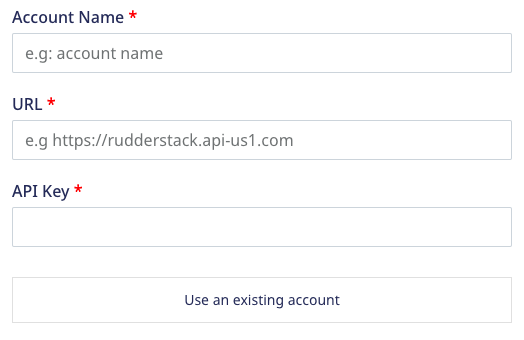
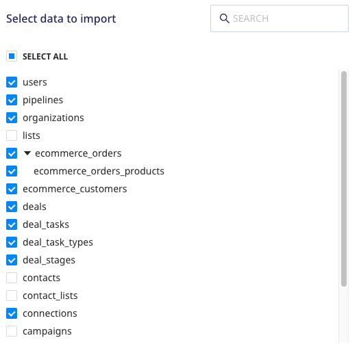
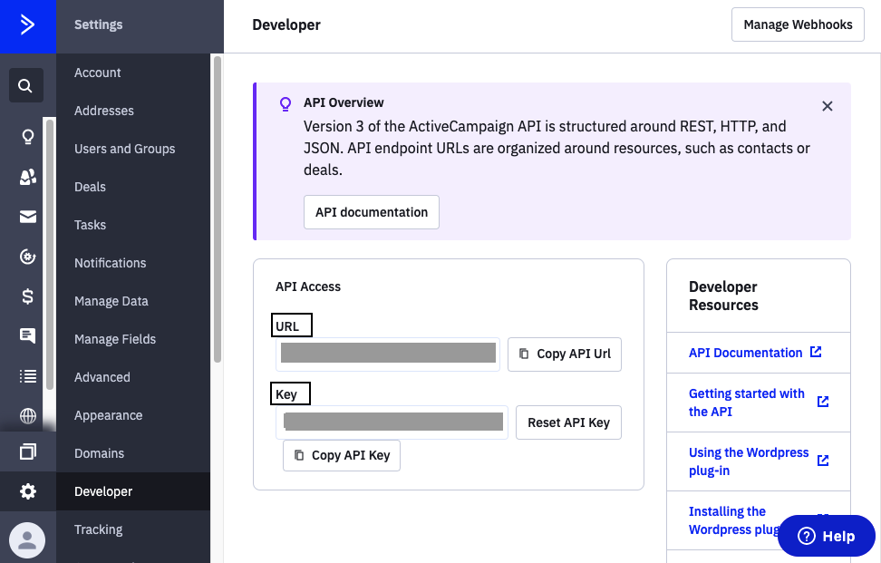
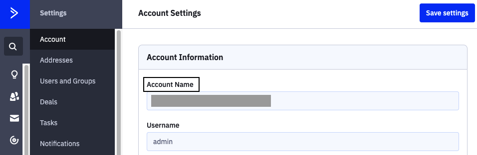

# ActiveCampaign Source

[ActiveCampaign](https://www.activecampaign.com/) is a popular marketing automation and CRM platform that lets you drive effective customer engagement and retention. With ActiveCampaign's all-in-one email marketing and growth platform, you can easily monitor your customers' product behavior and use the insights to design and drive highly personalized customer experiences.

This document guides you in setting up ActiveCampaign as a source in RudderStack. Once configured, RudderStack automatically ingests your specified ActiveCampaign data, which can then be routed to your RudderStack-supported data warehouse destination.

All the Cloud Extract sources support sending data only to a <a href="https://www.rudderstack.com/docs/data-warehouse-integrations/">data warehouse destination</a>.

## Getting started

To set up ActiveCampaign as a source in RudderStack, follow these steps:

1. Log into your [RudderStack dashboard](https://app.rudderstack.com/).
2. Go to **Sources** > **New source** > **Cloud Extract** and select **ActiveCampaign** from the list of sources.
3. Assign a name to your source and click on **Next**.

### Connection settings

1. Click on **Create Credentials from Scratch**. You will then see the following screen:

2. Enter the following connection credentials to authenticate your ActiveCampaign account with RudderStack:
  - **Account Name**: Enter your ActiveCampaign account name. It can be found in your ActiveCampaign dashboard under **Settings** > **Account**.
  - **URL**: Enter your ActiveCampaign API access URL. It can be found in your ActiveCampaign dashboard under **Settings** > **Developer**.
  - **API Key**: Enter your ActiveCampaign API key in this field. It can be found in your ActiveCampaign dashboard under **Settings** > **Developer**.

### Destination settings

The following settings specify how RudderStack sends the data ingested from ActiveCampaign to the connected warehouse destination:

- **Table prefix**: RudderStack uses this prefix to create a table in your data warehouse and loads all your ActiveCampaign data into it.
- **Schedule Settings**: RudderStack gives you three options to ingest the data from ActiveCampaign:
    - **Basic**: Runs the syncs at the specified time interval. 
    - **CRON**: Runs the syncs based on the user-defined CRON expression.
    - **Manual**: You are required to run the syncs manually.

For more information on the schedule types, refer to the <a href="https://www.rudderstack.com/docs/cloud-extract-sources/common-settings/">Common Settings</a> guide.

### Selecting the data to import

Choose the ActiveCampaign data that you wish to ingest via RudderStack. You can either select all the data or choose specific ActiveCampaign data attributes as per your requirement.

ActiveCampaign is now configured as a source. RudderStack will start ingesting data from ActiveCampaign as per your specified schedule and frequency.

You can further connect this source to your data warehouse by clicking on **Add Destination**, as shown:

Use the <strong>Use Existing Destination</strong> option if you have an already-configured data warehouse destination in RudderStack. To configure a data warehouse destination from scratch, select the <strong>Create New Destination</strong> button.

## FAQ

### How do I obtain the ActiveCampaign account name?

### How do I obtain the ActiveCampaign API key and URL?

### Is it possible to have multiple Cloud Extract sources writing to the same schema?

Yes, it is.

RudderStack associates a table prefix for every Cloud Extract source writing to a warehouse schema. This way, multiple Cloud Extract sources can write to the same schema with different table prefixes.

## Contact us

If you come across any issues while configuring Sendgrid as a source in RudderStack, you can [contact us](mailto:%20docs@rudderstack.com) or start a conversation in our [Slack](https://rudderstack.com/join-rudderstack-slack-community) community.
