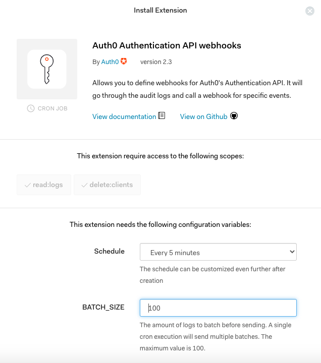
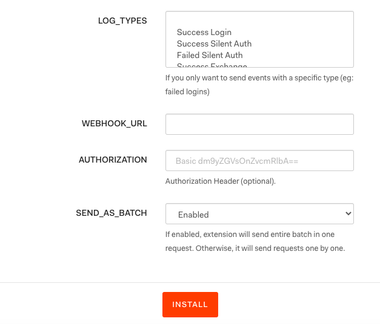

# Auth0

[Auth0](https://auth0.com) is a popular solution used by many companies to add authentication and authorization services to their applications. It is very flexible, and allows you to connect Auth0 to your application with just a few lines of code. You can also define the identity providers - that is how you want the users to log in.

This guide is aimed at setting up Auth0 as a source in RudderStack in the easiest possible way. You can simply add a Auth0 Authentication API webhook in your Auth0 Extension page that points to RudderStack. This will allow you to send events to RudderStack whenever Auth0 generates an Authentication log. Events such as `Successful Login`, `Successful Signup` can also be captured and sent to RudderStack.

## Getting Started

In order to add Auth0 as a source in RudderStack, please follow these steps:

* From your [RudderStack dashboard](https://app.rudderlabs.com/), click on **Add Source**. From the list of sources, select **Auth0**, as shown:


* Enter the name you want to assign to this source.
* Once you have entered the name of your source, click on **Next** and save the source.
* Head over to your [Auth0](https://auth0.com/) account and navigate to the **Extensions** page from the sidebar. Look for the extension **Auth0 Authentication API webhooks**, as shown in the screenshot below:


* After selecting this option, you should be able to see the extension installation page as shown below:



* At the bottom of the same page select the **LOG\_TYPES** which you want to forward to RudderStack.



* Add the **WEBHOOK\_URL** as shown on the source settings page in your RudderStack [dashboard](https://app.rudderstack.com). 


An example webhook URL is as follows:

```http
https://hosted.rudderlabs.com/v1/webhook?writeKey=1bCenS7ynqHh8ETX8s5Crjh22J
```


Make sure to add the `writeKey` as query parameter to the URL. This is required to prevent the webhook from failing for the lack of a valid write key.


* Keep the authorization section as blank.
* You can disable **SEND\_AS\_BATCH** setting to receive the events in separate requests, but we recommend to keep it **Enabled**.
* Finally click on **INSTALL** to install the webhook on your Auth0 dashboard.

## RudderStack Event Transformation

The webhook event from Auth0 is ingested into RudderStack after converting it into the format of a RudderStack event. The `user_id` set by Auth0 is set as `userId` . 

Also, we populate following properties from Auth0 event payload directly to the RudderStack event:

| Auth0 Property | RudderStack Property |
| :--- | :--- |
| `client_id` | `properties.client_id` |
| `client_name` | `properties.client_name` |
| `details` | `properties.details`  Note: These are the unmodified details sent by Auth0 |
| `auth0_client` | `properties.auth0_client` |
| `log_id` | `properties.log_id` |
| `isMobile` | `properties.is_mobile` |
| `description` | `properties.description` |
| `ip` | `context.request_ip` |
| `details.auth.user.email` | `context.traits.email` |
| `details.auth.user.name` | `context.traits.name` |
| `user_name` | `context.traits.user_name` |
| `user_agent` | `context.userAgent` |

## Contact Us

If you come across any issues while configuring Auth0 with RudderStack, please feel free to [contact us](mailto:%20docs@rudderstack.com). You can also start a conversation on our [Slack](https://resources.rudderstack.com/join-rudderstack-slack) channel; we will be happy to talk to you!

