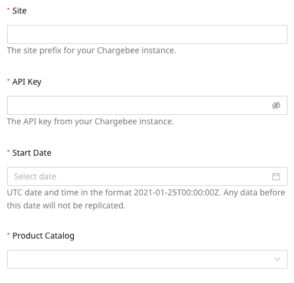
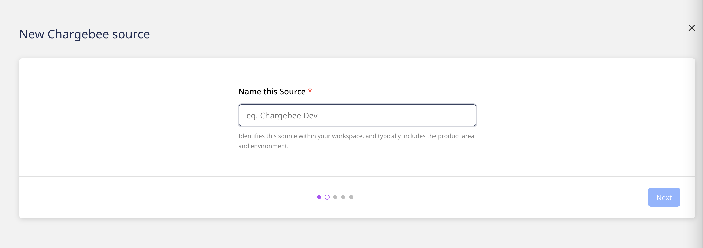
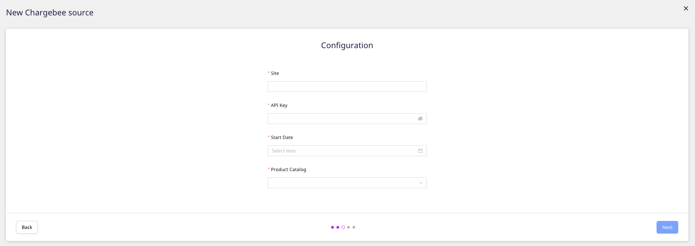
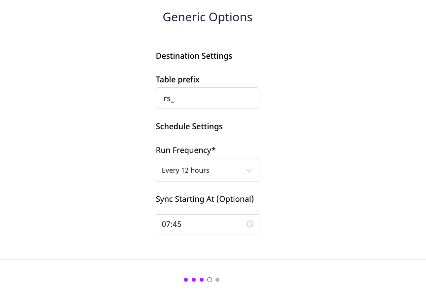
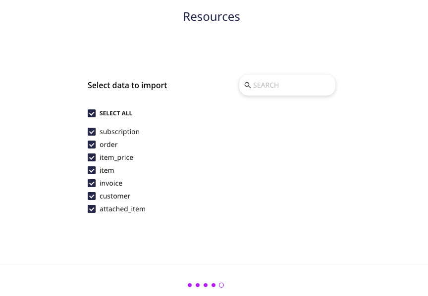
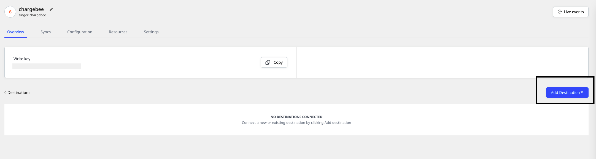

# Chargebee

[**Chargebee**](https://www.Chargebee.com/) is a subscription billing and revenue management platform. It lets you streamline your revenue operations via features like subscription workflow automation, cutting-edge revenue reporting, and more. 

This document guides you in setting up Chargebee as a source in RudderStack. Once configured, RudderStack automatically ingests your specified Chargebee data, which can then be routed to your RudderStack-supported data warehouse destination.

All the Cloud Extract sources support sending data only to a data warehouse destination.

## Getting started

To set up Chargebee as a source on the RudderStack dashboard, follow these steps:

- Log into your [**RudderStack dashboard**](https://app.rudderstack.com/).

- At the panel on the left, select **Sources**. Then, click on **Add Source**.

- Next, go to **Cloud Extract** and select **Chargebee**.

- Assign a name to your source, and click on **Next**.

### Configuring the source

- Add the following Chargebee credentials:

   -  **Site**: Enter your Chargebee site name.

   - **API Key**: Enter your Chargebee API key. For more information on where to find the Chargebee API key, refer to their [**documentation**](https://www.chargebee.com/docs/2.0/api_keys.html).

   - **Start Date**: Enter the date from which RudderStack will import all your historical Chargebee data.

   - **Product Catalog**: Select your Chargebee Product Catalog version from the dropdown. For more information on the Product Catalog, refer to the [**Chargebee documentation**](https://www.chargebee.com/docs/2.0/product-catalog.html).

RudderStack currently does not support changing the <strong>Product Catalog</strong> version once you have successfully set up the source.

- Under **Destination Settings**, set the **Table prefix**. RudderStack will create a table in your data warehouse with this prefix name and load all your Chargebee data into it.

- Under **Schedule Settings**, set the **Run Frequency**. This option specifies how frequently the syncs will occur.

- Optionally, you can also specify the time of the sync by selecting the time under **Sync Starting At**. Then, click on **Next**.

### Selecting the data to import

- Finally, choose the Chargebee data that you wish to ingest via RudderStack. You can either select all the data, or choose specific Chargebee data attributes, as per your requirement.

That's it! Chargebee is now successfully configured as a source on your RudderStack dashboard.

RudderStack will start ingesting data from Chargebee as per the specified frequency. You can further connect this source to your data warehouse by clicking on **Add Destination**, as shown:

  Select the <strong>Use Existing Destination</strong> option if you have already configured a <a href="https://rudderstack.com/docs/data-warehouse-integrations/">data warehouse destination</a> in RudderStack. To configure a warehouse destination from scratch, click on the <strong>Create New Destination</strong> button.

## FAQs

#### Is it possible to have multiple Cloud Extract sources writing to the same schema?

Yes, it is.

RudderStack associates a table prefix for every Cloud Extract source writing to a warehouse schema. This way, multiple Cloud Extract sources can write to the same schema with different table prefixes.

## Contact us

For queries on any of the sections covered in this guide, you can [**contact us**](mailto:%20docs@rudderstack.com) or start a conversation on our [**Slack**](https://rudderstack.com/join-rudderstack-slack-community) channel.
