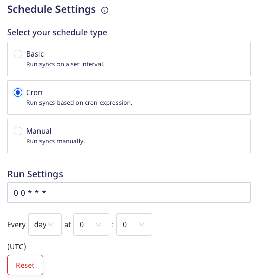

# Common Settings

This guide details the common destination-specific settings to be configured while setting up your Cloud Extract sources.

These settings are:

- Table prefix
- Schedule settings

## Table prefix

RudderStack uses your specified table prefix to create a table named `prefix_table_name` in your data warehouse and load all the imported source data into it.

If you do not specify a prefix, RudderStack creates a table in your warehouse as <code class="inline-code">table_name</code>, where <code class="inline-code">table_name</code> refers to the resource you are importing.

For example, if you set the prefix to `rs_` and the resource you are importing is named `valid_emails`, then RudderStack creates the table `rs_valid_emails` in the warehouse.

## Schedule settings

RudderStack lets you set a schedule for importing data from your Cloud Extract sources while setting them up in your dashboard. It lets you specify the schedule type that defines how and when the syncs will run.

RudderStack supports the following three schedule types:

| Schedule type      | Description                                               |
| :------------------| :---------------------------------------------------------|
| Basic              | Run syncs at a given time interval and specified time.    |
| CRON               | Run syncs based on a CRON expression defined by the user. |
| Manual             | Run syncs manually.                                       |

### Basic

This schedule type lets you run the data syncs at a set interval. You can specify the sync frequency as well as the time(in UTC) when you want the sync to start.

- **Frequency**: You can choose the data sync frequency from the following options:
  - 30 minutes
  - 1 hour
  - 3 hours
  - 6 hours
  - 12 hours
  - 24 hours

- **Sync Starting At**: Specify the time at which the data sync should start.

### CRON 

This schedule type lets you define a custom CRON expression and runs the data syncs based on this setting. 

You can use the <a href="https://crontab.guru/">CRON scheduler utility</a> to specify your sync schedule.

The sync frequency specified under <strong>Run Settings</strong> needs to be greater than or equal to 15 minutes. Otherwise, you will encounter an error as shown below:

### Manual 

This schedule type lets you run your data syncs manually. RudderStack won't sync the data until you explicitly trigger it.

To trigger a sync manually, go to the **Syncs** tab in your Cloud Extract source details page and click on **Sync Now**, as shown:

## FAQ

### Can I change my sync schedule type?

Yes, you can. 

1. Go to the **Settings** tab in your Cloud Extract source details page and click on **Edit sync schedule** option, as shown:

2. Then, select your new sync schedule type.

### What happens if I don't set the Sync Starting At time?

RudderStack considers strict time windows to schedule syncs if you do not explicitly set the time under **Sync Starting At**.

Suppose you create a source at 12:30 hrs UTC, specify the **Frequency** as 3 hours, and do not specify any time under **Sync Starting At**. In this case, as the time falls in the 12:00-13:00 time window, RudderStack will run the next sync at 15:00 hrs UTC (12:00 + 03:00 = 15:00 hrs).

## Contact us

For queries on any of the sections covered in this guide, you can [contact us](mailto:%20docs@rudderstack.com) or start a conversation in our [Slack](https://rudderstack.com/join-rudderstack-slack-community) community.
