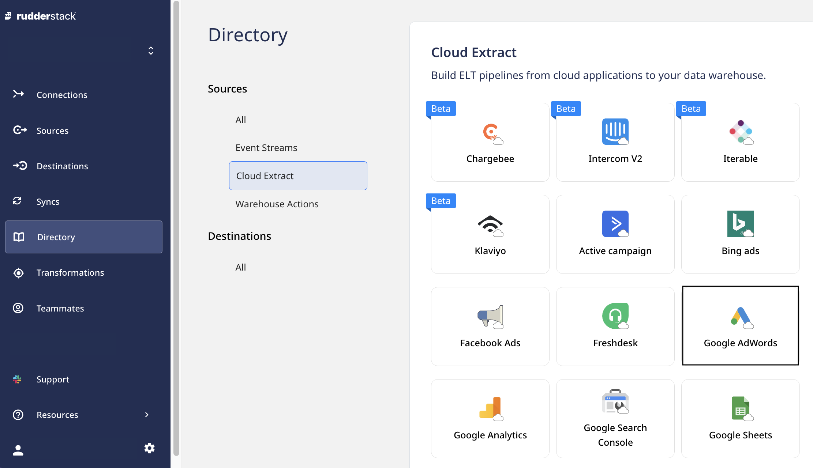

# Google AdWords

[Google AdWords](https://ads.google.com/intl/en_in/home/) is Google's premier online advertising platform that lets advertisers display their advertisements, service offerings, and product listings to prospective customers. 

This document guides you in setting up Google AdWords as a source in RudderStack. Once configured, RudderStack automatically ingests your specified Google AdWords data and routes it to the supported data warehouse destinations.

All the Cloud Extract sources support sending data only to a <a href="https://www.rudderstack.com/docs/data-warehouse-integrations/">warehouse destination</a>.

## Getting started

To add Google AdWords as a source in your [RudderStack dashboard](https://app.rudderstack.com), follow these steps:

1. In the left panel, go to **Directory**. Under **Sources**, click on **Cloud Extract** and select **Google Adwords**.

2. Assign a name to your source, and click on **Next**.

3. Click on **Connect with Google AdWords** and give RudderStack the required access permissions. Then, click on **Next**.

If you have already connected RudderStack to your Google AdWords account, your credentials should appear automatically under <strong>Use existing credentials</strong>.

### Source settings

- **Customer ID**: After you connect RudderStack to your Google AdWords account, the associated AdWords customer IDs will automatically appear in this dropdown. 

- **Start date**: RudderStack will import all your historical AdWords data from this date.

The <strong>Start Date</strong> setting is valid only for the first (historical) sync.

- **Conversion window**: Select your [AdWords conversion window](https://support.google.com/google-ads/answer/3123169?hl=en) from the dropdown options.

### Destination settings and data update schedule

- **Table prefix**: RudderStack creates a table in your data warehouse with this prefix name and loads all your AdWords data into it.

- **Run frequency**: Select the data import frequency from your AdWords account to RudderStack. 

- **Sync starting at**: Select the time when you want RudderStack to sync the data from your AdWords account.

### Specifying the data to import

- Finally, specify the AdWords data you want RudderStack to import. By default, all the resources are selected.

- You can also import a custom report as a resource. Refer to the [Adding a custom report as resource](#adding-custom-reports-as-resources) section below for more information.

Google AdWords is now successfully configured as a source. RudderStack will start importing the Google AdWords data as per the specified frequency. 

You can further connect this source to your data warehouse by clicking on **Add Destination**, as shown:

Select the <strong>Use Existing Destinations</strong> option if you have already configured a data warehouse destination in RudderStack. To configure a warehouse destination from scratch, select the <strong>Create New Destination</strong> option.

## Adding custom reports as resources

Follow the steps below to import custom reports as a resource and send this data to your warehouse:

1. Click on the **Add Resource** button as shown:

2. Under **Resource type**, select **report**.
3. Assign a name to the report.
4. Under **Report Type**, select the custom report you want to add as a resource.
5. Add the relevant **Attributes**, **Segments**, and **Metrics** fields from the respective dropdowns.
6. Finally, click on **Save**.

Your custom report and the selected resources will be visible under **Custom Resources**, as shown:

## AdWords data imported by RudderStack

| Property                      | Table name                     | Description                |
| :--------- | :-------------- | :----------- |
| Ad Groups                     | `ad_groups`                    | Contains information about the bounced people for your Ad Groups. The columns in this table include: `Name`, `CampaignName`, `labels`, and `BaseCampaignId` with `id` as the primary key. |
| Campaigns                     | `campaigns`                    | Contains information about the campaigns in your AdWords account. The columns in this table are `name`, `startDate`, and `frequencyCap` with `id` as the primary key.  |
| Report: Keywords Performance  | `keywords_performance_report`  | Contains information about your AdWords keywords' performance. The columns in this table are `ActiveViewImpressions`, `AverageCost`, `AverageCpc`, `CampaignName`, and `KeywordMatchType`.    |
| Report: Click Performance     | `click_performance_report`     | Contains information about your AdWords' click performance. The columns in this table are `AccountDescriptiveName`, `AdGroupStatus`, `CampaignId`, `Clicks`, and `ClickType`.                           |
| Report: Placement Performance | `placement_performance_report` | Contains the your AdWords account's placement performance. The columns in this table are `AverageCpc`, `AdGroupStatus`, `Clicks`, `Device`, and `Ctr`.                                         |

## FAQ

### Is it possible to have multiple Cloud Extract sources writing to the same schema?

Yes, it is. RudderStack associates a table prefix for every Cloud Extract source writing to a warehouse schema. This way, multiple Cloud Extract sources can write to the same schema with different prefixes.

## Contact us

For queries on any of the sections covered in this guide, you can [**contact us**](mailto:%20docs@rudderstack.com) or start a conversation in our [**Slack**](https://rudderstack.com/join-rudderstack-slack-community) community.
