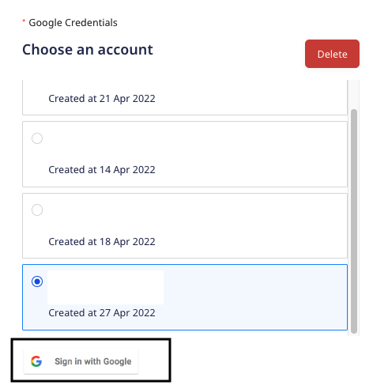
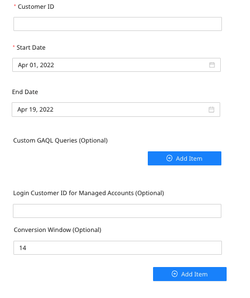
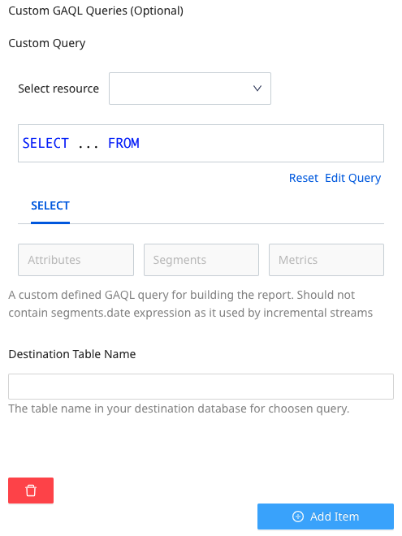
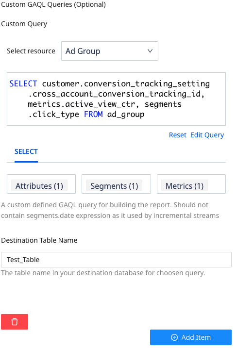
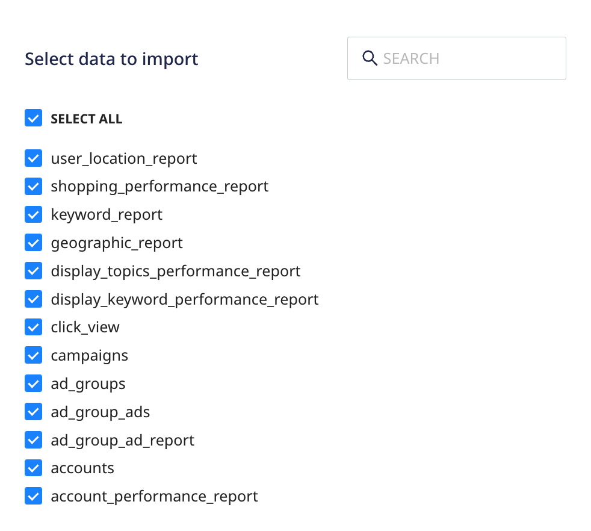
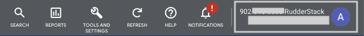

# Google Ads Source

[Google Ads](https://ads.google.com/intl/en_in/home/) is Google's premier online advertising platform that lets advertisers display their advertisements, service offerings, and product listings to prospective customers. 

This document guides you in setting up Google Ads as a source in RudderStack. Once configured, RudderStack automatically ingests your specified Google Ads data, which can then be routed to your RudderStack-supported data warehouse destination.

All the Cloud Extract sources support sending data only to a <a href="https://www.rudderstack.com/docs/data-warehouse-integrations/">data warehouse destination</a>.

## Getting started

To set up Google Ads as a source in RudderStack, follow these steps:

1. Log into your [RudderStack dashboard](https://app.rudderstack.com/).
2. Go to **Sources** > **New source** > **Cloud Extract** and select **Google Ads** from the list of sources.
3. Assign a name to your source and click on **Next**.

### Connection settings

- Give RudderStack access to your Google Ads account by clicking on the **Sign in with Google** button under **Google Credentials**.

If you have already connected RudderStack to your Google Ads account, your credentials will appear automatically under <strong>Choose an account</strong>.

Then, configure the following settings to set up the source:

- **Customer ID**: Enter the 10 digit customer ID associated with your Google Ads account **without the dashes**.

For more information on obtaining the customer ID, refer to the <a href="#faq">FAQ</a> section below.

- **Start Date**: RudderStack will import all your historical Google Ads data **from** this date.
- **End Date**: RudderStack will import all your Google Ads data **till** this date.

The <strong>Start Date</strong> setting is valid only for the first (historical) sync.

- **Login Customer ID for Managed Accounts**: This is a required field **if** you are using a Google Ads manager account to set up the source. Enter your 10 digit manager account customer ID **without the dashes**.
- **Conversion Window**: Enter the [Google Ads conversion window](https://support.google.com/google-ads/answer/3123169?hl=en) duration.

For more information on the conversion windows in Google Ads, refer to the <a href="#faq">FAQ</a> section below.

### Custom GAQL queries

The **Custom GAQL Queries** option lets you create a custom GAQL query for building a customized Google Ads report. The dashboard settings are described below:
- **Select resource**: Select the Google Ads API resource from the dropdown.
- **Select**: Select the relevant Attributes, Segments and Metrics from the dropdown.
- **Destination Table Name**: Specify the table name in your warehouse destination where the results for the above query will be sent.

As you select the relevant options from the dropdown, you can observe the custom GAQL query displayed in the query box. You can also use the **Reset** and **Edit query** buttons to reset or change the query respectively.

The following image shows a sample custom GAQL query:

### Destination settings

The following settings specify how RudderStack sends the data ingested from Google Ads to the connected warehouse destination:

- **Table prefix**: RudderStack uses this prefix to create a table in your data warehouse and loads all your Google Ads data into it.
- **Schedule Settings**: RudderStack gives you three options to ingest the data from Google Ads:
    - **Basic**: Runs the syncs at the specified time interval. 
    - **CRON**: Runs the syncs based on the user-defined CRON expression.
    - **Manual**: You are required to run the syncs manually.

For more information on the schedule types, refer to the <a href="https://www.rudderstack.com/docs/cloud-extract-sources/common-settings/">Common Settings</a> guide.

### Selecting the data to import

Choose the Google Ads data that you wish to ingest via RudderStack. You can either select all the data or choose specific Google Ads attributes as per your requirement.

Google Ads is now configured as a source. RudderStack will start ingesting data from Google Ads as per your specified schedule and frequency.

You can further connect this source to your data warehouse by clicking on **Add Destination**, as shown:

Use the <strong>Use Existing Destination</strong> option if you have an already-configured data warehouse destination in RudderStack. To configure a data warehouse destination from scratch, select the <strong>Create New Destination</strong> button.

## FAQ

### Where can I find my Google Ads customer ID?

You can find your Google Ads customer ID in the top right section of your dashboard, as shown:

### What is a conversion window in Google Ads?

A conversion window is defined as the time period after the user interacts with an ad (clicks, video views, etc.) during which a conversion is recorded in Google Ads.

### Is it possible to have multiple Cloud Extract sources writing to the same schema?

Yes, it is. RudderStack associates a table prefix for every Cloud Extract source writing to a warehouse schema. This way, multiple Cloud Extract sources can write to the same schema with different prefixes.

## Contact us

For queries on any of the sections covered in this guide, you can [contact us](mailto:%20docs@rudderstack.com) or start a conversation in our [Slack](https://rudderstack.com/join-rudderstack-slack-community) community.
