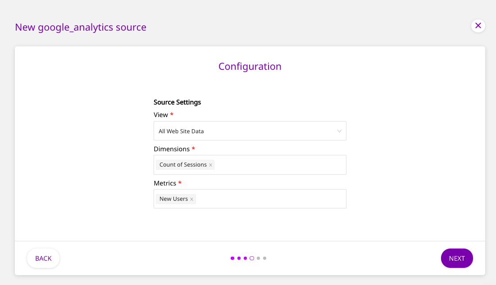
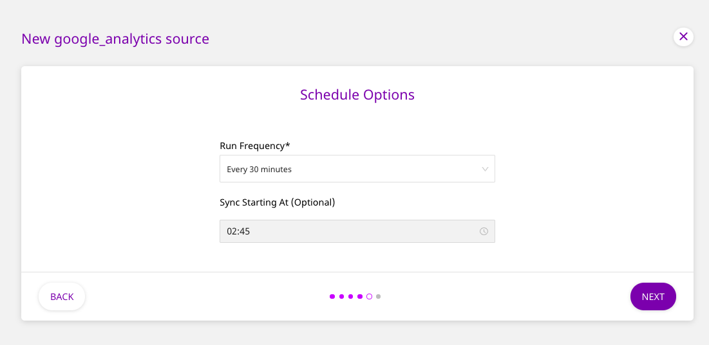

# Google Analytics

[Google Analytics](https://analytics.google.com/analytics/web/#/) is the world's most popular analytics service that allows you to track and report your website traffic across a variety of sources. It lets you measure your advertising ROI, as well as set up tracking code to perform data collection based on the type of your website.

This document guides you in setting up Google Analytics as a source in RudderStack. Once configured, RudderStack automatically ingests your specified Google Analytics data, which can then be routed to your data warehouse or any other third-party destination supported by RudderStack.

## Getting Started

To add Google Analytics as a source in RudderStack, follow these steps:

* Log into your [RudderStack dashboard](https://app.rudderlabs.com/signup?type=freetrial).
* From the left panel, select **Sources**. Then, click on **Add Source**, as shown:

* Next, select **Google Analytics** from the list of **Cloud Sources**, and click on **Next**.

* Assign a name to your source, and click on **Next**.

### Setting Up the Connection

* Click on **Connect with Google Analytics** and give RudderStack the required access permissions. Then, click on **Next**.


If you have already connected RudderStack to your Google Analytics account, your credentials should appear automatically under **Use existing credentials**.


### Specifying the Data to Import

* In the next screen, select one of your Google Analytics views in the **Source Settings**. Then, click on **Next**.

* Once you select a view, the **Dimensions** and **Metrics** rows should appear automatically. Choose the appropriate dimensions and metrics for RudderStack to ingest the data from, and then click **Next**.


Not all **Dimensions** and **Metrics** can be queried together. Only those dimensions and metrics combinations that follow Google’s compatibility rules can be used for querying. Read the [Valid Dimensions and Metrics](https://docs.rudderstack.com/sources/google-analytics#valid-dimensions-and-metrics-combinations) section below for more information.



The **Dimensions** and **Metrics** combination cannot be changed after the source is created and saved. The primary key that RudderStack creates depends on your choices during the source configuration.



If a combination of **Dimensions** and **Metrics** chosen by you is invalid, RudderStack will notify you.


### Setting the Data Update Schedule

* Next, you will be required to set the **Run Frequency** to schedule the data import from your Google Analytics account to RudderStack. You can also specify the time when you want this synchronization to start, by choosing the time under the **Sync Starting At** option.

That's it! Google Analytics is now successfully configured as a source on your RudderStack dashboard. 

RudderStack will start importing data from Google Analytics as per the specified frequency. You can further connect this source to your data warehouse or other third-party destinations by clicking on **Connect Destinations** or **Add Destinations**, as shown:

## Valid Dimensions and Metrics Combinations

Not all the dimensions and metrics can be queried together in Google Analytics. Only those dimensions-metrics combinations that follow Google's compatibility rules can be used together for querying. 


Check out the valid combinations in the [Google Dimensions & Metrics Explorer](https://ga-dev-tools.appspot.com/dimensions-metrics-explorer/).


### Definition Limits

Google also has a limit on the number of dimensions and metrics that you can define.


Read more about these limits in Google's [Core Reporting API](https://developers.google.com/analytics/devguides/reporting/core/v3/reference#metrics) documentation.


## FAQs

#### Is it possible to have multiple Cloud Extract sources writing to the same schema?

Yes, it is. 

We have implemented a feature wherein RudderStack associates a table prefix for every Cloud Extract source writing to a warehouse schema. This way, multiple Cloud Extract sources can write to the same schema with different table prefixes.

## Contact Us

If you come across any issues while configuring Google Analytics as a source on the RudderStack dashboard, please feel free to [contact us](mailto:%20docs@rudderstack.com). You can also start a conversation on our [Slack](https://resources.rudderstack.com/join-rudderstack-slack) channel; we will be happy to talk to you!

