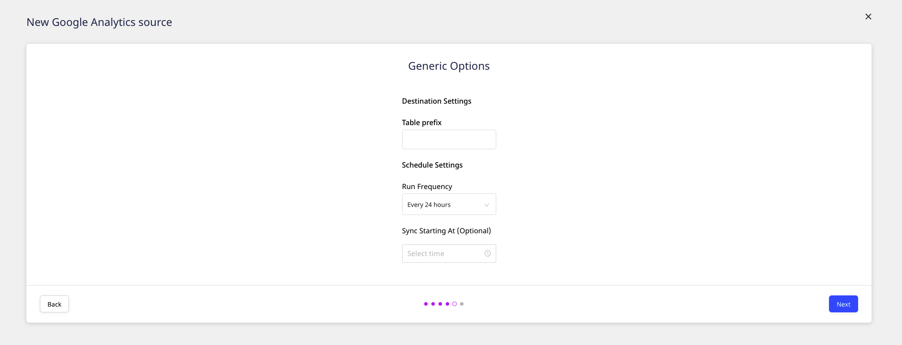

# Google Analytics

[**Google Analytics**](https://analytics.google.com/analytics/web/#/) is the world's most popular analytics service that allows you to track and report your website traffic across a variety of sources. It lets you measure your advertising ROI, as well as set up tracking code to perform data collection based on the type of your website.

This guide will help you set up Google Analytics as a source in RudderStack. Once configured, RudderStack automatically ingests your specified Google Analytics data and routes it to the supported [**warehouse destinations**](https://rudderstack.com/docs/data-warehouse-integrations/).

<strong>All the Cloud Extract sources support sending data only to a data warehouse destination.</strong>

## Getting started

To add Google Analytics as a source in RudderStack, follow these steps:

- Log into your [**RudderStack dashboard**](https://app.rudderstack.com).

- Then, click on the **Directory** option in the left navigation bar and go to **Cloud Extract** under **Sources**. From the list of sources, click on **Google Analytics**.

- Assign a name to your source, and click on **Next**.

### Setting up the connection

- Click on **Connect with Google Analytics** and give RudderStack the required access permissions. Then, click on **Next**.

  If you've already configured Google Analytics as a source before, you can select the account under the <strong>Use existing credentials</strong> tab.

### Selecting the data to import

- In the next screen, select your Google Analytics **View** in the **Source Settings**.

- Once you select a view, the **Dimensions** and **Metrics** rows should appear automatically. Choose the appropriate dimensions and metrics for RudderStack to ingest the data from, and then click **Next**.

Not all <strong>Dimensions</strong> and <strong>Metrics</strong>can be queried together. Only those dimensions and metrics combinations that follow Google’s compatibility rules can be used. Read the <a href="https://rudderstack.com/docs/cloud-extract-sources/google-analytics/#valid-dimensions-and-metrics-combinations">Valid Dimensions and Metrics</a> section below for more information.

The **Dimensions** and **Metrics** combination cannot be changed after the source is created and saved. The primary key that RudderStack creates depends on your choices during the source configuration.

### Setting the table prefix, run frequency, and data update schedule

- Next, under **Destination Settings**, specify the **Table Prefix**. RudderStack will create a table in your warehouse destination with this prefix and store your Google Analytics data.

- Then, under **Schedule Settings**, set the **Run Frequency** with which RudderStack will sync the data to the warehouse destination.

- Optionally, you can also specify the time when you want this synchronization to happen, by choosing the time under the **Sync Starting At** option.

RudderStack will start ingesting data from Google Analytics as per the specified frequency. You can then connect this source to your data warehouse by clicking on **Add Destination**, as shown:

Select the <strong>Use Existing Destination</strong> option if you have already configured a data warehouse destination in RudderStack. To configure a data warehouse destination from scratch, select the <strong>Create New Destination</strong> option.

## Valid dimensions and metrics combinations

Not all the dimensions and metrics can be queried together in Google Analytics. Only those dimensions-metrics combinations that follow Google's compatibility rules can be used together for querying.

Check out the valid combinations in the <a href="https://ga-dev-tools.appspot.com/dimensions-metrics-explorer/">Google Dimensions & Metrics Explorer</a>.

### Definition limits

Google has set a limit on the number of dimensions and metrics that you can define. Read more about these limits in Google's [**Core Reporting API documentation**](https://developers.google.com/analytics/devguides/reporting/core/v3/reference#metrics).

## FAQs

### Is it possible to have multiple Cloud Extract sources writing to the same schema?

Yes, it is.

We have implemented a feature wherein RudderStack associates a table prefix for every Cloud Extract source writing to a warehouse schema. This way, multiple Cloud Extract sources can write to the same schema with different table prefixes.

### My costs, impressions, and clicks are received as zeros in the destination. What should I do?

While configuring the Google Analytics source in RudderStack, make sure you are defining the right combination of metrics and dimensions. 

Not all the dimensions and metrics can be queried together in Google Analytics. Only those dimensions-metrics combinations that follow Google's compatibility rules can be used together for querying. 

For more information, refer to this [**Google Dimensions & Metrics Explorer**](https://ga-dev-tools.appspot.com/dimensions-metrics-explorer/) page.

## Contact us

For queries on any of the sections covered in this guide, you can [**contact us**](mailto:%20docs@rudderstack.com) or start a conversation on our [**Slack**](https://rudderstack.com/join-rudderstack-slack-community) channel.
