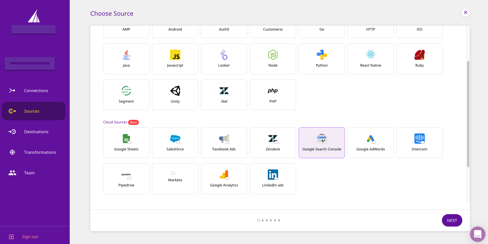
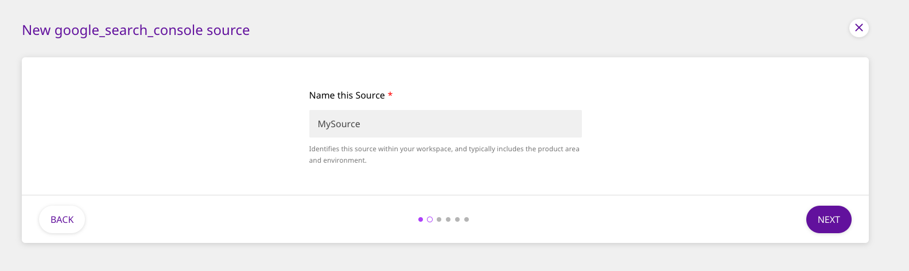
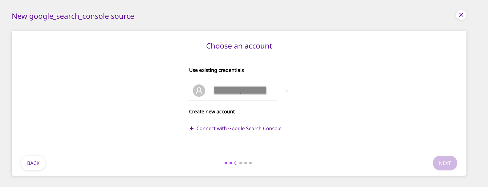
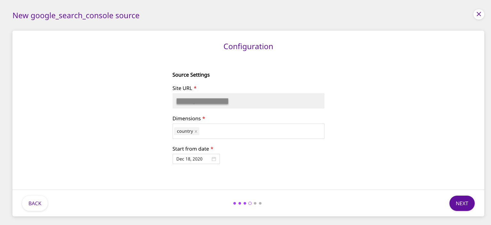
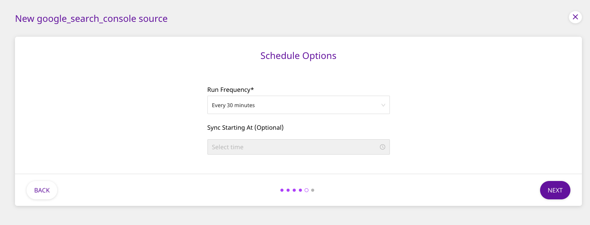

# Google Search Console

[Google Search Console](https://search.google.com/search-console/about) is Google's web service that allows webmasters to check the indexing status of the websites and optimize their visibility. Formerly known as Google Webmasters, this platform offers tools and reports to measure and optimize your website's search traffic and performance, optimize your website's content, as well as fix any issues that you might come across.

This document guides you in setting up Google Search Console as a source in RudderStack. Once configured, RudderStack automatically ingests your specified Search Console data, which can then be routed to your data warehouse destination supported by RudderStack.

**All the Cloud Extract sources support sending data only to a data warehouse destination.**

## Getting Started

To add Google Search Console as a source in RudderStack, follow these steps:

- Log into your [RudderStack dashboard](https://app.rudderlabs.com/signup?type=freetrial).
- From the left panel, select **Sources**. Then, click on **Add Source**, as shown:

<!---->

- Next, select **Google Search Console** from the list of **Cloud Sources**, and click on **Next**.

<!---->

- Assign a name to your source, and click on **Next**.

<!---->

### Setting Up the Connection

- Click on **Connect with Google Search Console** and give RudderStack the required access permissions. Then, click on **Next**.

<!---->

If you have already connected RudderStack to your Google Search Console account, your credentials should appear automatically under **Use existing credentials**.

### Configuring the Source Settings

- For configuring the source, enter the **Site URL** of the website linked to your Google Search Console account, as well as the **Dimensions** you want RudderStack to sync. You also need to specify the **Start from date**, which corresponds to the date RudderStack will start importing the historical data.

<!---->

In the **Site URL**, make sure to use the **exact URL** of the website as specified in your Google Search Console. Read [this guide](https://support.google.com/webmasters/answer/34592?hl=en) for more information.

If you are using a domain property in the Search Console, you will need prepend the site with sc-domain:

<!-- -->

  The available dimensions that you can query are **country**,
  **device**, and **page**.

Please note that this **Start from date** is valid only for the first (historical) sync.

### Setting the Data Update Schedule

- Next, you will be required to set the **Run Frequency** to schedule the data import from your Google Search Console account to RudderStack. You can also specify the time when you want this synchronization to start, by choosing the time under the **Sync Starting At** option.

<!---->

That's it! Google Search Console is now successfully configured as a source on your RudderStack dashboard.

RudderStack will start importing data from Google Search Console as per the specified frequency. You can further connect this source to your data warehouse by clicking on **Connect Destinations** or **Add Destination**, as shown:

<!---->

  Use the **Connect Destinations** option if you have already
  configured a data warehouse destination in RudderStack. To configure a data
  warehouse destination from scratch, click on the **Add Destination** button.

## Data Synchronization

After have added Google Search Console as a source, RudderStack will schedule an initial synchronization of your historical data from the specified date. This may take some time to complete.

After that, your Google Search Console data will be fetched as per the specified sync schedule.

The synchronization also depends on your destination's sync schedule.

## FAQs

#### Is it possible to have multiple Cloud Extract sources writing to the same schema?

Yes, it is.

We have implemented a feature wherein RudderStack associates a table prefix for every Cloud Extract source writing to a warehouse schema. This way, multiple Cloud Extract sources can write to the same schema with different table prefixes.

## Contact Us

If you come across any issues while configuring Google Search Console as a source on the RudderStack dashboard, please feel free to [contact us](mailto:%20docs@rudderstack.com). You can also start a conversation in our [Slack](https://rudderstack.com/join-rudderstack-slack-community) community; we will be happy to talk to you!
