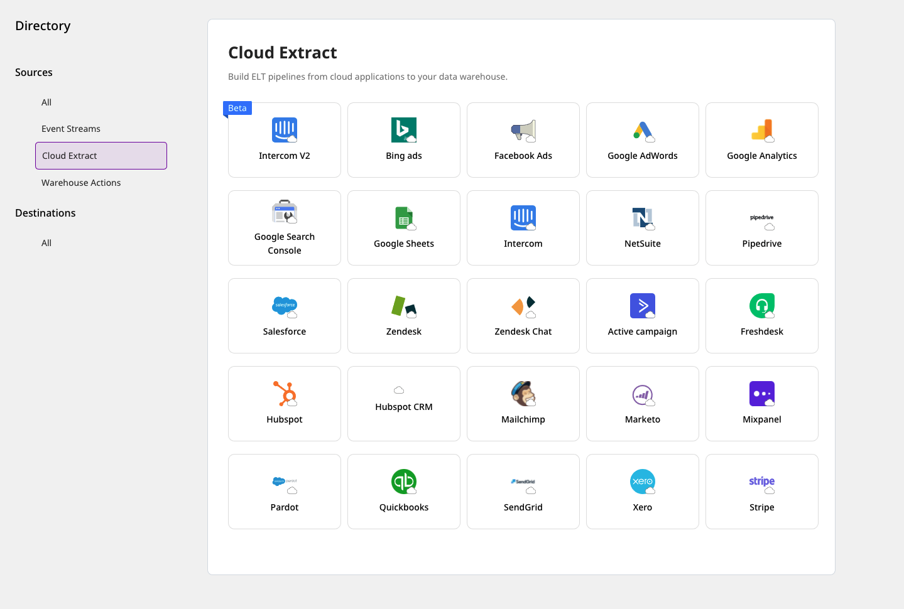
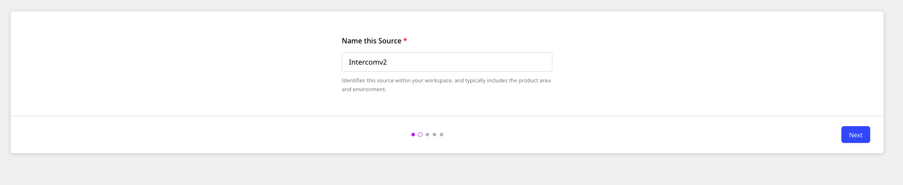
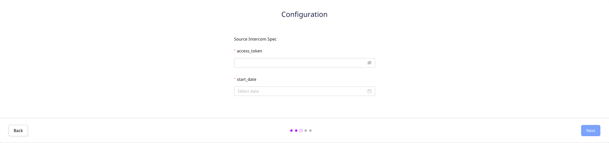
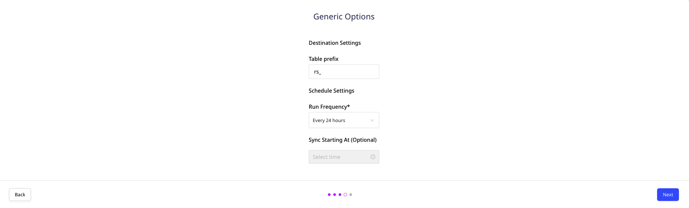
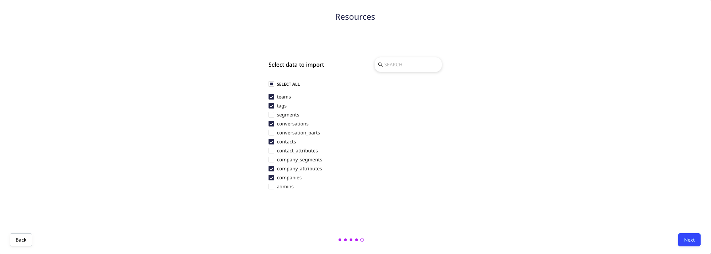
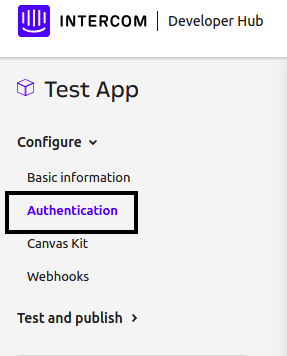

# Intercom v2

[**Intercom**](https://www.intercom.com/) is an industry-leading, real-time business messaging platform, that allows you to bring together and manage all your customer life cycle activities on a single platform.

This document guides you in setting up Intercom as a source in RudderStack. Once configured, RudderStack automatically ingests your specified Intercom data, which can then be routed to your RudderStack-supported data warehouse destination.

The Intercom v2 source supports <strong>Intercom API v2.1 and above</strong>. For the older versions of Intercom, refer to <a href="https://rudderstack.com/docs/cloud-extract-sources/intercom/">this</a> documentation.

All the Cloud Extract sources support sending data only to a data warehouse destination.

## Getting started

To set up Intercom as a source on the RudderStack dashboard, follow these steps:

- Log into your [**RudderStack dashboard**](https://app.rudderstack.com/).

- At the panel on the left, select **Sources**. Then, click on **Add Source**.

- Next, go to **Cloud Extract** and select **Intercom v2**.

- Assign a name to your source, and click on **Next**.

### Configuring the source

- Authenticate RudderStack with Intercom by entering the Intercom access token under the **access_token** section.

Refer to the FAQs section below for more information on how to get the Intercom access token.

- You will also need to enter the **Start date**. This option specifies the historical data to be imported.

- Under **Destination Settings**, set the **Table prefix**. RudderStack will create a table in your data warehouse with this prefix name and load all your Intercom data into it.

- Under **Schedule Settings**, set the **Run Frequency**. This option specifies how frequently the syncs will occur.

- Optionally, you can also specify the time of the sync by selecting the time under **Sync Starting At**. Then, click on **Next**.

### Selecting the data to import

- Finally, choose the Intercom data that you wish to ingest via RudderStack. You can either select all the data, or choose specific Intercom data attributes, as per your requirement.

That's it! Intercom is now successfully configured as a source on your RudderStack dashboard.

RudderStack will start ingesting data from Intercom as per the specified frequency. You can further connect this source to your data warehouse by clicking on **Add Destination**, as shown:

  Use the <strong>Use Existing Destination</strong> option if you have already configured a data warehouse destination in RudderStack. To configure a data warehouse destination from scratch, click on the <strong>Create New Destination</strong> button.

## Sync errors for older Intercom API versions

For Intercom versions less than **2.1**, data syncs to the warehouse destination will fail and throw an error. This is because many Intercom resources are not supported by the older API versions. 

In such a scenario, we highly recommend updating your Intercom API.

For more information on updating your Intercom API version, refer to this <a href="https://developers.intercom.com/building-apps/docs/update-your-api-version">Intercom support page</a>.

## FAQs

#### How do I get the Intercom access token?

To get the Intercom access token, go to the **Your apps** section under **Intercom Developer Hub**. 

If you have already created an app, click on the **Authentication** option under **Configure**, as shown below. Here, you will find the access token under the workspace associated with your app.

For more details, refer to the Intercom [**support page**](https://help-desk-migration.com/help/get-intercom-api-access-token/).

#### Is it possible to have multiple Cloud Extract sources writing to the same schema?

Yes, it is.

RudderStack associates a table prefix for every Cloud Extract source writing to a warehouse schema. This way, multiple Cloud Extract sources can write to the same schema with different table prefixes.

#### The sync to my warehouse destination is failing and I get an error. What should I do?

If the syncs are failing, the first step is to verify if your Intercom version is **2.1** or above. For versions less than 2.1, data syncs to the warehouse destination will fail. This is because many Intercom resources are not supported by the older API versions. In this scenario, you will need to update your Intercom API.

For more information on updating your Intercom API version, refer to their [**support page**](https://developers.intercom.com/building-apps/docs/update-your-api-version).

If you are using Intercom 2.1 or above and are facing this issue, you can [**contact us**](mailto:%20docs@rudderstack.com) or get in touch with us on our [**Slack**](https://rudderstack.com/join-rudderstack-slack-community) channel.

## Contact us

If you come across any issues while configuring Intercom as a source in RudderStack, you can [**contact us**](mailto:%20docs@rudderstack.com) or start a conversation on our [**Slack**](https://rudderstack.com/join-rudderstack-slack-community) channel.
