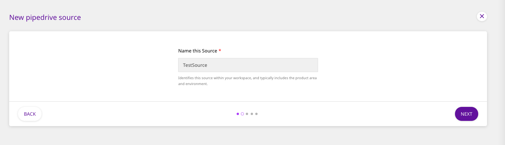
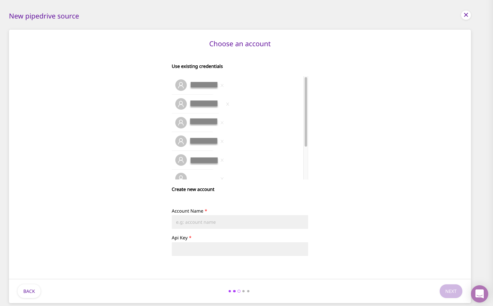
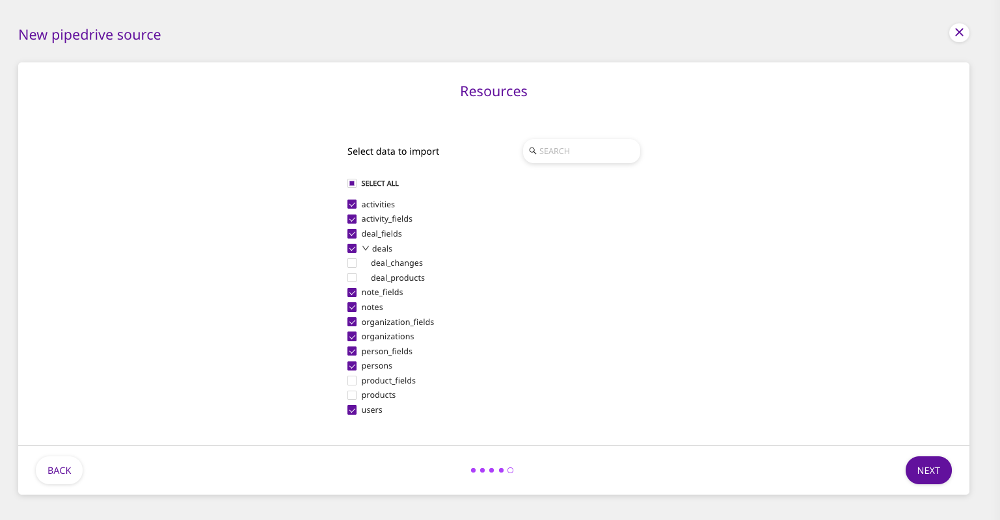
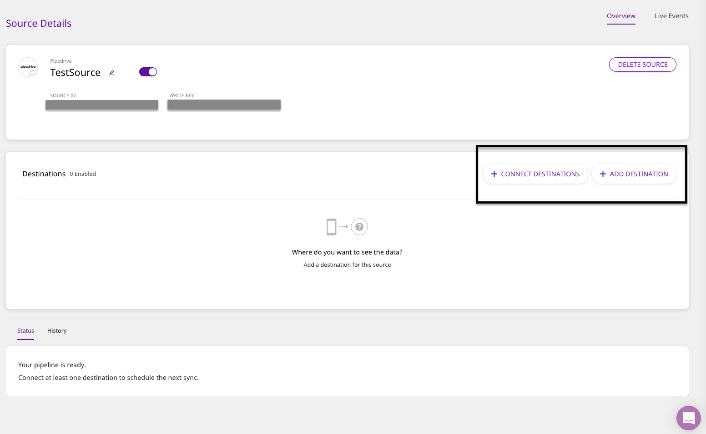

# Pipedrive

[Pipedrive](https://www.pipedrive.com/) is a popular sales CRM and pipeline management tool that lets you manage your leads, track all your customer communications, automate administrative tasks, and do so much more. With Pipedrive, you can efficiently track and manage your sales funnel, and also integrate it with hundreds of popular apps like Slack, Mailchimp, and more.

This document guides you in setting up Pipedrive as a source in RudderStack. Once configured, RudderStack automatically ingests your specified Pipedrive data, which can then be routed to your data warehouse or any other third-party destination supported by RudderStack.

## Getting Started

To add Pipedrive as a source in RudderStack, follow these steps:

* Log into your [RudderStack dashboard](https://app.rudderlabs.com/signup?type=freetrial).
* From the left panel, select **Sources**. Then, click on **Add Source**, as shown:

* Next, navigate to **Cloud Extract** within the **Sources** directory and select **Pipedrive**.

* Assign a name to your source, and click on **Next**.

### Setting Up the Connection

* Under **Create new account**, fill in the relevant connection credentials.

* The connection settings are: 
  * **Account Name** : Your Pipedrive account name goes here.
  * **API Key** : Enter your Pipedrive API Key, which can be obtained by logging into your Pipedrive dashboard and navigating to **Settings** - **Personal preferences** - **API.**


For more information on obtaining your Pipedrive API key, refer to their [knowledge base](https://support.pipedrive.com/hc/en-us/articles/207344545-How-can-I-find-my-personal-API-key-).



If you have already connected RudderStack to your Pipedrive account, your credentials should appear automatically under **Use existing credentials**.


### Setting the Data Update Schedule

* Next, you will be required to set the **Run Frequency** to schedule the data import from your Pipedrive account to RudderStack. You can also specify the time when you want this synchronization to start, by choosing the time under the **Sync Starting At** option, as shown:

### Configuring the Source

* In the next screen, select the data to import from Pipedrive. To import data from all the columns, click on **Select All**. Then, click on **Next** to complete the configuration.

That's it! Pipedrive is now successfully configured as a source on your RudderStack dashboard. 

RudderStack will start importing data from Pipedrive as per the specified frequency. You can further connect this source to your data warehouse by clicking on **Connect Destinations** or **Add Destination**, as shown:


Use the **Connect Destinations** option if you have already configured a data warehouse destination in RudderStack. To configure a data warehouse destination from scratch, click on the **Add Destination** button.


## FAQs

#### Is it possible to have multiple Cloud Extract sources writing to the same schema?

Yes, it is. 

We have implemented a feature wherein RudderStack associates a table prefix for every Cloud Extract source writing to a warehouse schema. This way, multiple Cloud Extract sources can write to the same schema with different table prefixes.

## Contact Us

If you come across any issues while configuring Pipedrive as a source on the RudderStack dashboard, please feel free to [contact us](mailto:%20docs@rudderstack.com). You can also start a conversation on our [Slack](https://resources.rudderstack.com/join-rudderstack-slack) channel; we will be happy to talk to you!

