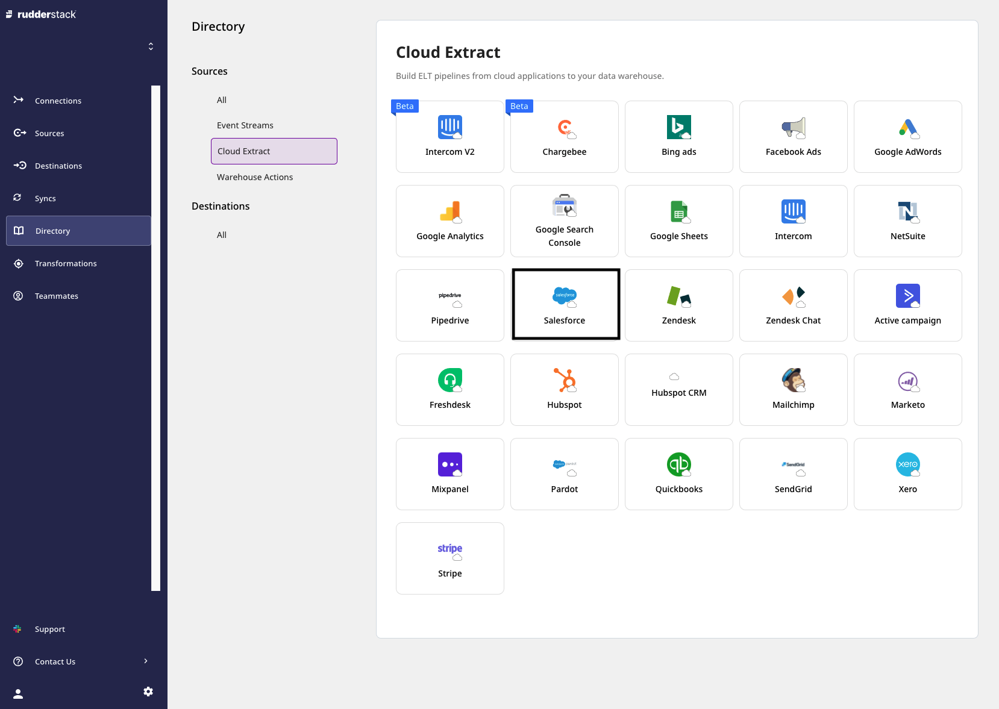

# Salesforce

[**Salesforce**](https://www.salesforce.com/in/?ir=1) is an industry leader in enterprise CRM. It offers a suite of enterprise applications revolving around marketing automation, customer engagement and support, application development as well as analytics.

This document guides you in setting up Salesforce as a source in RudderStack. Once configured, RudderStack automatically ingests your specified Salesforce data, which can then be routed to your RudderStack-supported data warehouse destination.

All the Cloud Extract sources support sending data only to a data warehouse destination.

## Getting Started

To set up Salesforce as a source on the RudderStack dashboard, follow these steps:

- Log into your [**RudderStack dashboard**](https://app.rudderstack.com/).

- At the panel on the left, select **Sources**. Then, click on **Add Source**.

- Next, go to **Cloud Extract** and select **Salesforce**.

- Assign a name to your source, and click on **Next**.

### Configuring the source

- Next, you will be required to connect your Salesforce account with RudderStack. To do so, click on **Connect with Salesforce**. After allowing the necessary permissions, your account should be successfully connected to RudderStack and visible on the dashboard. Then, click on **Next**.

  If you have already logged into your Salesforce account previously, clicking on the <strong>Connect with Salesforce</strong> option will automatically connect that account to RudderStack. To connect RudderStack to a different account, you will have to log out of your Salesforce account.

If you have given RudderStack access to your Salesforce account already, your account will automatically appear under the <strong>Use existing credentials</strong> option.

- Under **Destination Settings**, set the **Table prefix**. RudderStack will create a table in your data warehouse with this prefix name and load all your Intercom data into it.

- Under **Schedule Settings**, set the **Run Frequency**. This option specifies how frequently the syncs will occur, i.e. how often RudderStack pulls data from your Salesforce account.

- Optionally, you can also specify the time of the sync by selecting the time under **Sync Starting At**. Then, click on **Next**.

Salesforce’s API strictly enforces a usage limit. A high **Run Frequency** may exceed your Salesforce’s API and result in failure when RudderStack tries to sync your data.

### Selecting the data to import

- Finally, choose the Salesforce data that you wish to ingest via RudderStack. You can either select all the data, or choose specific Salesforce data attributes, as per your requirement.

That's it! Salesforce is now successfully configured as a source on your RudderStack dashboard.

RudderStack will start ingesting data from Salesforce as per the specified frequency. You can further connect this source to your data warehouse by clicking on the **Add Destination**, as shown:

  Use the <strong>Use Existing Destination</strong> option if you have already configured a data warehouse destination in RudderStack. To configure a data warehouse destination from scratch, click on the <strong>Create New Destination</strong> button.

## How RudderStack syncs Salesforce data

The following sections will help you better understand the overall replication process once RudderStack connects to your Salesforce data source.

### Historical import

When RudderStack first connects to your Salesforce data source, it will pull **all** your historical data.

### Sync schedule

RudderStack synchronizes with your Salesforce data source based on the schedule and run frequency you choose while configuring the source.

### Replication process

The first time RudderStack syncs with your Salesforce data, it performs a full replication - as mentioned above. After that, your Salesforce data is replicated incrementally. This means that RudderStack will replicate only the new and updated rows to your destination.

RudderStack will only read your data.

## Sync time and Salesforce API quota

Salesforce imposes a strict API quota that regulates its API usage. This quota corresponds to the total number of API requests that can be made over a period of time.

<strong>The Salesforce API usage includes RudderStack and any other apps you may use.</strong>

Because of Salesforce's API quotas and the data volume to be synchronized, the initial data sync could take some time.

RudderStack handles these API quotas as described below:

- If a single replication attempt utilizes 20% of your daily quota, the replication process will stop.
- If more than 80% of your daily API quota has been utilized \(by RudderStack or any other apps\), the replication will stop. The process will resume once the API limit is lifted.

Refer to <a href="https://developer.salesforce.com/docs/atlas.en-us.salesforce_app_limits_cheatsheet.meta/salesforce_app_limits_cheatsheet/salesforce_app_limits_platform_api.htm">this</a> article by Salesforce to calculate and increase your total API calls.

## FAQs

#### Is it possible to have multiple Cloud Extract sources writing to the same schema?

Yes, it is.

We have implemented a feature wherein RudderStack associates a table prefix for every Cloud Extract source writing to a warehouse schema. This way, multiple Cloud Extract sources can write to the same schema with different table prefixes.

## Contact us

For queries on any of the sections covered in this guide, you can [**contact us**](mailto:%20docs@rudderstack.com) or start a conversation on our [**Slack**](https://rudderstack.com/join-rudderstack-slack-community) channel.
