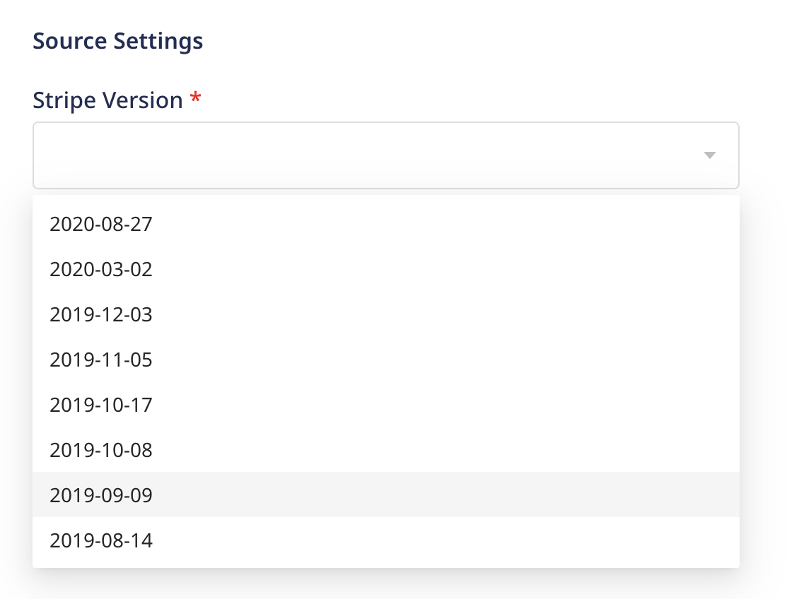
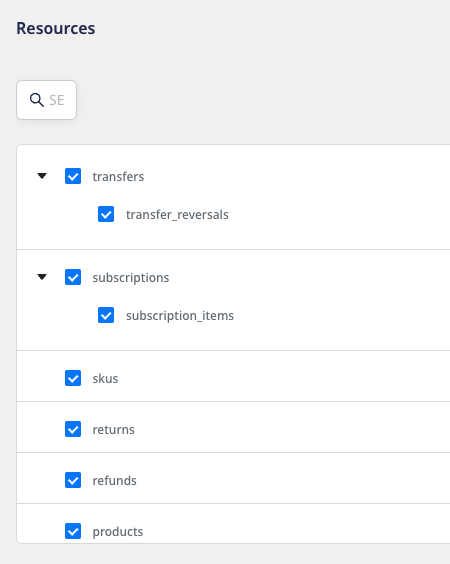
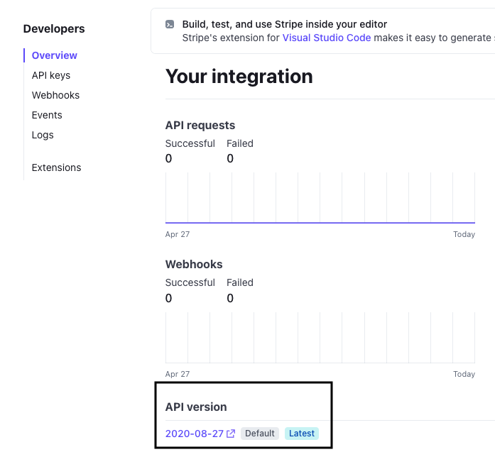

# Stripe Source

[Stripe](https://stripe.com/) is an online payment processing system for businesses. It offers cutting-edge software and APIs that allows thousands of businesses to manage their business payments online. Retailers, subscription businesses, software platforms, and online marketplaces all use Stripe for online payment.

This document guides you in setting up Stripe as a source in RudderStack. Once configured, RudderStack automatically ingests your specified Stripe data, which can then be routed to your RudderStack-supported data warehouse destination.

All the Cloud Extract sources support sending data only to a <a href="https://www.rudderstack.com/docs/data-warehouse-integrations/">data warehouse destination</a>.

## Getting started

To set up Stripe as a source in RudderStack, follow these steps:

1. Log into your [RudderStack dashboard](https://app.rudderstack.com/).
2. Go to **Sources** > **New source** > **Cloud Extract** and select **Stripe** from the list of sources.
3. Assign a name to your source and click on **Next**.

### Connection settings

1. Click on **Connect with Stripe** and give RudderStack the required access to your Stripe account.
2. **Stripe Version**: Under **Source Settings**, select the default API version associated with your Stripe account.

For more information on the Stripe API version and where to find it in your account, refer to the <a href="https://stripe.com/docs/upgrades">Stripe Documentation</a>.

### Destination settings

The following settings specify how RudderStack sends the data ingested from Stripe to the connected warehouse destination:

- **Table prefix**: RudderStack uses this prefix to create a table in your data warehouse and loads all your Stripe data into it.
- **Schedule Settings**: RudderStack gives you three options to ingest the data from Stripe:
    - **Basic**: Runs the syncs at the specified time interval. 
    - **CRON**: Runs the syncs based on the user-defined CRON expression.
    - **Manual**: You are required to run the syncs manually.

For more information on the schedule types, refer to the <a href="https://www.rudderstack.com/docs/cloud-extract-sources/common-settings/">Common Settings</a> guide.

### Selecting the data to import

Choose the Stripe data that you wish to ingest via RudderStack. You can either select all the data or choose specific Stripe data attributes as per your requirement.

Stripe is now configured as a source. RudderStack will start ingesting data from Stripe as per your specified schedule and frequency.

You can further connect this source to your data warehouse by clicking on **Add Destination**, as shown:

Use the <strong>Use Existing Destination</strong> option if you have an already-configured data warehouse destination in RudderStack. To configure a data warehouse destination from scratch, select the <strong>Create New Destination</strong> button.

## FAQ

### How do I determine the API version associated with my Stripe account?

To determine your Stripe API version, go to **Developers** > **Overview**. Here, you should be able to see your Stripe API version, as shown:

### Is it possible to have multiple Cloud Extract sources writing to the same schema?

Yes, it is.

RudderStack associates a table prefix for every Cloud Extract source writing to a warehouse schema. This way, multiple Cloud Extract sources can write to the same schema with different table prefixes.

## Contact us

If you come across any issues while configuring Stripe as a source in RudderStack, you can [contact us](mailto:%20docs@rudderstack.com) or start a conversation in our [Slack](https://rudderstack.com/join-rudderstack-slack-community) community.
