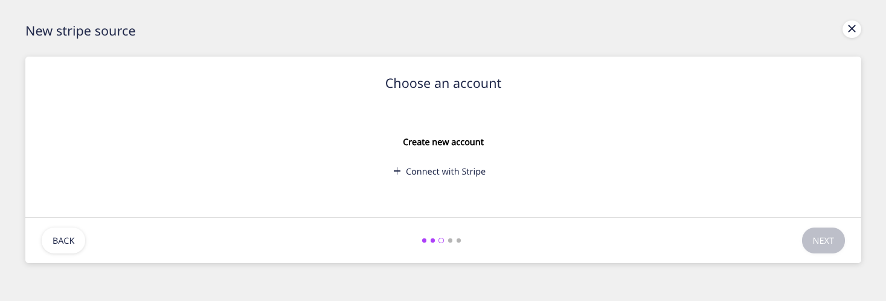

# Stripe

[Stripe](https://stripe.com/) is an online payment processing system for businesses. It offers cutting-edge software and APIs that allows thousands of businesses to manage their business payments online. Retailers, subscription businesses, software platforms, and online marketplaces all use Stripe for online payment.

This document guides you in setting up Stripe as a source in RudderStack. Once configured, RudderStack automatically ingests your specified Stripe data, which can then be routed to your data warehouse destination supported by RudderStack.

**All the Cloud Extract sources support sending data only to a data warehouse destination.**

## Getting Started

To add Stripe as a source in RudderStack, follow these steps:

- Log into your [RudderStack dashboard](https://app.rudderlabs.com/signup?type=freetrial).
- From the left panel, select **Directory**. Then, click on **Cloud Extract** under **Sources**, as shown below. Then, choose **Stripe** from the list of sources.

- Assign a name to your source, and click on **Next**.

### Setting Up the Connection

- Under **Create new account**, click on **Connect with Stripe** and grant RudderStack the access to your Stripe account.

  If you have already connected RudderStack to your Stripe account, your
  credentials should appear automatically under
  **Use existing credentials**.

### Setting the Data Update Schedule

- Next, you will be required to set the **Run Frequency** to schedule the data import from your Stripe account to RudderStack. You can also specify the time when you want this synchronization to start, by choosing the time under the **Sync Starting At** option, as shown:

  You can also set a **Table Prefix** for the warehouse table where
  you want to send this data.

### Selecting the Data to Import

- In the next screen, choose the data you want to import from Stripe. To import all the data, click on **Select All**, as shown:

That's it! Stripe is now successfully configured as a source on your RudderStack dashboard.

RudderStack will start importing data from your Stripe source as per the specified frequency. You can further connect this source to your data warehouse by clicking on **Connect Destinations** or **Add Destination**, as shown:

  Use the **Connect Destinations** option if you have already
  configured a data warehouse destination in RudderStack. To configure a data
  warehouse destination from scratch, click on the
  **Add Destination** button.

## FAQs

#### Is it possible to have multiple Cloud Extract sources writing to the same schema?

Yes, it is.

We have implemented a feature wherein RudderStack associates a table prefix for every Cloud Extract source writing to a warehouse schema. This way, multiple Cloud Extract sources can write to the same schema with different table prefixes.

## Contact Us

If you come across any issues while configuring Stripe as a source on the RudderStack dashboard, please feel free to [contact us](mailto:%20docs@rudderstack.com). You can also start a conversation in our [Slack](https://rudderstack.com/join-rudderstack-slack-community) community; we will be happy to talk to you
