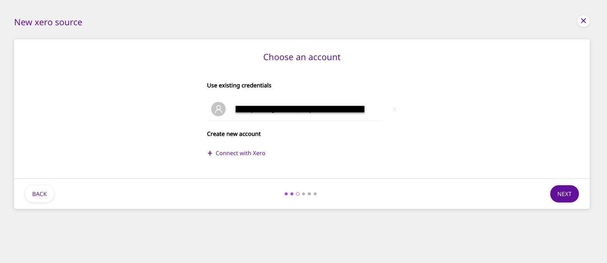
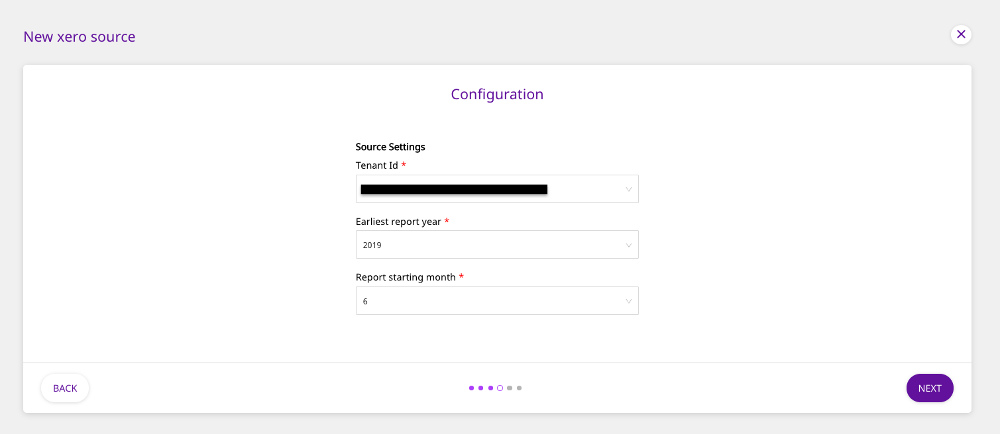
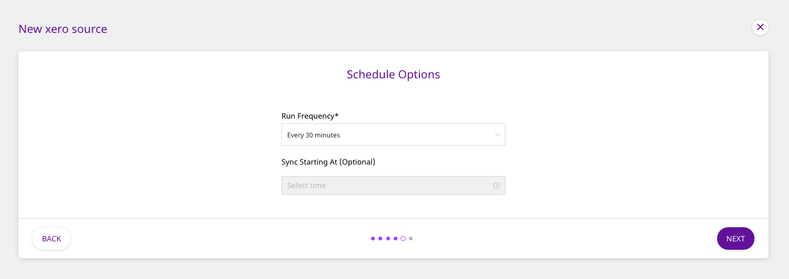
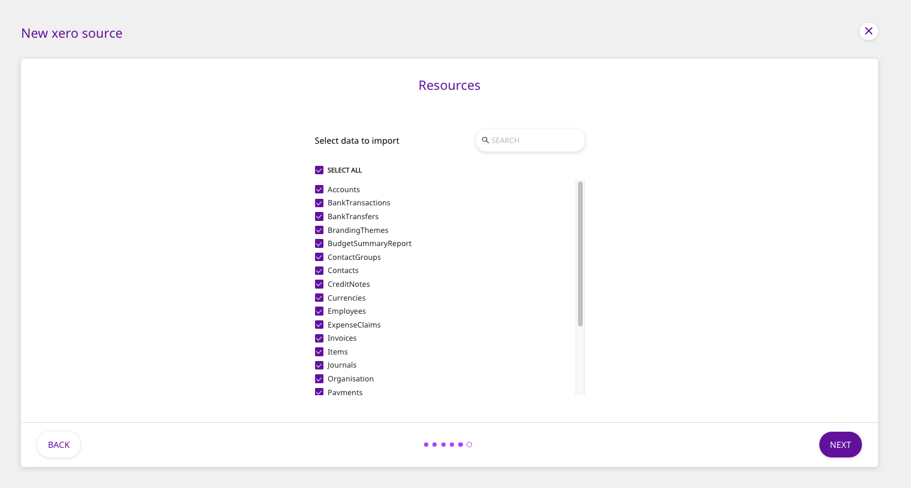

# Xero

[Xero](https://www.xero.com/us/) is a popular cloud-based accounting software, ideal for small and medium-sized businesses, accountants, and book-keepers. It allows you to simplify your accounting and everyday business-related tasks, including bill payments, bank connections, and claiming expenses.

This document guides you in setting up Xero as a source in RudderStack. Once configured, RudderStack automatically ingests your specified Xero data, which can then be routed to your data warehouse or any other third-party destination supported by RudderStack.

## Getting Started 

To add Xero as a source in RudderStack, follow these steps:

* Log into your [RudderStack dashboard](https://app.rudderlabs.com/signup?type=freetrial).
* From the left panel, select **Sources**. Then, click on **Add Source**, as shown:

* Next, navigate to **Cloud Extract** within the **Sources** directory and select **Xero**.

* Assign a name to your source, and click on **Next**.

### Setting Up the Connection 

* Under **Create new account**, click on **Connect with Xero** and authenticate RudderStack with your Xero account.


If you have already connected RudderStack to your Xero account, your credentials should appear automatically under **Use existing credentials**.


### Configuring the Source 

* In the next screen, choose the Xero **Tenant ID** . Also, select the **Earliest Report Year** and **Report Starting Month** from which you want RudderStack to ingest the data.

### Setting the Data Update Schedule 

* Next, you will be required to set the **Run Frequency** to schedule the data import from your Xero account to RudderStack. You can also specify the time when you want this synchronization to start, by choosing the time under the **Sync Starting At** option, as shown:

### Selecting the Data to Import

* Finally, select the appropriate data columns to import. To import all the data, simply click on **Select All**.

That's it! Xero is now successfully configured as a source on your RudderStack dashboard.

RudderStack will start importing data from Xero as per the specified frequency. You can further connect this source to your data warehouse or other third-party destinations by clicking on **Connect Destinations** or **Add Destinations**, as shown:

## Contact Us 

If you come across any issues while configuring Xero as a source on the RudderStack dashboard, please feel free to [contact us](mailto:%20docs@rudderstack.com). You can also start a conversation on our [Slack](https://resources.rudderstack.com/join-rudderstack-slack) channel; we will be happy to talk to you

