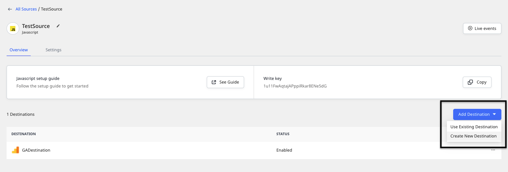
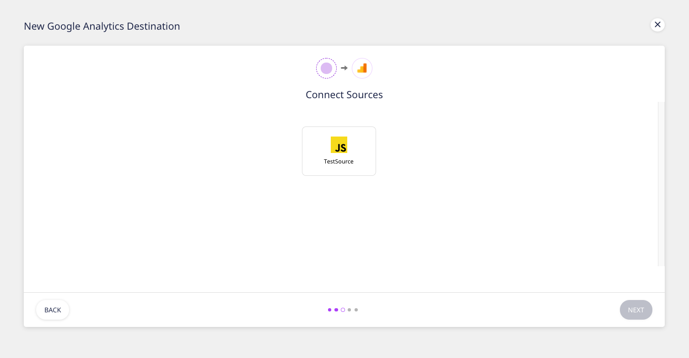

# How to Add a Source and Destination in RudderStack

This guide details the steps to add a source and destination in RudderStack.


Refer to the [**Connections**](./) guide to read more about sources and destinations in RudderStack.


## Adding a Source


For more information on sources in RudderStack, refer to the [**Connections**](./) guide.


Follow these steps to add an event data source in RudderStack:

* Log in to the **RudderStack dashboard**.

* Under Sources, click on **Add Source**. From the list of sources, click on the source you want to set up in RudderStack.


All the RudderStack sources are classified into the following three categories. Read their respective documentation for more information:

* \*\*\*\*[**Event Streams**](../stream-sources/)\*\*\*\*
* \*\*\*\*[**Cloud Extract**](../cloud-extract-sources/)\*\*\*\*
* \*\*\*\*[**Warehouse Actions**](../warehouse-actions/)\*\*\*\*


* Click on the desired source, assign a name to it, and click **Next**. 
* Enter the required source-specific settings as applicable.


Setting up the data sources to ingest data from your cloud apps might require some additional configuration. Refer to the relevant source documentation for more details.


* **Important**: Note the source **Write Key**. This is required to configure the RudderStack SDK to track and collect events from the source platform.

## Adding a Destination


For more information on destinations in RudderStack, refer to the [**Connections**](./) guide.


To add a destination in RudderStack, follow these steps:

* On your dashboard home page, click on the **ADD DESTINATION** option under **Destinations**, as shown:

* Alternatively, you can also connect your source to a destination as shown:

* From the list of destinations, select the desired destination. Assign a name to it and click on **Next**. 
* Select the data source for this destination and click on **Next**.

* Configure the destination with the relevant connection settings. Refer to the specific [**destination documentation**](../destinations/) for more details on these settings.

* RudderStack lets you transform your source events in a destination-specific format through the [**Transformations**](../adding-a-new-user-transformation-in-rudderstack/) feature. Click on the **CREATE NEW TRANSFORMATION** option to add a transformation. Otherwise, click on **Next**.

* Your destination should now be configured successfully.

### Updating a Destination

Here are a few things to keep in mind when updating a destination:

* To rename a destination, click on the edit icon next to the destination name as shown:

* To add or change the transformation, go the **Transformation** tab.
* To change the destination configuration, go to the **Configuration** tab.
* To enable/disable a destination or permanently delete it, go to the **Settings** tab.


Before deleting a destination, make sure it is disconnected from the source.


## Contact Us

For more information or support on adding a source and destination in RudderStack, you can [**contact us**](mailto:%20docs@rudderstack.com) or start a conversation on our [**Slack**](https://resources.rudderstack.com/join-rudderstack-slack) channel.

