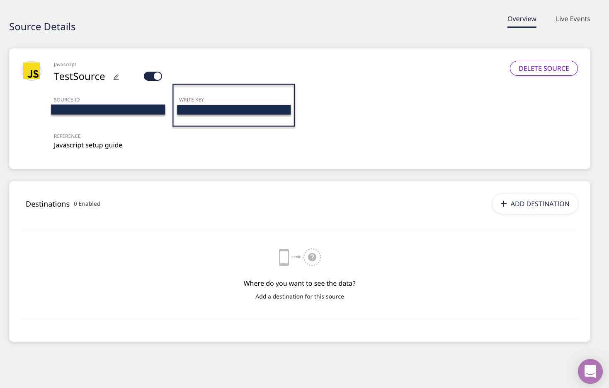
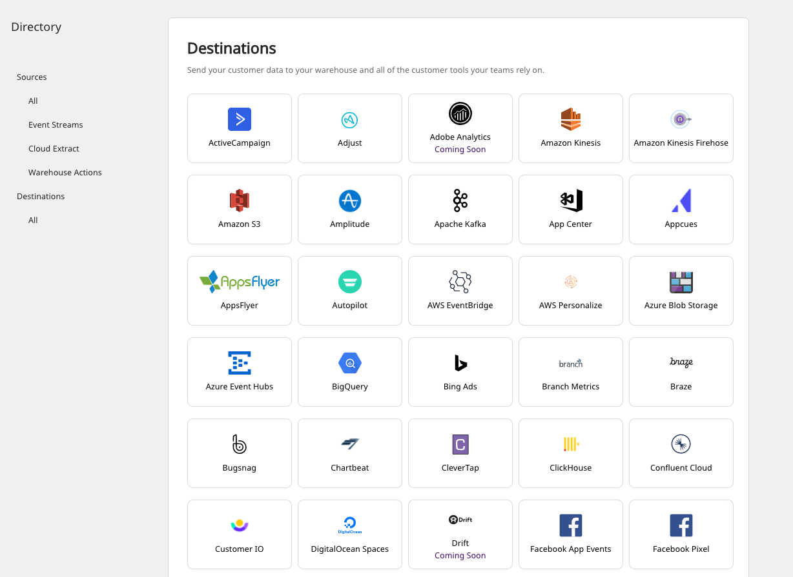
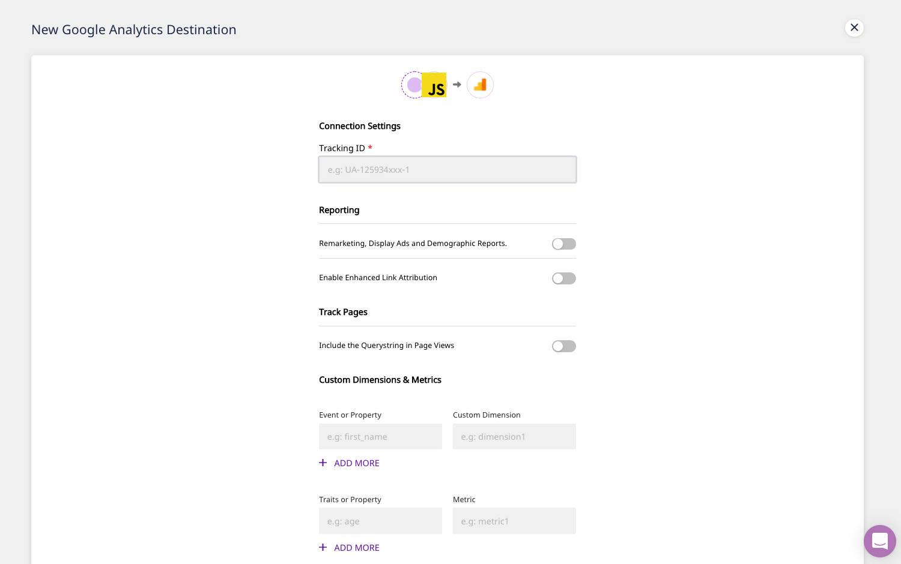

# How to Add a Source and Destination in RudderStack


Refer to the [**Connections**](./) guide to read more about sources and destinations in RudderStack.


## How to Add a Source

Follow these steps to add an event data source in RudderStack:

* Log in to the [RudderStack app](https://app.rudderlabs.com/login).
* Once logged in, you should see the following dashboard:

* Click on the **ADD SOURCE** option under **Sources**.
* You will be presented with a list of sources. Select the source you want to configure.


All the RudderStack sources are classified into the following categories. Read their respective documentation for more information.

* \*\*\*\*[**Event Streams**](../stream-sources/)\*\*\*\*
* \*\*\*\*[**Cloud Extract**](../cloud-extract-sources/)\*\*\*\*
* \*\*\*\*[**Warehouse Actions**](../warehouse-actions/)\*\*\*\*


* Assign a name to the source and click on **Next**.

* Your source should now be configured. Click on the **ADD DESTINATION** button to connect this source to a destination.


Setting up the event streams to ingest data from your cloud apps might require some additional configuration. Refer to the relevant [**source documentation**](../stream-sources/rudderstack-event-streams/) ****for more details.



Note the **WRITE KEY**. This is required to configure the SDK in the source platform for RudderStack to track and collect events.


## How to Add a Destination

To add a destination in RudderStack, follow these steps:

* On your dashboard home page, click on the **ADD DESTINATION** option under **Destinations**, as shown. 


Alternatively, you can also click on the **Destinations** option in the left navigation bar and click on **ADD DESTINATION**.


* From the list, select the destination to configure.

* Assign a name to this destination and click on **Next**.

* Select the event data source for this destination and click on **Next**.

* Configure the destination with the relevant connection settings. Refer to the specific [**destination documentation**](../destinations/) ****for more ****details. 

* RudderStack allows you to transform your source events in a destination-specific format through the [**Transformations**](../adding-a-new-user-transformation-in-rudderstack/) feature. Click on the **CREATE NEW TRANSFORMATION** option to add a transformation. Otherwise, click on **Next**. 

* Your destination should now be configured successfully.


* To change the settings of the configured destination, click on the **SETTINGS** button. 
* To view the live events sent to the destination, click on the **Live Events** tab on the top right. 
* To disconnect your destination from the source, click on the **DISCONNECT** button.



Before deleting a destination, make sure it is disconnected from the source.


## Contact Us

For more information or support on adding a source and destination in RudderStack, [contact us](mailto:%20docs@rudderstack.com) or start a conversation on our [Slack](https://resources.rudderstack.com/join-rudderstack-slack) channel.

