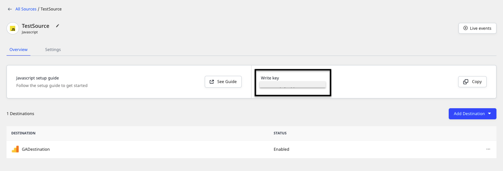
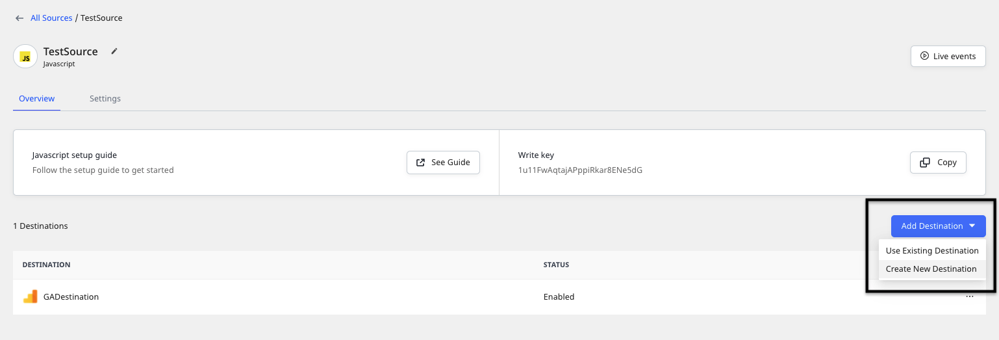
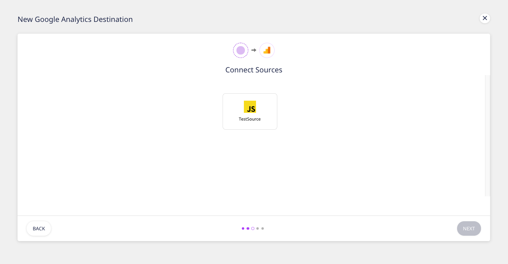
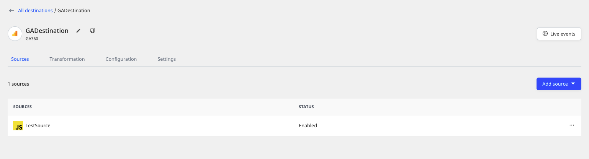
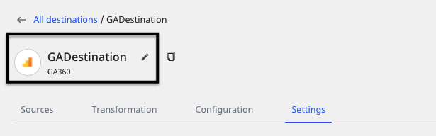

# How to Add a Source and Destination in RudderStack

This guide details the steps to add a source and destination in RudderStack.

  Refer to the <a href="https://rudderstack.com/docs/connections/">Connections</a> guide to read more about
  sources and destinations in RudderStack.

## Adding a Source

  For more information on sources in RudderStack, refer to the <a href="https://rudderstack.com/docs/connections/">Connections</a> guide.

Follow these steps to add an event data source in RudderStack:

- Log in to the **RudderStack dashboard**.

<!--  -->

- Under Sources, click on **Add Source**. From the list of sources, click on the source you want to set up in RudderStack.

<!--  -->

  All the RudderStack sources are classified into the following three
  categories. Read their respective documentation for more information:
  <ul>
    <li>
      <a href="https://rudderstack.com/docs/stream-sources/">Event Streams</a>
    </li>
    <li>
      <a href="https://rudderstack.com/docs/cloud-extract-sources/">Cloud Extract</a>
    </li>
    <li>
      <a href="https://rudderstack.com/docs/warehouse-actions/">Warehouse Actions</a>
    </li>
  </ul>

- Click on the desired source, assign a name to it, and click **Next**.
- Enter the required source-specific settings as applicable.

  Setting up the data sources to ingest data from your cloud apps might require
  some additional configuration. Refer to the relevant source documentation for
  more details.

- **Important**: Note the source **Write Key**. This is required to configure the RudderStack SDK to track and collect events from the source platform.

<!--  -->

## Adding a Destination

  For more information on destinations in RudderStack, refer to the <a href="https://rudderstack.com/docs/connections/">Connections</a> guide.

To add a destination in RudderStack, follow these steps:

- On your dashboard home page, click on the **ADD DESTINATION** option under **Destinations**, as shown:

<!--  -->

- Alternatively, you can also connect your source to a destination as shown:

<!--  -->

- From the list of destinations, select the desired destination. Assign a name to it and click on **Next**.
- Select the data source for this destination and click on **Next**.

<!--  -->

- Configure the destination with the relevant connection settings. Refer to the specific [**destination documentation**](https://rudderstack.com/docs/destinations/) for more details on these settings.

<!--  -->

- RudderStack lets you transform your source events in a destination-specific format through the [**Transformations**](https://rudderstack.com/docs/transformations/) feature. Click on the **CREATE NEW TRANSFORMATION** option to add a transformation. Otherwise, click on **Next**.

<!--  -->

- Your destination should now be configured successfully.

<!--  -->

### Updating a Destination

Here are a few things to keep in mind when updating a destination:

- To rename a destination, click on the edit icon next to the destination name as shown:

<!--  -->

- To add or change the transformation, go the **Transformation** tab.
- To modify the destination configuration, go to the **Configuration** tab.
- To enable or disable a destination or permanently delete it, go to the **Settings** tab.

  Before deleting a destination, make sure it is disconnected from the source.

## Contact Us

For more information or support on adding a source and destination in RudderStack, you can [**contact us**](mailto:%20docs@rudderstack.com) or start a conversation in our [**Slack**](https://rudderstack.com/join-rudderstack-slack-community) community.
