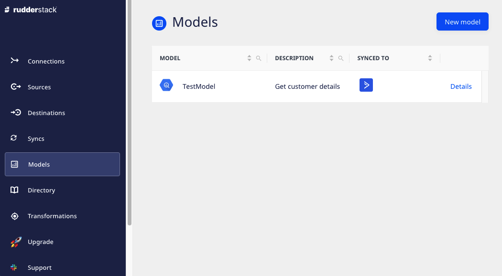
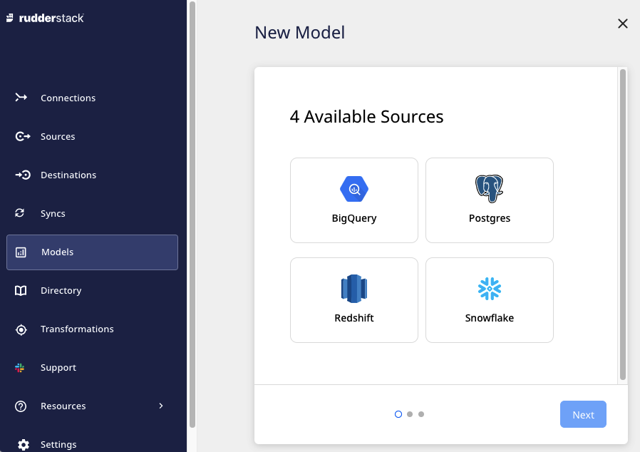
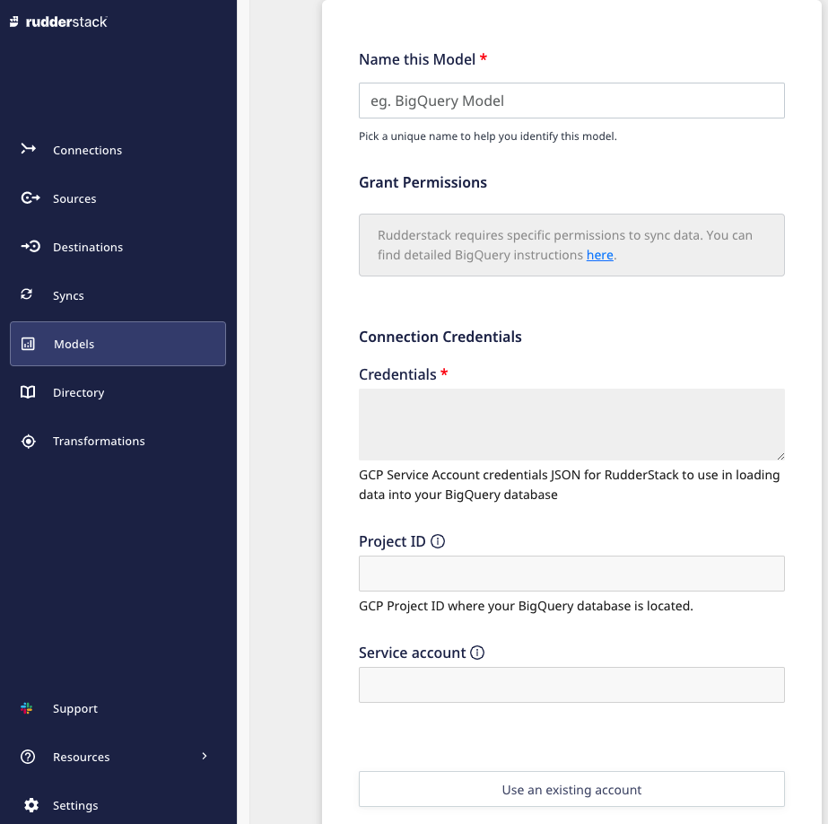
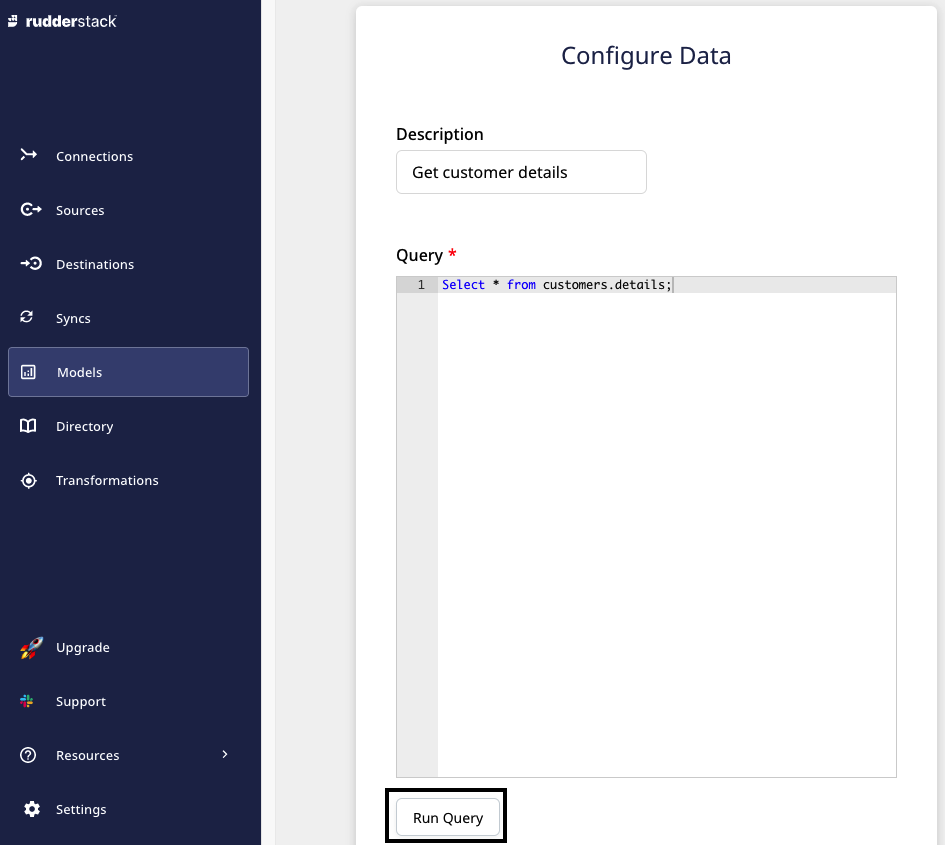
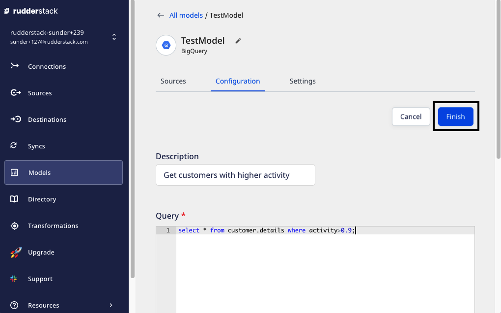

# Models

The **Models** feature lets you create models by defining custom SQL queries. These queries can then be executed over the Warehouse sources schema to send the resultant data to the specified destinations. You can create as many models and reuse them with their corresponding Warehouse Actions sources.

  Currently, the <strong>Models</strong> feature is supported for <a href="https://www.rudderstack.com/docs/warehouse-actions/amazon-redshift/">Amazon Redshift</a>, <a href="https://www.rudderstack.com/docs/warehouse-actions/google-bigquery/">Google BigQuery</a>, <a href="https://www.rudderstack.com/docs/warehouse-actions/postgresql/">PostgreSQL</a>, and <a href="https://www.rudderstack.com/docs/warehouse-actions/snowflake/">Snowflake</a> Warehouse Actions sources only.

The RudderStack dashboard provides **Models** option in the left navigation bar that allows you to view all the existing models:

## Create model

Follow these steps to create a model:

1. Log in to the **RudderStack dashboard**.

2. Click on **Models** in the left navigation bar and select **New model**.

3. Select a source for the model and click **Next**.

4. Configure the model with relevant source settings and click **Next**. For more information on these settings, refer [Warehouse Actions Sources](https://www.rudderstack.com/docs/warehouse-actions/).

5. Enter the **Description** and custom SQL **Query**. Click on **Run Query** to **Preview** the result.

The <strong>Preview</strong> section displays the preview of the first 50 resultant rows in a paginated format.

6. Click **Next** to configure the model succesfully.

## Update model

Follow these steps to update an existing model:

1. Click the model you want to update and select the **Configuration** tab.
2. Click on **Edit Configuration** and make the required changes in  **Description** and/or **Query**.
3. If you have edited the **Query**, click on **Run Query** to see if the new query generates the desired result.
4. Finally, click on **Finish** to save your changes.

## Model details

To get details about an existing model, you can click on it to see the options listed below:

- **Rename**: Lets you rename the model by clicking on the edit icon next to the model's name.

- **Sources**: Displays the sources associated with the model. To know more on how to use a model with a source, refer to [Custom SQL Models](https://www.rudderstack.com/docs/warehouse-actions/custom-sql-models/).

- **Configuration**: Displays and lets you edit the SQL **Query** and **Description**.

- **Settings**: This option provides additional model-related details, such as:  

  - **Credentials**: Lets you edit the credentials used for the source.

  - **Permanently delete the model**: Lets you delete the model by clicking on the **Delete** button. The **Delete** button is only enabled when no source is connected to the model.

## Contact us

For more information on any of the sections covered in this guide, you can [**contact us**](mailto:%20docs@rudderstack.com) or start a conversation in our [**Slack**](https://rudderstack.com/join-rudderstack-slack-community) community.
