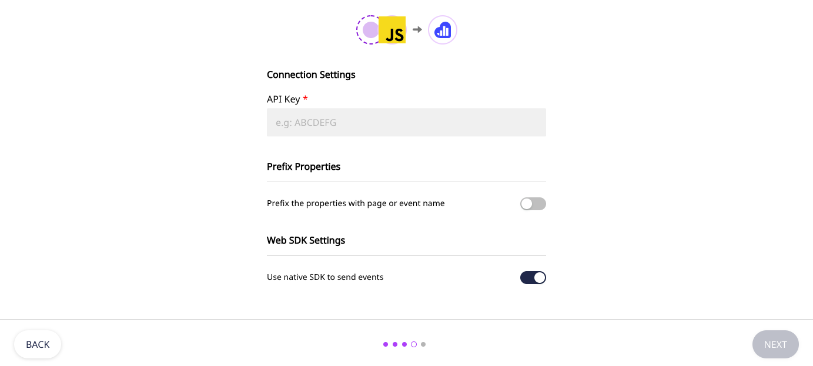
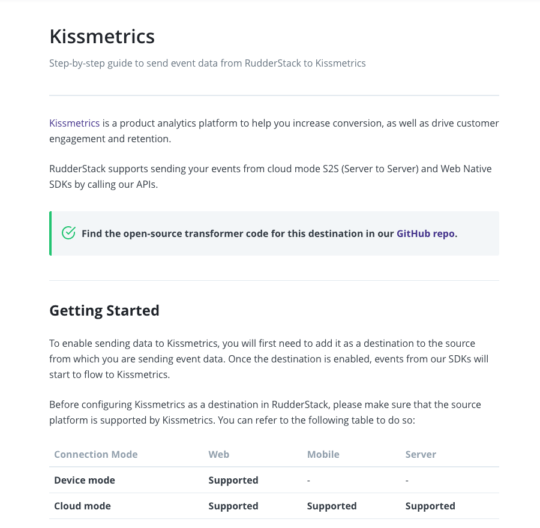

# RudderStack Connection Modes: Cloud Mode vs. Device Mode

This guide clarifies the two main connection modes in RudderStack - Cloud mode and Device mode. It also describes in detail the differences between these modes.

RudderStack's workflow is quite simple - it receives the event data from a variety of **Sources**, and routes this data to the **Destinations**.


RudderStack currently supports over 80 destinations to which you can send your event data. You can find the complete list in our [**Destinations**](../destinations/) guides. You can also check our [**Sources**](../stream-sources/) guides to get a list of the sources through which you can send your event data to RudderStack.


## Connection Modes in RudderStack

There are two modes through which you can send your event data from your website or mobile app to the desired destinations via RudderStack:

* Cloud Mode
* Device Mode

## Cloud Mode

In this mode, the SDK sends the event data directly to RudderStack. RudderStack then transforms this data and routes it to the desired destination. This transformation is done in the RudderStack backend, using RudderStack's ****[**Transformer**](https://github.com/rudderlabs/rudder-transformer) module.

### How It Works

Suppose you want to analyze your website users' event data using Amplitude. To do so, you've decided to use RudderStack's [**JavaScript**](../stream-sources/rudderstack-sdk-integration-guides/rudderstack-javascript-sdk/) ****SDK.

RudderStack defines a fixed event structure. If you track your events in this format, RudderStack will take care of transforming the events as required by Amplitude. You can start by [**adding a source and an Amplitude destination**](adding-source-and-destination-rudderstack.md) in the RudderStack dashboard.   
  
Then, [**add the RudderStack JavaScript SDK snippet**](https://docs.rudderstack.com/stream-sources/rudderstack-sdk-integration-guides/rudderstack-javascript-sdk#2-installing-the-rudderstack-javascript-sdk) into the web page which you wish to track.

The SDK automatically tracks and sends the user events to RudderStack. These events are then transformed by RudderStack and then routed to Amplitude.


The above example uses the JavaScript SDK; the other [**RudderStack SDKs**](https://docs.rudderstack.com/stream-sources/rudderstack-sdk-integration-guides) also work in the same way.



In the Cloud Mode, you get the flexibility to use transformations to enrich the events, or filter selective events to forward to destinations.



Our [**Data Warehouse Destinations**](https://docs.rudderstack.com/data-warehouse-integrations) support only cloud mode.



All the RudderStack server-side SDKs \([**Java**](https://docs.rudderstack.com/rudderstack-sdk-integration-guides/rudderstack-java-sdk), [**Python**](https://docs.rudderstack.com/rudderstack-sdk-integration-guides/rudderstack-python-sdk), [**Node.js**](https://docs.rudderstack.com/rudderstack-sdk-integration-guides/rudderstack-node-sdk), [**Go**](https://docs.rudderstack.com/rudderstack-sdk-integration-guides/rudderstack-go-sdk), [**Ruby**](https://docs.rudderstack.com/rudderstack-sdk-integration-guides/rudderstack-ruby-sdk)\) support only Cloud Mode. This is because the server-side SDKs operate in the RudderStack backend and cannot load any additional destination-specific SDKs.


## Device Mode

This mode lets you send your events to the preferred destinations using the client-specific libraries on your website or mobile app. These libraries allow RudderStack to use the data you collect on your device to call the destination APIs without sending it to the RudderStack first.

### How It Works

Suppose you want to send your event data from your source mobile apps to Firebase through RudderStack's mobile SDK \([**Android**](https://docs.rudderstack.com/rudderstack-sdk-integration-guides/rudderstack-android-sdk), [**iOS**](https://docs.rudderstack.com/rudderstack-sdk-integration-guides/rudderstack-ios-sdk), or [**Unity**](https://docs.rudderstack.com/rudderstack-sdk-integration-guides/getting-started-with-unity-sdk)**,** depending on your requirement\). You can start by [**adding a source and a Firebase destination**](https://docs.rudderstack.com/how-to-guides/adding-source-and-destination-rudderstack) in the RudderStack dashboard.

The RudderStack SDK will download the Firebase SDK, transform the events and will send them to Firebase for analytics.

In some cases, you can also use the RudderStack web SDK \([**JavaScript**](../stream-sources/rudderstack-sdk-integration-guides/rudderstack-javascript-sdk/)\) to send the events to the destination through the device mode. To do so, enable the **Use native SDK to send events** option on the RudderStack dashboard as shown:


Device mode integrations will send data to the destinations directly from your client \(browser or mobile application\).



Device mode does not support the RudderStack [**Transformations**](../transformations/) feature.


## Which Connection Mode Should I Choose?

* Use **Cloud Mode** if you wish to transform your events before sending them to the destination. 
* If you are planning to work with destinations that record information directly on your users' devices, you should opt for the **Device Mode**. There is a possibility that these destinations might not function correctly if they are not loaded directly on the device.

## How to Check If a Destination Supports Cloud Mode or Device Mode, or Both?

The easiest way to check the connection mode supported by the destination is to go refer to the individual destination's [**documentation**](../destinations/). 

We explicitly mention the supported connection modes for every destination in the **Getting Started** section of each guide. A sample example is as shown:

## Cloud + Device Mode Support

Some of our destinations support both Cloud and Device Modes. Some examples are [**Google Analytics**](https://docs.rudderstack.com/destinations/google-analytics-ga), [**HubSpot**](https://docs.rudderstack.com/destinations/hubspot), [**Intercom**](https://docs.rudderstack.com/destinations/intercom), [**Kissmetrics**](https://docs.rudderstack.com/destinations/kissmetrics), [**Branch**](https://docs.rudderstack.com/destinations/branchio), [**Braze**](https://docs.rudderstack.com/destinations/braze), [**Customer.io**](https://docs.rudderstack.com/destinations/customer.io), and [**Facebook App Events**](https://docs.rudderstack.com/destinations/facebook-app-events). 

You can choose to integrate these destinations with RudderStack via cloud mode or device mode, depending on your requirement.

## Contact Us

To learn more about the connection modes supported by RudderStack, feel free to [**contact us**](mailto:%20docs@rudderstack.com) or start a conversation on our [**Slack**](https://resources.rudderstack.com/join-rudderstack-slack) channel.

