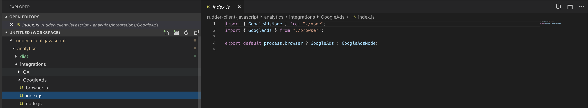

# How to Implement a Native JavaScript SDK Integration

## Basic functionality

> We will be using the integration and destination term loosely and interchangeably

RudderStack JS SDK reads the config data from the control plane to fetch the native integrations. The native integrations must have the following methods/attributes defined by you as shown below. RudderStack JS SDK calls these for initializing the destination global object and forwarding event data namely identify, page and track.

* **constructor**: RudderStack JS SDK, constructs an integration object with the destination specific keys such as `name`, `apiKey,` `custom mappings etc`, fetched from your config plane. These information are required by the below calls.
* **init** : Add the destination script \(Javascript snippet provided by the destination to initialize a global queue on window object\)
* **identify**: RudderStack JS SDK calls this method to pass identify event data. One can write custom logic specific to the destination before calling destination specific implementation.
* **page**: Similar to identify, with page event data
* **track**: Similar to identify, with track event data
* **isLoaded**: RudderStack JS SDK checks the output of this method, once true, events are forwarded to above methods.


RudderStack JS SDK makes a call to the config plane to fetch all native SDK **true** destinations before constructing and initializing the integration object with the fetched config.

The **isLoaded** method return true when the global destination object is ready. RudderStack JS SDK waits for a maximum of 10 secs and polls for this flag to be ready every 1sec. Once all the native SDK enabled integrations are ready, all the event data accumulated from the time of page load is replayed on these integrations.



The input to identify, page, track methods/property of the integration object is the entire event data object constructed by utility methods of the core analytics object.


## Code Structure

To add a new integration, add the above said methods to a JS object and export that object to be picked up by the **integrations** map.

This map is iterated and matched against the config fetched from the control plane to construct only those enabled integrations. This is matched against the `name` property of the integration object and destination config `name` .

`All the activities of fetching configs and constructing and event forwarding to integrations is handled by the core analytics object.`

> Refer the existing integrations in case of any parameter reference.  
> For adding destination JS snippet, use the init method of the new integration.

