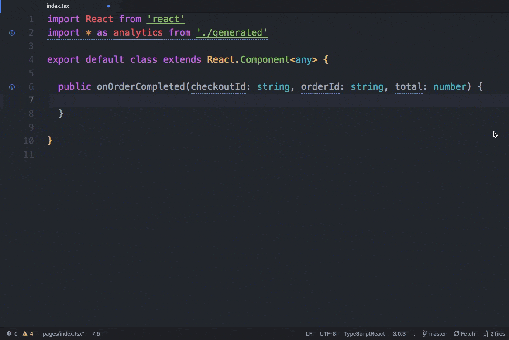

# RudderTyper

[RudderTyper](https://github.com/rudderlabs/rudder-typer) is a tool that lets you generate strongly-typed analytics library wrappers based on your [Tracking Plans](https://www.rudderstack.com/docs/data-governance/tracking-plans/). Simply put, it uses an event from your specified tracking plan and generates an analytics call in the supported languages.

<div class="successBlock">

  RudderTyper currently generates native clients for the following SDKs:

  <ul>
    <li><a href="https://rudderstack.com/docs/stream-sources/rudderstack-sdk-integration-guides/rudderstack-javascript-sdk">JavaScript</a></li>
    <li><a href="https://rudderstack.com/docs/stream-sources/rudderstack-sdk-integration-guides/rudderstack-node-sdk">Node.js</a></li>
    <li><a href="https://rudderstack.com/docs/stream-sources/rudderstack-sdk-integration-guides/rudderstack-android-sdk">Android</a></li>
    <li><a href="https://rudderstack.com/docs/stream-sources/rudderstack-sdk-integration-guides/rudderstack-ios-sdk">iOS</a></li>
  </ul>
</div>



## Key features

Some key features of RudderTyper are:

- Allows you to contextualize your analytics instrumentation and validate it with your event spec, before deploying to production.
- You can access and validate your event names, properties, types, etc.
- It provides compile-time errors and warns you about any missing required properties, data mismatch, and any issues in the JSON schema configured in your tracking plan.

<div class="infoBlock">

This feature is currently in a closed beta. If you're interested, contact your account representative for more information.
</div>


## Get started

Run the following command to fire up a quick start wizard, create a `ruddertyper.yml` file, and generate your first client with the specified configuration details:

```bash
$ npx rudder-typer init | initialize | quickstart
```

## Other commands

### Update

The following command syncs `plan.json` with RudderStack to pull the latest changes in your tracking plan and then generates an updated development client.

```bash
$ npx rudder-typer update | u | *   (default)
```

### Generate a development client

To generate a development client from `plan.json`, run the following command:

```bash
$ npx rudder-typer build | b | d | dev | development
```

### Generate a production client

The following command generates a production client from `plan.json`:

```bash
$ npx rudder-typer prod | p | production
```

### Print local RudderStack API token configuration

The following command prints the local RudderStack API token configuration.

```bash
$ npx rudder-typer token | tokens | t
```

### Version

The following command prints the RudderTyper CLI version:

```bash
$ npx rudder-typer version
```

### Help

To print the help message describing different commands available with RudderTyper, run the following command:

```bash
$ npx rudder-typer help
```

## CLI arguments

| Argument  | Type      | Description                                                                        |
| :-------- | :-------- | :--------------------------------------------------------------------------------- |
| `config`  | `string`  | An optional path to a `ruddertyper.yml` \(or a directory with `ruddertyper.yml`\). |
| `debug`   | `boolean` | An optional \(hidden\) flag for enabling Ink debug mode.                           |
| `version` | `boolean` | Standard `--version` flag to print the version of this CLI.                        |
| `v`       | `boolean` | Standard `-v` flag to print the version of this CLI.                               |
| `help`    | `boolean` | Standard `--help` flag to print help on a command.                                 |
| `h`       | `boolean` | Standard `-h` flag to print help on a command.                                     |

## Configuration reference

RudderTyper stores its configuration in a `ruddertyper.yml` file in the root of your repository.

A sample configuration looks like the following:

```bash
# RudderStack RudderTyper Configuration Reference (https://github.com/rudderlabs/rudder-typer)
# Just run `npx rudder-typer` to re-generate a client with the latest versions of these events.

scripts:
  # You can supply a RudderStack API token using a `script.token` command. The output of `script.token` command should be a valid RudderStack API token.
  token: source .env; echo $RUDDERTYPER_TOKEN
  # You can supply email address linked to your workspace using a `script.email` command.The output of `script.email` command should be an email address registered with your workspace.
  email: source .env: echo $EMAIL
  # You can format any of RudderTyper's auto-generated files using a `script.after` command.
  # See `Formatting Generated Files` below.
  after: ./node_modules/.bin/prettier --write analytics/plan.json

client:
  # Which RudderStack SDK you are generating for.
  # Valid values: analytics.js, analytics-node, analytics-ios, analytics-android.
  sdk: analytics-node
  # The target language for your RudderTyper client.
  # Valid values: javascript, java, objective-c, swift.
  language: javascript
  # Javascript Transpilation Settings
  # Valid values: 'ES3','ES5','ES2015','ES2016','ES2017','ES2018','ES2019','ESNext','Latest'
  scriptTarget: 'ES6'
  # Valid values: 'CommonJS','AMD','UMD','System','ES2015','ESNext'
  moduleTarget: 'ESNext'

trackingPlans:
  # The RudderStack Tracking Plan that you are generating a client for.
  # Provide your workspace slug and Tracking Plan id
  # You also need to supply a path to a directory to save your RudderTyper client.
  - id: rs_QhWHOgp7xg8wkYxilH3scd2uRID
    workspaceSlug: rudderstack-demo
    path: ./analytics
```

## Integrating RudderTyper-generated client with your app

This section includes the steps to integrate your RudderTyper-generated client with your app across different RudderStack SDKs.

### RudderStack Android SDK

1. Import all the files in the client generated by RudderTyper as a package in your project.
2. Then, you can directly make the calls using the RudderTyper client as shown:

```java
// Import your auto-generated RudderTyper client:
import com.rudderstack.generated.*

  // Issue your first RudderTyper track call!
  RudderTyperAnalytics.with(this).orderCompleted(
    OrderCompleted.Builder()
    .orderID("ck-f306fe0e-cc21-445a-9caa-08245a9aa52c")
    .total(39.99)
    .build()
  );
```

### RudderStack iOS SDK

1. Import your RudderTyper client into your project using XCode.

<div class="warningBlock">

If you have placed your generated files in a folder in your project, import the project as a group not a folder reference.
</div>

2. Then, you can directly make the calls using the RudderTyper client as shown:

```
// Import your auto-generated RudderTyper client:
#import "RSRudderTyperAnalytics.h"

// Issue your first RudderTyper track call!
[RSRudderTyperAnalytics orderCompletedWithOrderID: "ck-f306fe0e-cc21-445a-9caa-08245a9aa52c" total: @39.99];
```

### RudderStack JavaScript SDK

<div class="successBlock">

RudderTyper now also supports TypeScript for generating clients for the JavaScript SDK. This feature is available from the version 1.0.0-beta.5.
</div>

1. Import the RudderTyper-generated client using `require()` and make the calls if your framework supports them. Alternatively, you can use [Browserify](https://browserify.org/) to generate a bundle that supports your implementation. The implementation for each of the alternatives mentioned above will be as shown:

#### Using the `require()`method

<Tabs>
  <TabList>
    <Tab>JavaScript</Tab>
    <Tab>TypeScript</Tab>
  </TabList>
  <TabPanels>
    <TabPanel>
      <span>
        
```javascript
// Import RudderStack JS SDK and initialize it

const rudderanalytics = require("rudder-sdk-js")
rudderanalytics.load(YOUR_WRITE_KEY, DATA_PLANE_URL)

// Import your auto-generated RudderTyper client

const rudderTyper = require("./rudderTyperClient")

// Pass in your rudder-sdk-js instance to RudderTyper client

rudderTyper.setRudderTyperOptions({
  analytics: rudderanalytics,
})

// Issue your first RudderTyper track call

rudderTyper.orderCompleted({
  orderID: "ck-f306fe0e-cc21-445a-9caa-08245a9aa52c",
  total: 39.99,
})
```
</span>
</TabPanel>
<TabPanel>
  <span>

```typescript
import * as rudderanalytics from "rudder-sdk-js"
import ruddertyper, { OrderCompleted } from "./ruddertyper"

rudderanalytics.load(YOUR_WRITE_KEY, DATA_PLANE_URL)
ruddertyper.setRudderTyperOptions({ analytics: rudderanalytics });

const orderCompleted: OrderCompleted = {
    "orderID": "ck-f306fe0e-cc21-445a-9caa-08245a9aa52c",
    "total": 39.99
}

ruddertyper.orderCompleted(orderCompleted)
```
</span>
</TabPanel>
</TabPanels>
</Tabs>

#### Using `browserify`

1. Execute the following command to generate a bundle from the RudderTyper client:

```bash
browserify rudderTyperClient.js --standalone rudderTyper >  rudderTyperBundle.js
```

2. Now you can make calls from your `html` file as shown:

```markup
<head>
  <script>
    rudderanalytics = window.rudderanalytics = [];
    var methods = ["load", "page", "track", "identify", "alias", "group", "ready", "reset", "getAnonymousId", "setAnonymousId"];
    for (var i = 0; i < methods.length; i++) {
      var method = methods[i];
      rudderanalytics[method] = function(methodName) {
        return function() {
          rudderanalytics.push([methodName].concat(Array.prototype.slice.call(arguments)));
        };
      }(method);
    }
    rudderanalytics.load(YOUR_WRITE_KEY, DATA_PLANE_URL);
    rudderanalytics.page();
  </script>
  <script src="https://cdn.rudderlabs.com/v1.1/rudder-analytics.min.js"></script>
  <script src="./rudderTyperBundle.js"></script>
  <meta charset="UTF-8">
  <meta http-equiv="X-UA-Compatible" content="IE=edge">
  <meta name="viewport" content="width=device-width, initial-scale=1.0">
  <title>Document</title>
</head>
<script>
  rudderTyper.setRudderTyperOptions({
    analytics: rudderanalytics
  });
  rudderTyper.orderCompleted({
    orderID: 'ck-f306fe0e-cc21-445a-9caa-08245a9aa52c',
    total: 39.99
  })
</script>
```

<div class="infoBlock">

If you are using an older version of the JavaScript SDK (v1), refer to the <a href="https://www.rudderstack.com/docs/stream-sources/rudderstack-sdk-integration-guides/rudderstack-javascript-sdk/version-migration-guide/">Version Migration Guide</a> to migrate to v1.1.
</div>

### RudderStack Node.js SDK

<div class="successBlock">

RudderTyper now also supports TypeScript for generating clients for the Node.js SDK. This feature is available from the RudderTyper version 1.0.0-beta.5 and it is compatible with the Node.js SDK with v1.1.2 or later.
</div>

1. Import the the RudderTyper-generated client and start making calls using RudderTyper as shown:

<Tabs>
  <TabList>
    <Tab>JavaScript</Tab>
    <Tab>TypeScript</Tab>
  </TabList>
  <TabPanels>
    <TabPanel>
      <span>

```javascript
// Import Rudder Node SDK and intialize it

const Analytics = require("@rudderstack/rudder-sdk-node")
const client = new Analytics(WRITE_KEY, DATA_PLANE_URL / v1 / batch)
const ruddertyper = require("./rudderTyperClient")

// Pass in your rudder-sdk-node instance to RudderTyper

ruddertyper.setRudderTyperOptions({
  analytics: client,
})

// Issue your first RudderTyper track call

ruddertyper.orderCompleted({
  orderID: "ck-f306fe0e-cc21-445a-9caa-08245a9aa52c",
  total: 39.99,
})
```
</span>
</TabPanel>
<TabPanel>
  <span>

```typescript
import Analytics from '@rudderstack/rudder-sdk-node'
import ruddertyper, { OrderCompleted } from './analytics/ruddertyper'

const client = new Analytics(WRITE_KEY, DATA_PLANE_URL/v1/batch)

ruddertyper.setRudderTyperOptions({
	analytics: client,
})

const orderCompleted: OrderCompleted = {
	orderID: 'ck-f306fe0e-cc21-445a-9caa-08245a9aa52c',
	total: 39.99,
}

ruddertyper.orderCompleted({
	userId: '4009',
	properties: orderCompleted,
})
```
</span>
</TabPanel>
</TabPanels>
</Tabs>

## Contribute

- To submit a bug report or feature request, file an [issue](https://github.com/rudderlabs/rudder-server/issues).
- To develop on `ruddertyper` or propose support for a new language, refer to the [contributor's documentation](https://github.com/rudderlabs/rudder-server/blob/master/CONTRIBUTING.md).

## Contact us

For queries on any of the sections in this guide, you can [contact us](mailto:%20docs@rudderstack.com) or start a conversation in our [Slack](https://rudderstack.com/join-rudderstack-slack-community) community.
