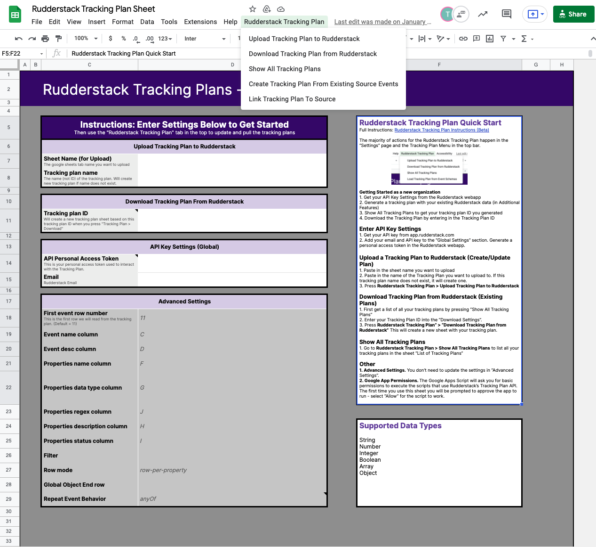
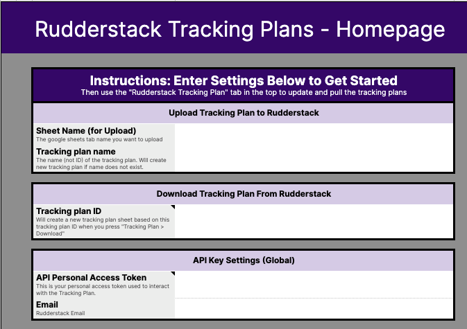

# Tracking Plan Spreadsheet

By default, the Tracking Plan configuration is in JSON format. The [Tracking Plan spreadsheet](https://docs.google.com/spreadsheets/d/1QnCY3dbzyz2InB68W3AGIJshsuY3Zu8WA3AfMMxIzAQ/edit#gid=1810167975) is a no-code, spreadsheet representation of your Tracking Plan configuration. It lets you easily create or use an existing Tracking Plan.

This guide details the various options and spreadsheet settings that let you effectively configure your Tracking Plan.

##  Spreadsheet overview

The configuration settings for your Tracking Plan are listed in the **Homepage** and **Additional Features** tabs of the Tracking Plan spreadsheet. They are linked to the actions listed in the **RudderStack Tracking Plan** menu in the Google Sheets top bar, as seen in the following image:

The Tracking Plan spreadsheet uses the Google Sheets' scripts functionality to integrate with the Rudderstack Tracking Plan API.

## Creating a Tracking Plan from existing event data

RudderStack lets you create a Tracking Plan from an existing event data source. This option uses the Data Governance API and the Tracking API features to generate an initial plan.

This is the easiest way to kickstart your Tracking Plan program without having to start from scratch.

To create a Tracking Plan from an existing RudderStack source, follow these steps:

1. Go to the **Additional Features** tab of your Tracking Plan spreadsheet. 
2. Under **Create Tracking Plan from Existing Source**, enter the following settings:

    - **Data Plane URL**: Enter the data plane URL of your workspace or where the data plane is hosted.
    - **Write key**: Enter the write key for the RudderStack source. You can find it in the **Sources** page.
    - **Username**: Enter your admin username.
    - **Password**: Enter your admin password.
    - **Tracking Plan Name**: Assign a name to this Tracking Plan.

The <strong>Username</strong> and <strong>Password</strong> are your Grafana dashboard credentials and not your RudderStack account credentials. If you are unsure, contact your Account Manager.

3. Click on the **RudderStack Tracking Plan** > **Create Tracking Plan from Existing Source Events** option in the top bar to create a new Tracking Plan.

For the first time you use the Tracking Plan spreadsheet, you will be prompted with an approval request. Select <strong>Allow</strong> to permit Google Apps to execute the scripts.

4. To verify if the Tracking Plan is created, refer to the [Getting the Tracking Plans](#getting-the-tracking-plans) section below.

## Getting the Tracking Plans

To get a list of all your existing Tracking Plans, go to **RudderStack Tracking Plan** > **Show All Tracking Plans**.

This option lists all your existing Tracking Plans along with their respective Tracking Plan IDs in the **List of Tracking Plans** sheet.

## Uploading a Tracking Plan to RudderStack

## Downloading an existing Tracking Plan

Follow these steps to download an existing Tracking Plan:

1. Get a list of all your Tracking Plans by going to **RudderStack Tracking Plan** > **Show All Tracking Plans**. Note the Tracking Plan ID.
2. Go to the **Download Tracking Plan from RudderStack** option in the spreadsheet and enter the **Tracking Plan ID**, as shown:

3. Click on **RudderStack Tracking Plan** > **Download Tracking Plan from RudderStack** in the top bar. 

This will create a new sheet with your Tracking Plan.

## Show All Tracking Plans

## Link Tracking Plan to source

## Contact us

For queries on any of the sections covered in this guide, you can [**contact us**](mailto:%20docs@rudderstack.com) or get in touch with your Account Manager.

RudderStack currently supports only the simple datatypes (String, Number, Boolean, Array, Object). 

You can create, delete, or update new events as well as properties within these events. 
Once you upload the changes, you will create a new version of the Tracking Plan to keep track of your edit history.