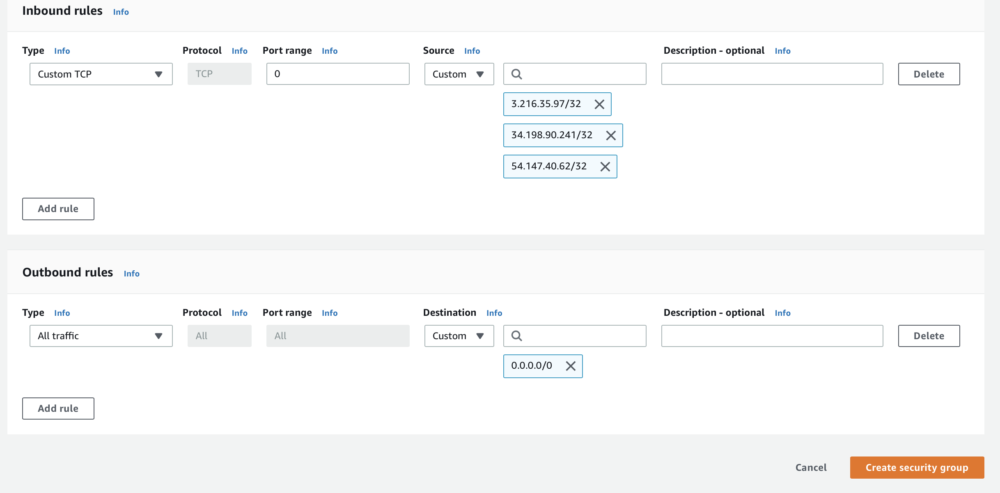
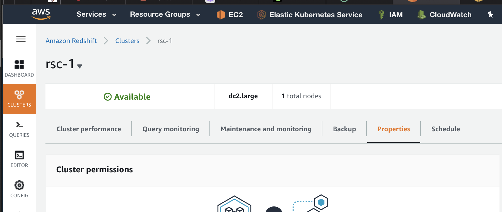
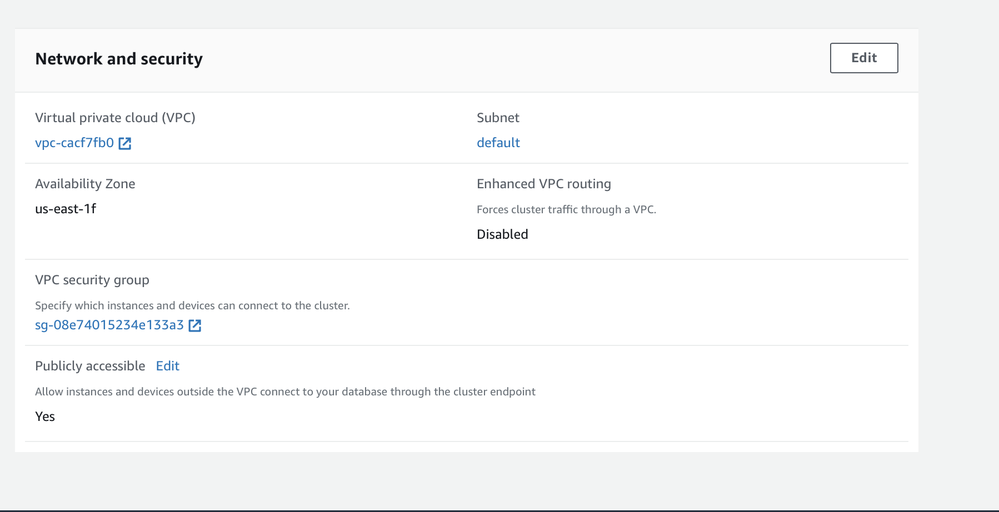
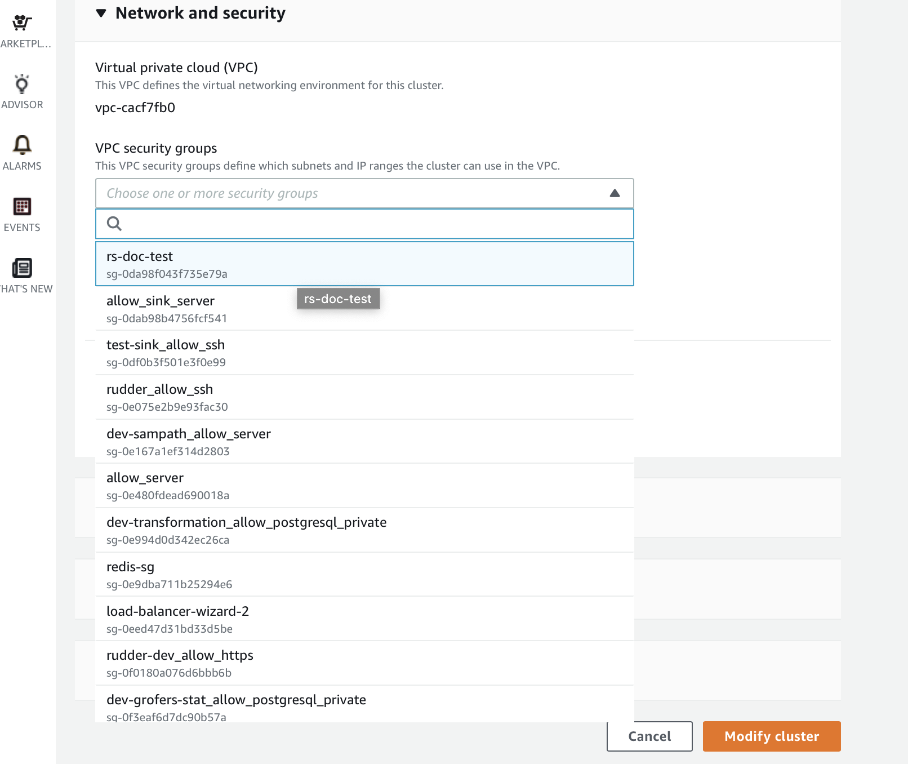
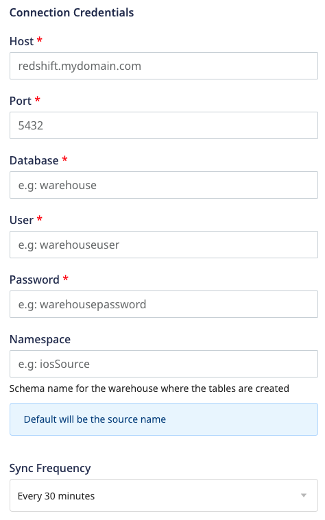
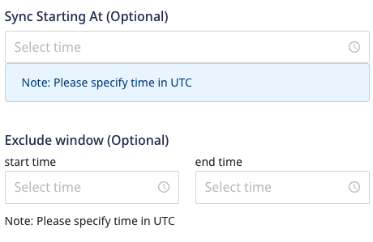

# Amazon Redshift

[Amazon Redshift](https://aws.amazon.com/redshift/) is the world's fastest cloud data warehouse. It allows you to handle large analytical workloads with best-in-class performance, speed, and efficiency. With Redshift, you don't have to worry about the scale of your data or the cost of running queries on them.

RudderStack lets you configure Redshift as a destination to which you can send your event data seamlessly.

<div class="infoBlock">

Refer to the <a href="https://rudderstack.com/docs/data-warehouse-integrations/warehouse-schemas/">Warehouse Schemas</a> guide for more information on how the events are mapped to the tables in Redshift.
</div>

<div class="successBlock">

Find the open source transformer code for this destination in the <a href="https://github.com/rudderlabs/rudder-transformer/tree/master/v0/destinations/rs">GitHub repository</a>.
</div>

## Setting up a Redshift cluster

Before adding Redshift as a destination in RudderStack, it is recommended that you create a new Redshift cluster depending on the type of instance needed. 

The following sections contain step-by-step instructions on setting up a Redshift cluster.

### Choosing the Redshift instance type

Amazon Redshift provides two types of clusters: **Dense Compute** and **Dense Storage** clusters.

- **Dense Compute** clusters maximize CPU usage, resulting in an increased query performance. However, there is a trade-off with respect to the storage.
- **Dense Storage** clusters maximize storage for customers with hundreds of millions of rows of data. However, there is a trade-off in the CPU usage, resulting in a lower query performance.

<div class="infoBlock">

Refer to this <a href="https://docs.aws.amazon.com/redshift/latest/mgmt/working-with-clusters.html#working-with-clusters-overview">Redshift guide</a> for more information on the cluster and node types in Redshift.
</div>

### Creating a new Redshift cluster

Follow the steps below to create a new Redshift cluster:

1. Open the Redshift Console as shown:

<span class="imageTitle">Redshift Console</span>

2. Click on the **Create Cluster** option, as shown:


3. Enter the cluster details. First, fill in the **Cluster identifier** and choose the instance type, as shown:

<span class="imageTitle">Redshift cluster configuration settings</span>

4. Enter the number of nodes for your cluster. This will primarily depend on the amount of data you expect to work with.


5. Enter the database name, and create the admin user with the name of your choice.


<div class="warningBlock">

For security purposes, it is recommended that you choose a strong password.
</div>

6. Finish creating the cluster by allowing the default options for **Additional Configurations**.

<div class="infoBlock">

As a part of this setup, you also need to edit the VPC network and configure the security settings. More information on these aspects in available in the following sections.
</div>

With the Redshift cluster now created and ready to use, the next sections cover the necessary steps to set up the necessary user permissions and set up Redshift as a destination in RudderStack.

## Setting user permissions in Redshift

This section contains the steps to create a new user to access the Redshift cluster and create temporary tables in it.

<div class="warningBlock">

The username and password provided earlier while creating the Redshift cluster should be strictly used for administration purposes. RudderStack will create a different user to enable access to Redshift. This also helps RudderStack keep the queries separate as well as maintain an audit log.
</div>

1. Click on the **Editor** option in the left pane. You can run the queries to create a new user to access the Redshift cluster in the **Query editor**, as shown:


2. The queries to create a new user are listed below:

```sql
-- create a user named "rudder" RudderStack can use to access Redshift
CREATE USER rudder PASSWORD '<password goes here>';

-- granting schema creation permission to the "rudder" user on the database you chose earlier
GRANT CREATE ON DATABASE "<database name goes here>" TO "rudder";
```

3. Log into the Redshift cluster with the newly created user credentials.

<div class="infoBlock">

Use the newly-created user credentials while configuring Redshift as a destination in the RudderStack dashboard.
</div>

## Setting up network and security access

<div class="successBlock">

This section is listed for EC2-VPC. However, EC2-Classic works similarly.
</div>

### IPs to be whitelisted

To enable network access to RudderStack, you will need to whitelist the following RudderStack IPs:

- 3.216.35.97
- 34.198.90.241
- 54.147.40.62
- 23.20.96.9
- 18.214.35.254
- 35.83.226.133
- 52.41.61.208
- 44.227.140.138
- 54.245.141.180
- 3.66.99.198
- 3.64.201.167

<div class="infoBlock">

If you have your deployment in the EU region, you can whitelist only the following two IPs:
<ul>
<li>3.66.99.198</li>
<li>3.64.201.167</li>
</ul>
</div>

<div class="infoBlock">

All the outbound traffic is routed through these RudderStack IPs.
</div>

### Adding a security group

Follow these steps to add a security group and assign it to your Redshift cluster:

1. Go to EC2 from the services on your AWS console, as shown:


2. Go to **Security Groups** under **Network & Security**, followed by **Create Security Group**.


3. Enter the details of the security group. The **Security group name** will be used to select the group later.


4. Add an **Inbound rule** with IPs listed above, and enter the Redshift port as `5439` in the **Port range** field, as shown:



5. Next, go to the Redshift cluster and select **Properties**, where you can modify the network and security rules of the cluster.



6. Edit the **Network and security** option and choose the VPC security group that you selected earlier.



7. Finally, click on **Modify cluster** to finish the **Network and Security** setup.



## Configuring Redshift destination in RudderStack

To send event data to Redshift, you first need to add it as a destination in RudderStack and connect it to your data source. Once the destination is enabled, events will automatically start flowing to Redshift via RudderStack.

To configure Redshift as a destination in RudderStack, follow these steps:

1. In your [RudderStack dashboard](https://app.rudderstack.com), set up the data source. Then, select **Redshift** from the list of destinations.

<div class="infoBlock">

Refer to the <a href="https://rudderstack.com/docs/connections/adding-source-and-destination-rudderstack/">Adding a Source and Destination in RudderStack</a> guide for more information.
</div>

2. Assign a name to your destination and then click on **Next**.

### Connection Settings




Enter the following credentials in the **Connection Credentials** page:
  - **Host**: The host name of your Redshift service.
  - **Port**: The port number associated with the Redshift database instance.
  - **Database**: The database name in your Redshift instance where the data will be sent.
  - **User**: The name of the user with the required read/write access to the above database.
  - **Password**: The password for the above user.
  - **Namespace**: Enter the schema name where RudderStack will create all the tables. If you don't specify any namespace, RudderStack will set this to the source name, by default.
  - **Sync Frequency**: Specify how often RudderStack should sync the data to your Redshift database.
  - **Sync Starting At**: This optional setting lets you specify the particular time of the day (in UTC) when you want RudderStack to sync the data to the warehouse.
  - **Exclude Window**: This optional setting lets you set a time window when RudderStack will **not sync** the data to your database.

### Configuring the object storage

RudderStack lets you configure the following object storage configuration settings while setting up your Azure Synapse destination:

  - **Use RudderStack-managed object storage**: Enable this setting to use RudderStack-managed buckets for object storage.

<div class="warningBlock">

This option is applicable only for RudderStack-hosted data planes. For self-hosted data planes, you will have to specify your own object storage configuration settings.
</div>

 - **Choose your storage provider**: If **Use RudderStack-managed object storage** is disabled in the dashboard, you can enter the relevant [Amazon S3 bucket storage settings](https://www.rudderstack.com/docs/destinations/storage-platforms/amazon-s3/#setting-up-amazon-s3).

## S3 Permissions

The alternative to providing AWS credentials for S3 access, is to set up permissions for your bucket as specified in the following section:

### RudderStack-hosted data plane

You need to edit your bucket policy to allow RudderStack to write to your bucket with the following JSON:

```jsx
{
  "Version": "2012-10-17",
  "Statement": [
    {
      "Effect": "Allow",
      "Principal": {
        "AWS": "arn:aws:iam::422074288268:user/s3-copy"
      },
      "Action": [
        "s3:GetObject",
        "s3:PutObject",
        "s3:PutObjectAcl",
        "s3:ListBucket"
      ],
      "Resource": [
        "arn:aws:s3:::YOUR_BUCKET_NAME/*",
        "arn:aws:s3:::YOUR_BUCKET_NAME"
      ]
    }
  ]
}
```

### Self-hosted data plane

1. Create an IAM policy with the following JSON:

```javascript
{
  "Version": "2012-10-17",
  "Statement": [
    {
      "Effect": "Allow",
      "Action": "*",
      "Resource": "arn:aws:s3:::*"
    }
  ]
}
```

2. Create an IAM user with programmatic access keys and attach the above created IAM policy. Copy the ARN of this user.
3. Edit your bucket policy to allow the data plane to write to your bucket with the following JSON. Make sure you edit the account id and user ARN with your AWS Account ID and the above created user ARN:

```javascript
{
  "Version": "2012-10-17",
  "Statement": [
    {
      "Effect": "Allow",
      "Principal": {
        "AWS": "arn:aws:iam::ACCOUNT_ID:user/USER_ARN"
      },
      "Action": [
        "s3:GetObject",
        "s3:PutObject",
        "s3:PutObjectAcl",
        "s3:ListBucket"
      ],
      "Resource": [
        "arn:aws:s3:::YOUR_BUCKET_NAME/*",
        "arn:aws:s3:::YOUR_BUCKET_NAME"
      ]
    }
  ]
}
```

4. Finally, add the programmatic access credentials to the environment of your data plane, as shown:

```bash
RUDDER_AWS_S3_COPY_USER_ACCESS_KEY_ID=<above created user access key>
RUDDER_AWS_S3_COPY_USER_ACCESS_KEY=<above created user access key secret>
```

## Column compression encoding

Compression encoding specifies the type of compression applied to a column of data values as rows are added to a table. 

If not specified, Redshift automatically assigns [compression encoding](https://docs.aws.amazon.com/redshift/latest/dg/c_Compression_encodings.html). RudderStack explicitly sets the [runlength](https://docs.aws.amazon.com/redshift/latest/dg/c_Runlength_encoding.html) encoding for Boolean columns.

## FAQ

### How are reserved words handled by RudderStack?

There are some limitations when it comes to using [reserved words](http://docs.aws.amazon.com/redshift/latest/dg/r_pg_keywords.html) in a schema, table, or column names. If such words are used in event names, traits or properties, they will be prefixed with a `_`when RudderStack creates tables or columns for them in your schema.

Besides, integers are not allowed at the start of the schema or table name. Hence, such schema, column or table names will be prefixed with a `_`.

For instance, `'25dollarpurchase`' will be changed to `'_25dollarpurchase`'.

## Contact us

For queries on any of the sections covered in this guide, you can [contact us](mailto:%20docs@rudderstack.com) or start a conversation in our [Slack](https://rudderstack.com/join-rudderstack-slack-community) community.
