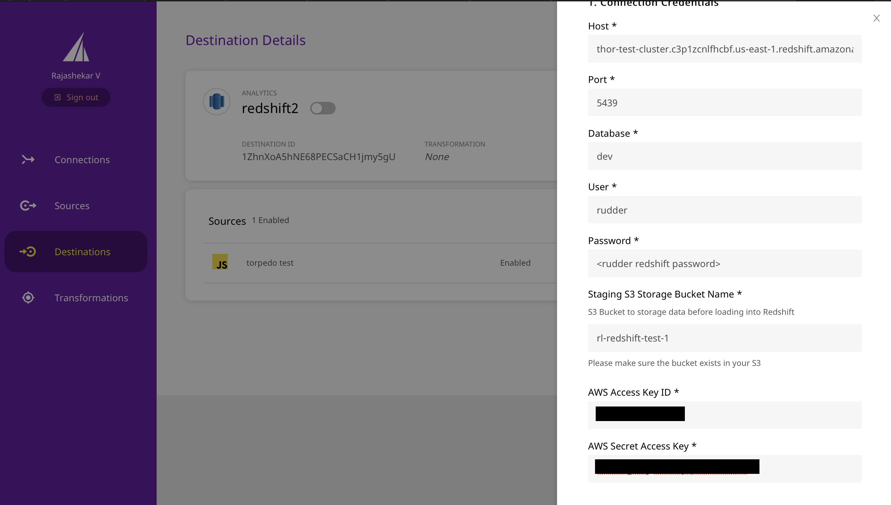

# Amazon Redshift

Amazon Redshift is the world's fastest cloud data warehouse. It allows you to handle large analytical workloads with best-in-class performance, speed, and efficiency. With Redshift, you don't have to worry about the scale of your data or the cost of running queries on them.

You can integrate RudderStack with Redshift seamlessly and store your customer event data into it, from the source of your choice.

<div class="infoBlock">

Please check our <a href="https://rudderstack.com/docs/data-warehouse-integrations/warehouse-schemas">Warehouse Schemas</a> guide to know how events are mapped to the tables in Redshift.

</div>

<div class="successBlock">

  **Find the open-source transformer code for this destination in our <a href="https://github.com/rudderlabs/rudder-transformer/tree/master/v0/destinations/rs">GitHub repo</a>.**
</div>

## Setting Up a Redshift Cluster

Before adding Redshift as a destination in RudderStack, it is recommended that you create a new Redshift cluster depending on the type of instance needed. The following sections give you step-by-step instructions on how to do so.

### Choosing the type of Redshift instance

Amazon Redshift provides two types of clusters: **Dense Compute** and **Dense Storage** clusters

- **Dense Compute** clusters maximize CPU usage, resulting in an increase in query performance. However, there is a trade-off with respect to the storage.
- **Dense Storage** clusters maximize storage for customers with hundreds of millions of rows of data. However, there is a trade-off in the CPU usage, resulting in a lower query performance.

<div class="infoBlock">

Please refer to <a href="https://docs.aws.amazon.com/redshift/latest/mgmt/working-with-clusters.html#working-with-clusters-overview">this article</a> to read more about the cluster and node types in Amazon Redshift.

</div>

### Creating a new Redshift cluster

Please follow the steps below in order to create a new Redshift cluster:

- Open the Redshift Console as shown:

<span class="imageTitle">Redshift Console</span>

- Click on the **Create Cluster** option as shown:


- Enter the cluster details**.** First, fill in the **Cluster identifier** and choose the instance type as shown:

<span class="imageTitle">Redshift cluster configuration settings</span>

- Enter the number of nodes for your cluster. This will primarily depend on the amount of data you expect to work with.


- Enter the database name, and create the admin user with the name of your choice.


<div class="warningBlock">

For security purposes, we recommend that you choose a strong password.

</div>

- Finish creating the cluster by allowing the default options for **Additional Configurations**.

<div class="infoBlock">

As a part of this setup, we will also have to edit the VPC network and configure the security settings. We will cover these aspects in the <a href="https://rudderstack.com/docs/data-warehouse-integrations/amazon-redshift">Connecting RudderStack to Redshift</a> section.

</div>

With the Redshift cluster now created and ready to use, the next section covers the necessary steps to configure Redshift as a destination in RudderStack.

## Connecting RudderStack to Redshift

The following sections describe creating a database user, setting up the network and security, as well as configuring Redshift in the RudderStack dashboard.

### Creating a Database User

<div class="infoBlock">

The username and password we provided earlier while creating the Redshift cluster should be strictly used for administration purposes. We will create a different user to enable RudderStack access to Redshift. This also helps us keep the queries separate as well as maintain an audit log.

</div>

- Click on the **Editor** option visible in the left pane. You can run the queries to create a new user to access the Redshift cluster in the **Query editor**, as shown in the image below:


- The queries to create a new user are:

```sql
-- create a user named "rudder" RudderStack can use to access Redshift
CREATE USER rudder PASSWORD '<password goes here>';

-- granting schema creation permission to the "rudder" user on the database you chose earlier
GRANT CREATE ON DATABASE "<database name goes here>" TO "rudder";
```

- Log into the Redshift cluster with the newly created user credentials.

<div class="infoBlock">

The newly created user credentials should be used while configuring Redshift as a destination, in the RudderStack dashboard.

</div>

### Setting up network and security access

The Redshift cluster needs to whitelist the RudderStack IPs to enable network access to it.
<div class="successBlock">

This section is listed for **EC2-VPC**. However, **EC2-Classic** works similarly.
</div>

The IPs to be whitelisted are listed below:

- 3.216.35.97
- 34.198.90.241
- 54.147.40.62
- 23.20.96.9
- 18.214.35.254
- 35.83.226.133
- 52.41.61.208
- 44.227.140.138
- 54.245.141.180

The EU cluster IPs are listed below:

- 3.66.99.198
- 3.64.201.167

<div class="infoBlock">

All the outbound traffic is routed through these RudderStack IPs.
</div>

Follow these steps to add a security group and assign it to your Redshift cluster:

- Go to EC2 from the services on AWS console, as shown:


- Go to **Security Groups** under **Network & Security** and click on **Create Security Group**.


- Enter the details of the security group. The **Security group name** will be used to select the group later.


- Add an **Inbound rule** with IPs listed above, and enter the Redshift port as `5439` in the **Port range** field, as shown:


- Next, go to the Redshift cluster and select **Properties**, where you can modify the network and security rules of the cluster.


- Edit the **Network and security** option, and choose the VPC security group you selected earlier.


- Click on **Modify cluster** to finish the **Network and Security** setup.


### Configuring Redshift as a destination in RudderStack

In order to enable RudderStack to send data to Redshift, you will first need to add Redshift as a destination to the source from which you are sending the events.

To do so, please follow these steps:

- Choose a source to which you would like to add Redshift as a destination. You can also simply create the destination and connect it to a source later.

<div class="infoBlock">

Please follow our <a href="https://rudderstack.com/docs/connections/adding-source-and-destination-rudderstack/">Adding a Source and Destination</a> guide to know how to add a source in RudderStack.

</div>

- Once you have set up the source, select **Redshift** from the list of destinations. Give your destination a name, and then click on **Next**. You will then see the following **Connection Credentials** screen:

<span class="imageTitle">Connection Settings for adding Redshift as a destination in RudderStack</span>

- Enter the details of the cluster you have created in the [Setting Up a Redshift Cluster](https://rudderstack.com/docs/data-warehouse-integrations/amazon-redshift/#setting-up-a-redshift-cluster) section. You will also need to create a S3 bucket to which the data will be dumped.
- You will also need to enter the AWS Access Key ID and AWS Secret Access Key. you can avoid this by setting up permission for your S3 bucket by following [this guide](https://rudderstack.com/docs/data-warehouse-integrations/amazon-redshift/#s3-permissions).

<div class="infoBlock">

You can read more about creating a S3 bucket in <a href="https://docs.aws.amazon.com/AmazonS3/latest/gsg/CreatingABucket.html">this article</a>.

</div>

That's it! You have successfully added Redshift as a destination in RudderStack. Once you start sending events from your source, RudderStack will dump them into the specified S3 bucket periodically.

## S3 Permissions

The alternative to providing AWS credentials for S3 access, is to set up permissions on your bucket as per the below steps

### RudderStack-hosted Data Plane

You need to edit your bucket policy to allow RudderStack to write to your bucket with the following JSON:

```jsx
{
  "Version": "2012-10-17",
  "Statement": [
    {
      "Effect": "Allow",
      "Principal": {
        "AWS": "arn:aws:iam::422074288268:user/s3-copy"
      },
      "Action": [
        "s3:GetObject",
        "s3:PutObject",
        "s3:PutObjectAcl",
        "s3:ListBucket"
      ],
      "Resource": [
        "arn:aws:s3:::YOUR_BUCKET_NAME/*",
        "arn:aws:s3:::YOUR_BUCKET_NAME"
      ]
    }
  ]
}
```

### Self-hosted Data Plane

1. Create an IAM policy with the following JSON:

```javascript
{
  "Version": "2012-10-17",
  "Statement": [
    {
      "Effect": "Allow",
      "Action": "*",
      "Resource": "arn:aws:s3:::*"
    }
  ]
}
```

2. Create an IAM user with programmatic access keys and attach the above created IAM policy. Copy the ARN of this user.

3. Edit your bucket policy to allow the data plane to write to your bucket with the following JSON. Make sure you edit the account id and user ARN with your AWS Account ID and the above created user ARN:

```javascript
{
  "Version": "2012-10-17",
  "Statement": [
    {
      "Effect": "Allow",
      "Principal": {
        "AWS": "arn:aws:iam::ACCOUNT_ID:user/USER_ARN"
      },
      "Action": [
        "s3:GetObject",
        "s3:PutObject",
        "s3:PutObjectAcl",
        "s3:ListBucket"
      ],
      "Resource": [
        "arn:aws:s3:::YOUR_BUCKET_NAME/*",
        "arn:aws:s3:::YOUR_BUCKET_NAME"
      ]
    }
  ]
}
```

4. Add the programmatic access credentials to the environment of your data plane.

```bash
RUDDER_AWS_S3_COPY_USER_ACCESS_KEY_ID=<above created user access key>
RUDDER_AWS_S3_COPY_USER_ACCESS_KEY=<above created user access key secret>
```

## Column Compression Encoding

Compression encoding specifies the type of compression that is applied to a column of data values as rows are added to a table. Redshift automatically assigns [compression encoding](https://docs.aws.amazon.com/redshift/latest/dg/c_Compression_encodings.html) if not specified. We explicitly set [runlength](https://docs.aws.amazon.com/redshift/latest/dg/c_Runlength_encoding.html) encoding for boolean columns.

## FAQs

### How are reserved words handled?

There are some limitations when it comes to using [reserved words](http://docs.aws.amazon.com/redshift/latest/dg/r_pg_keywords.html) in a schema, table, or column names. If such words are used in event names, traits or properties, they will be prefixed with a `_`when RudderStack creates tables or columns for them in your schema.

Besides, integers are not allowed at the start of the schema or table name. Hence, such schema, column or table names will be prefixed with a `_`.

For instance, `'25dollarpurchase`' will be changed to `'_25dollarpurchase`'.

## Contact Us

If you come across any issues while configuring Redshift with RudderStack, please feel free to [contact us](mailto:%20docs@rudderstack.com) or start a conversation in our [Slack](https://rudderstack.com/join-rudderstack-slack-community) community. We will be happy to help you.
