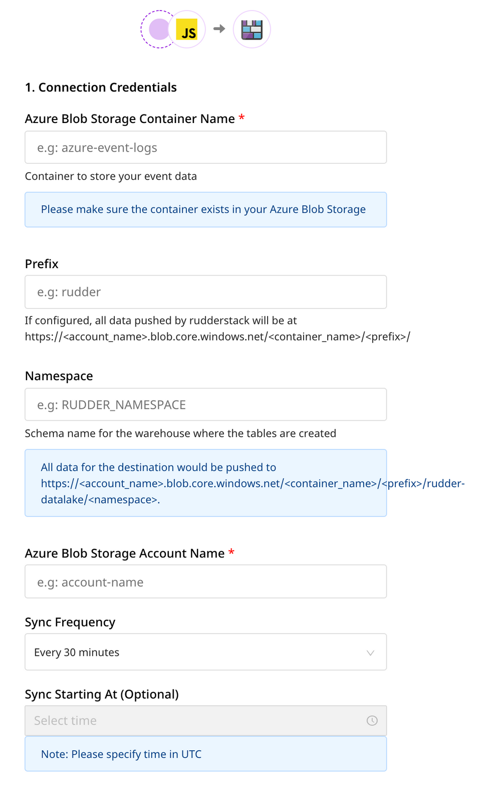

# Azure Data Lake

[Azure Data Lake](https://azure.microsoft.com/en-in/solutions/data-lake/) is Microsoft's secure and scalable data lake functionality that lets you store data of varying sizes and complexity and facilitates fast, cross-platform data processing and analytics.

RudderStack lets you configure Azure data lake as a destination to which you can send your event data seamlessly.

Refer to the <a href="https://rudderstack.com/docs/data-warehouse-integrations/warehouse-schemas/">Warehouse Schemas</a> guide for more information on how the events are mapped to the tables in the Azure data lake.

Find the open source transformer code for this destination in the <a href="https://github.com/rudderlabs/rudder-transformer/tree/master/v0/destinations/azure_datalake">GitHub repository</a>.

## Configuring Azure data lake destination in RudderStack

To send event data to Azure data lake, you first need to add it as a destination in RudderStack and connect it to your data source. Once the destination is enabled, events will automatically start flowing to Azure data lake via RudderStack.

To configure Azure data lake as a destination in RudderStack, follow these steps:

1. In your [RudderStack dashboard](https://app.rudderstack.com), set up the data source. Then, select **Azure Data Lake** from the list of destinations.

Refer to the <a href="https://rudderstack.com/docs/connections/adding-source-and-destination-rudderstack/">Adding a Source and Destination in RudderStack</a> guide for more information.

2. Assign a name to your destination and then click on **Next**.

### Connection settings

Enter the following credentials in the **Connection Credentials** page:
    - **Azure Blob Storage Container Name**: The name of the Azure container used to store the data before loading it into the data lake.
    - **Prefix**: If specified, RudderStack will create a folder in the bucket with this prefix and push all the data within that folder. For example, `https://<account_name>.blob.core.windows.net/<container_name>/<prefix>/`
    - **Namespace**: If specified, all the data for the destination will be pushed to `https://<account_name>.blob.core.windows.net/<bucketName>/<prefix>/rudder-datalake/<namespace>`. If you don't specify a namespace in the settings, RudderStack sets it to the source name, by default.
    - **Azure Blob Storage Account Name**:Your Azure Blob Storage account name.
    - **Azure Blob Storage Account Key**: Your Azure Blob Storage account key.
    - **Sync Frequency**: Specify how often RudderStack should sync the data to your Azure data lake.
    - **Sync Starting At**: This optional setting lets you specify the particular time of the day (in UTC) when you want RudderStack to sync the data to the warehouse.

For more information on setting up your Azure Blob Storage account, refer to the <a href="https://rudderstack.com/docs/destinations/storage-platforms/microsoft-azure-blob-storage/#setting-up-azure-blob-storage">Azure Blob Storage</a> guide.

## Finding your data in the Azure data lake

RudderStack converts your events into Parquet files and dumps them into the configured Azure bucket. Before dumping the events, RudderStack groups the files by the event name based on the time (in UTC) they were received. 

The folder structure is similar to the following format:

`https://<account_name>.blob.core.windows.net/<prefix>/rudder-datalake/<namespace>/<tableName>/YYYY/MM/DD/HH`

As specified in the [Connnection settings](#connection-settings) section above:

* `<prefix>` is the Azure prefix used while configuring the Azure data lake destination in RudderStack. If not specified, RudderStack will omit this value.
* `<namespace>` is the namespace specified in the destination settings. If not specified, RudderStack sets it to the source name.
* `<tableName>` is set to the event name.
* `YYYY`, `MM`, `DD`, and `HH` are replaced by the actual time values.

A combination of the <code class="inline-code">YYYY</code>, <code class="inline-code">MM</code>, <code class="inline-code">DD</code>, and <code class="inline-code">HH</code> values represents the UTC time.

### Use case

Suppose that RudderStack tracks the following two events:

| Event Name             | Timestamp                                        |
| :-------------------| :----------------------------------|
| Product Purchased | `"2019-10-12T08:40:50.52Z" UTC` |
| Cart Viewed             | `"2019-11-12T09:34:50.52Z" UTC`  |

RudderStack then converts these events into Parquet files and dumps them into the following folders:

| Event Name             | Folder Location  |
| :-------------------| :----------------|
| Product Purchased | `https://<account_name>.blob.core.windows.net/<prefix>/rudder-datalake/<namespace>/product_purchased/2019/10/12/08` |
| Cart Viewed             | `https://<account_name>.blob.core.windows.net/<prefix>/rudder-datalake/<namespace>/cart_viewed/2019/11/12/09`              |

## IPs to be whitelisted

To enable network access to RudderStack, you will need to whitelist the following RudderStack IPs:

- 3.216.35.97
- 34.198.90.241
- 54.147.40.62
- 23.20.96.9
- 18.214.35.254
- 35.83.226.133
- 52.41.61.208
- 44.227.140.138
- 54.245.141.180
- 3.66.99.198
- 3.64.201.167

If you have your deployment in the EU region, you can whitelist only the following two IPs:
<ul>
<li>3.66.99.198</li>
<li>3.64.201.167</li>
</ul>

All the outbound traffic is routed through these RudderStack IPs.

## Contact us

If you come across any issues while setting up using the Azure data lake destination, you can [contact us](mailto:%20docs@rudderstack.com) or start a conversation in our [Slack](https://rudderstack.com/join-rudderstack-slack-community) community.
