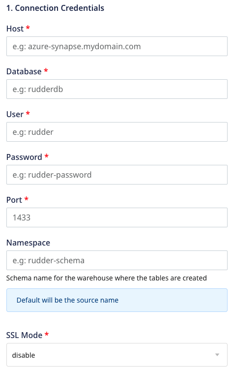
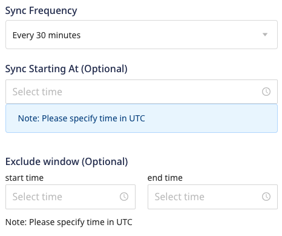

# Azure Synapse

[**Azure Synapse Analytics**](https://azure.microsoft.com/en-in/services/synapse-analytics/) is an analytics service that combines data warehousing capabilities with Big Data analytics. If offers a unified data engineering platform to ingest, explore, manage, and serve your data for analytics and Business Intelligence. You can query data on your own terms, using either serverless or dedicated computing resources based on your requirements.

RudderStack lets you configure Azure Synapse as a destination to which you can send your event data seamlessly.

Please check our <a href="https://rudderstack.com/docs/data-warehouse-integrations/warehouse-schemas">Warehouse Schemas</a> guide to know how events are mapped to the tables in Azure Synapse.

  **Find the open-source transformer code for this destination in our <a href="https://github.com/rudderlabs/rudder-transformer/tree/master/v0/destinations/azure_synapse">GitHub repo</a>.**

## Setting Up a Azure Synapse Analytics User

To set up an Azure Synapse Analytics user, you will need to have an Azure subscription for the [**SQL Data Warehouse**](https://docs.microsoft.com/en-us/azure/synapse-analytics/sql-data-warehouse/create-data-warehouse-portal)

## Configuring Azure Synapse in RudderStack

In order to send events to Azure Synapse, you will first need to add it as a destination in RudderStack and connect it to your data source. Once the destination is enabled, the tracked source data will automatically start flowing to Azure Synapse via RudderStack.

To configure Azure Synapse as a destination, follow these steps:

- Configure your data source in RudderStack if you haven't already.

  Please follow our <a href="https://rudderstack.com/docs/connections/adding-source-and-destination-rudderstack/">Adding a Source and Destination</a> guide to know how to add a source in RudderStack.

- After choosing a source, click on the **Add Destination** button and select **Azure Synapse** from the list of destinations.
- Assign a name to your destination and then click on **Next**.

### Connection settings

- Enter the following credentials in the **Connection Settings**:
  - **Host -** Enter the host name of your Azure Synapse service.
  - **Database -** The database name in your Azure Synapse instance where the data is to be sent goes here.
  - **User** - Enter the user name which has the required read/write access to the above database.
  - **Port** - Enter the port number associated with the Azure Synapse database instance.
  - **Password** - The password for the above user goes here.
  - **SSL Mode** - Enter the SSL modes for connecting to your Azure Synapse instance.

  You can also set the <strong>Sync Frequency</strong> to set the frequency of
  the data import into your SQL Server database. Optionally, you can also
  specify the time when you want this synchronization to start, by choosing the
  time under the <strong>Sync Starting At</strong> option.

### Configuring the object storage

RudderStack lets you configure the following object storage configuration settings while setting up your Azure Synapse destination:

  - **Use RudderStack-managed object storage**: Enable this setting to use RudderStack-managed buckets for object storage.

This option is applicable only for RudderStack-hosted data planes. For self-hosted data planes, you will have to specify your own object storage configuration settings.

 - **Choose your storage provider**: If **Use RudderStack-managed object storage** is disabled in the dashboard, you can select the cloud provider for your object storage and enter the relevant settings.

   - [Amazon S3 bucket storage settings](https://www.rudderstack.com/docs/destinations/storage-platforms/amazon-s3/#setting-up-amazon-s3)
   - [Azure Blob Storage settings](https://www.rudderstack.com/docs/destinations/storage-platforms/microsoft-azure-blob-storage/#setting-up-azure-blob-storage)
   - [Google Cloud Storage bucket settings](https://www.rudderstack.com/docs/destinations/storage-platforms/google-cloud-storage/#setting-up-google-cloud-storage)
   - [MinIO bucket storage settings](https://www.rudderstack.com/docs/destinations/storage-platforms/minio/#setting-up-minio)

## Setting up network access

You will need to whitelist the following RudderStack IPs to enable network access:

- 3.216.35.97
- 34.198.90.241
- 54.147.40.62
- 23.20.96.9
- 18.214.35.254
- 35.83.226.133
- 52.41.61.208
- 44.227.140.138
- 54.245.141.180
- 3.66.99.198
- 3.64.201.167

If you have your deployment in the EU region, you can whitelist only the following two IPs:
<ul>
<li>3.66.99.198</li>
<li>3.64.201.167</li>
</ul>

All the outbound traffic is routed through these RudderStack IPs.

## FAQs

### **How are reserved words handled by RudderStack?**

There are some limitations when it comes to using [**reserved words**](https://docs.microsoft.com/en-us/sql/t-sql/language-elements/reserved-keywords-transact-sql?view=sql-server-ver15) in a schema, table, or column names. If such words are used as event names, traits or properties, they will be prefixed with a `_` when RudderStack creates tables or columns for them in your schema.

Also, note that integers are not allowed at the start of the schema or table name. Hence, RudderStack prefixes such schema, column or table names with a `_`.

For instance, `'25dollarpurchase'` will be changed by RudderStack to `'_25dollarpurchase`'.

### How does RudderStack handle cases when loading the data into Azure Synapse?

RudderStack converts the event keys into lower case before exporting the data into Azure Synapse, so that it does not create two tables if the event name has two different cases.

## Contact Us

If you come across any issues while configuring Azure Synapse with RudderStack, please feel free to [**contact us**](mailto:%20docs@rudderstack.com) or start a conversation in our [**Slack**](https://rudderstack.com/join-rudderstack-slack-community) community. We will be happy to help you.
