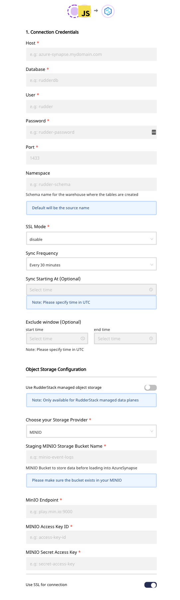

# Azure Synapse

[**Azure Synapse Analytics**](https://azure.microsoft.com/en-in/services/synapse-analytics/) is an analytics service that combines data warehousing capabilities with Big Data analytics. If offers a unified data engineering platform to ingest, explore, manage, and serve your data for analytics and Business Intelligence. You can query data on your own terms, using either serverless or dedicated computing resources based on your requirements.

RudderStack lets you configure Azure Synapse as a destination to which you can send your event data seamlessly.

Please check our <a href="https://rudderstack.com/docs/data-warehouse-integrations/warehouse-schemas">Warehouse Schemas</a> guide to know how events are mapped to the tables in Azure Synapse.

  **Find the open-source transformer code for this destination in our <a href="https://github.com/rudderlabs/rudder-transformer/tree/master/v0/destinations/azure_synapse">GitHub repo</a>.**

## Setting Up a Azure Synapse Analytics User

To set up an Azure Synapse Analytics user, you will need to have an Azure subscription for the [**SQL Data Warehouse**](https://docs.microsoft.com/en-us/azure/synapse-analytics/sql-data-warehouse/create-data-warehouse-portal)

## Configuring Azure Synapse in RudderStack

In order to send events to Azure Synapse, you will first need to add it as a destination in RudderStack and connect it to your data source. Once the destination is enabled, the tracked source data will automatically start flowing to Azure Synapse via RudderStack.

To configure Azure Synapse as a destination, follow these steps:

- Configure your data source in RudderStack if you haven't already.

  Please follow our <a href="https://rudderstack.com/docs/connections/adding-source-and-destination-rudderstack/">Adding a Source and Destination</a> guide to know how to add a source in RudderStack.

- After choosing a source, click on the **Add Destination** button and select **Azure Synapse** from the list of destinations.
- Assign a name to your destination and then click on **Next**. You should then see the following screen:

- Enter the following credentials in the **Connection Settings**:
  - **Host -** Enter the host name of your Azure Synapse service.
  - **Database -** The database name in your Azure Synapse instance where the data is to be sent goes here.
  - **User** - Enter the user name which has the required read/write access to the above database.
  - **Port** - Enter the port number associated with the Azure Synapse database instance.
  - **Password** - The password for the above user goes here.
  - **SSL Mode** - Enter the SSL modes for connecting to your Azure Synapse instance.
  - **Bucket Provider** - Select the intermediate storage for storing the staging files. RudderStack currently supports Amazon S3, MinIO, Google Cloud Storage, and Azure Blob Storage.

  You can also set the **Sync Frequency** to set the frequency of
  the data import into your Azure Synapse database. Optionally, you can also
  specify the time when you want this synchronization to start, by choosing the
  time under the **Sync Starting At** option.

## FAQs

### **How are reserved words handled by RudderStack?**

There are some limitations when it comes to using [**reserved words**](https://docs.microsoft.com/en-us/sql/t-sql/language-elements/reserved-keywords-transact-sql?view=sql-server-ver15) in a schema, table, or column names. If such words are used as event names, traits or properties, they will be prefixed with a `_` when RudderStack creates tables or columns for them in your schema.

Also, note that integers are not allowed at the start of the schema or table name. Hence, RudderStack prefixes such schema, column or table names with a `_`.

For instance, `'25dollarpurchase'` will be changed by RudderStack to `'_25dollarpurchase`'.

### How does RudderStack handle cases when loading the data into Azure Synapse?

RudderStack converts the event keys into lower case before exporting the data into Azure Synapse, so that it does not create two tables if the event name has two different cases.

## Contact Us

If you come across any issues while configuring Azure Synapse with RudderStack, please feel free to [**contact us**](mailto:%20docs@rudderstack.com) or start a conversation in our [**Slack**](https://rudderstack.com/join-rudderstack-slack-community) community. We will be happy to help you.
