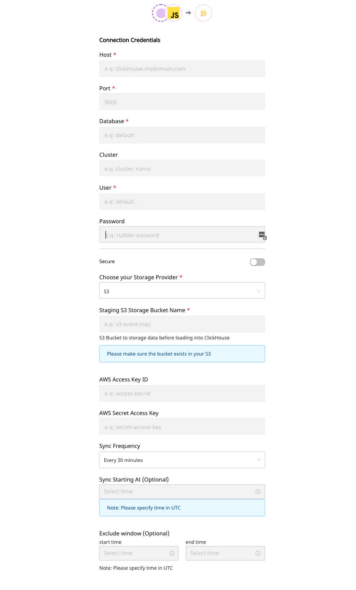

# ClickHouse

[ClickHouse](https://clickhouse.tech/) is an open-source, column-oriented database management system mainly used for online analytical processing \(OLAP\). It is fast, and allows for real-time analysis of your data. ClickHouse was originally developed by Yandex, the Russian IT company, for the Yandex Metrica web analytics service. ClickHouse is highly scalable, and built for high performance.

You can now integrate RudderStack with ClickHouse seamlessly and store your customer event data into it, from the source of your choice.

<div class="infoBlock">

Please check our <a href="https://rudderstack.com/docs/data-warehouse-integrations/warehouse-schemas/">Warehouse Schemas</a> guide to know how events are mapped to the tables in ClickHouse.

</div>

<div class="successBlock">

  **Find the open-source transformer code for this destination in our <a href="https://github.com/rudderlabs/rudder-transformer/tree/master/v0/destinations/clickhouse">GitHub repo</a>.**
</div>

## Setting ClickHouse Permissions

You to need to set `date_time_input_format` to `best_effort` for ClickHouse to parse all the [ISO 8601](https://en.wikipedia.org/wiki/ISO_8601) date and time formats. For example, `'2018-06-08T01:02:03.000Z'`.

```bash
set date_time_input_format = 'best_effort';
```

<div class="infoBlock">

We use <code class="inline-code">UInt8</code> datatype to set Boolean values and map <code class="inline-code">UInt8</code>to Boolean internally. So when we fetch schema from ClickHouse, we treat <code class="inline-code">UInt8</code> as Boolean.

</div>

<div class="infoBlock">

Make sure your ClickHouse User has read access to <code class="inline-code">system.columns</code> table for fetching table schema's

</div>

<div class="warningBlock">

If you are creating tables in the same database where RudderStack loads, we highly recommend not using <code class="inline-code">UInt8</code>as a datatype except for boolean values (0,1).

</div>

## Setting up network access

You will need to whitelist the following RudderStack IPs to enable network access:

- 3.216.35.97
- 34.198.90.241
- 54.147.40.62
- 23.20.96.9
- 18.214.35.254

The EU cluster IPs are listed below:

- 3.66.99.198
- 3.64.201.167

<div class="infoBlock">

All the outbound traffic is routed through these RudderStack IPs.
</div>

## Configuring ClickHouse in RudderStack

In order to enable dumping data to ClickHouse, you will first need to add it as a destination to the source from which you are sending the event data. Once the destination is enabled, events from RudderStack will automatically start to flow to ClickHouse.

To configure ClickHouse as a destination, please follow these steps:

- Choose a source to which you would like to add ClickHouse as a destination. You can also simply create a destination and connect it to a source later.

<div class="infoBlock">

Please follow our <a href="https://rudderstack.com/docs/connections/adding-source-and-destination-rudderstack/">Adding a Source and Destination</a> guide to know how to add a source in RudderStack.

</div>

- After choosing a source, select **ClickHouse** from the list of destinations.
- Give your destination a name and then click on **Next**. You should then see the following screen:



- Add the required credentials in the **Connection Settings** as mentioned below:
  - **Host** - The host name of your ClickHouse Database.
  - **Port** - The TCP port of your ClickHouse Host. ex: 9000. if you want the connection to be secure use TCP secure port 9440. [reference](https://clickhouse.tech/docs/en/operations/server-configuration-parameters/settings/#server_configuration_parameters-tcp_port)
  - **Database -** The database name in your ClickHouse instance where the data gets loaded.
  - **Cluster** - The name of your ClickHouse cluster _**Please note: Leave this blank if you are running a single host ClickHouse Cluster**_
  - **User** - The username which has the required read/write access to the above database.
  - **Password** - The password for the above user.
  - **Secure** - To establish secure connection.
  - **Skip verify** - To skip certificate verification. if you are using self-signed certificates, set this field `true`
  - **CA certificate** - Certificate which needs to be verified while establishing a secure connection. Add the certificate contents to the text input
  - **Bucket Provider** - Intermediate storage for storing staging files. Currently, we support S3, MinIO, Google Cloud Storage, and Azure Blob Storage.

## FAQs

### **How do we de-dupe events that are loaded into the warehouse?**

We create tables with engine `ReplacingMergeTree order by (received_at, id)` and column `dataType` as `Nullable(dataType)`.[`ReplacingMergeTree`](https://clickhouse.tech/docs/en/engines/table-engines/mergetree-family/replacingmergetree/) replaces the latest event which has the same `received_at, id` while merging. `Nullable` is not applicable for `sortKeys`.

### How do we merge user properties in the user's table?

For the user's table, we create a table with an engine `AggregatingMergeTree` order by `id` and column `dataType` as `SimpleAggregateFunction(anyLast, Nullable(dataType))`. Merging the columns with the same`id`picks the last value which is not null. `Nullable` is not applicable for `sortKeys`.

### How does RudderStack handle cases when loading data into ClickHouse?

RudderStack converts the event keys into the lower case before exporting the data into ClickHouse. This is so that it does not create two tables in case the event name has two different cases.

## Contact Us

If you come across any issues while configuring ClickHouse with RudderStack, please feel free to [contact us](mailto:%20docs@rudderstack.com) or start a conversation in our [Slack](https://rudderstack.com/join-rudderstack-slack-community) community. We will be happy to help you.
