# Databricks Delta Lake

[**Delta Lake**](https://databricks.com/product/delta-lake-on-databricks) is a popular data lake used for both streaming and batch operations. It lets you store structured, unstructured, and semi-structured data securely and reliably. With features such as support for ACID transactions, scalable metadata management, and schema enforcement, Delta Lake enables you to scale and deliver real-time data insights and analytics directly via your data lake. 

RudderStack supports Delta Lake as a destination to which you can securely send your data.

<div class="infoBlock">

Find the open-source transformer code for this destination in our <a href="https://github.com/rudderlabs/rudder-transformer/blob/feat_delta_lakes/v0/destinations/deltalake/transform.js">GitHub repository</a>.
</div>

Before configuring Delta Lake as a destination in RudderStack, we highly recommend going through the following sections in the exact order to grant RudderStack and Databricks the necessary permissions to your S3 bucket.

## Step 1: Granting RudderStack access to your Amazon S3 bucket

This section contains the steps to edit your S3 bucket policy to grant RudderStack the necessary permissions.

### For RudderStack Cloud

If you are using RudderStack Cloud, edit your bucket policy using the following JSON:

```json
{
  "Version": "2012-10-17",
  "Statement": [{
    "Effect": "Allow",
    "Principal": {
      "AWS": "arn:aws:iam::422074288268:user/s3-copy"
    },
    "Action": [
      "s3:GetObject",
      "s3:PutObject",
      "s3:PutObjectAcl",
      "s3:ListBucket"
    ],
    "Resource": [
      "arn:aws:s3:::YOUR_BUCKET_NAME/*",
      "arn:aws:s3:::YOUR_BUCKET_NAME"
    ]
  }]
}
```

<div class="infoBlock">

Make sure you replace <code class="inline-code">YOUR_BUCKET_NAME</code> with the name of your S3 bucket.
</div>

### For self-hosted RudderStack

If you are  [**self-hosting RudderStack**](https://rudderstack.com/docs/get-started/installing-and-setting-up-rudderstack/#what-is-a-data-plane-url-where-do-i-get-it), follow these steps:

* Create an IAM policy with the following JSON:

```json
{
  "Version": "2012-10-17",
  "Statement": [{
    "Effect": "Allow",
    "Action": "*",
    "Resource": "arn:aws:s3:::*"
  }]
}
```

* Then, create an [**IAM user with programmatic access**](https://docs.aws.amazon.com/IAM/latest/UserGuide/id_users_create.html). Attach the above IAM policy to this user. 

<div class="infoBlock">

Copy the ARN of this newly-created user. This is required in the next step.
</div>

* Next, edit your bucket policy with the following JSON to allow RudderStack to write to your S3 bucket.

```json
{
  "Version": "2012-10-17",
  "Statement": [{
    "Effect": "Allow",
    "Principal": {
      "AWS": "arn:aws:iam::ACCOUNT_ID:user/USER_ARN"
    },
    "Action": [
      "s3:GetObject",
      "s3:PutObject",
      "s3:PutObjectAcl",
      "s3:ListBucket"
    ],
    "Resource": [
      "arn:aws:s3:::YOUR_BUCKET_NAME/*",
      "arn:aws:s3:::YOUR_BUCKET_NAME"
    ]
  }]
}
```
<div class="infoBlock">

Make sure you replace <code class="inline-code">USER_ARN</code> with the ARN copied in the previous step. Also, replace <code class="inline-code">ACCOUNT_ID</code> with your AWS account ID and <code class="inline-code">YOUR_BUCKET_NAME</code> with the name of your S3 bucket.
</div>

* Finally, add the programmatic access credentials to the `env` file present in your RudderStack installation, as shown:

```
RUDDER_AWS_S3_COPY_USER_ACCESS_KEY_ID=<user_access_key>
RUDDER_AWS_S3_COPY_USER_ACCESS_KEY=<user_access_key_secret>
```

## Step 2: Granting Databricks access to your Amazon S3 staging bucket

In this step, you will configure your AWS account to [**create an instance profile**](https://docs.databricks.com/administration-guide/cloud-configurations/aws/instance-profiles.html) which will be attached with the cluster later. Follow these steps in the exact order:

1.  [**Create an instance profile to access the S3 bucket**](https://docs.databricks.com/administration-guide/cloud-configurations/aws/instance-profiles.html#step-1-create-an-instance-profile-to-access-an-s3-bucket)

2. [**Create a bucket policy for the target S3 bucket**](https://docs.databricks.com/administration-guide/cloud-configurations/aws/instance-profiles.html#step-2-create-a-bucket-policy-for-the-target-s3-bucket)

3. [**Note the IAM role used to create the Databricks deployment**](https://docs.databricks.com/administration-guide/cloud-configurations/aws/instance-profiles.html#step-3-note-the-iam-role-used-to-create-the-databricks-deployment)

4. [**Add the S3 IAM role to the EC2 policy**](https://docs.databricks.com/administration-guide/cloud-configurations/aws/instance-profiles.html#step-4-add-the-s3-iam-role-to-the-ec2-policy)

5. [**Add the instance profile to Databricks**](https://docs.databricks.com/administration-guide/cloud-configurations/aws/instance-profiles.html#step-5-add-the-instance-profile-to-databricks)

## Step 3: Creating a new Databricks cluster

To create a new Databricks cluster, follow these steps:

* Sign into your Databricks account. Then, click on the **Compute** option on the dashboard, as shown:

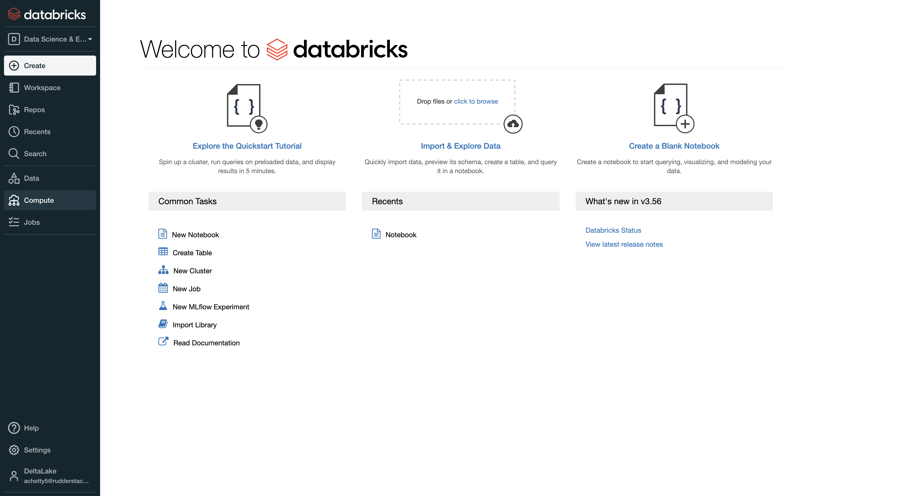

* Click on the **Create Cluster** option.

* Next, enter the cluster details. Fill in the **Cluster Name**, as shown:

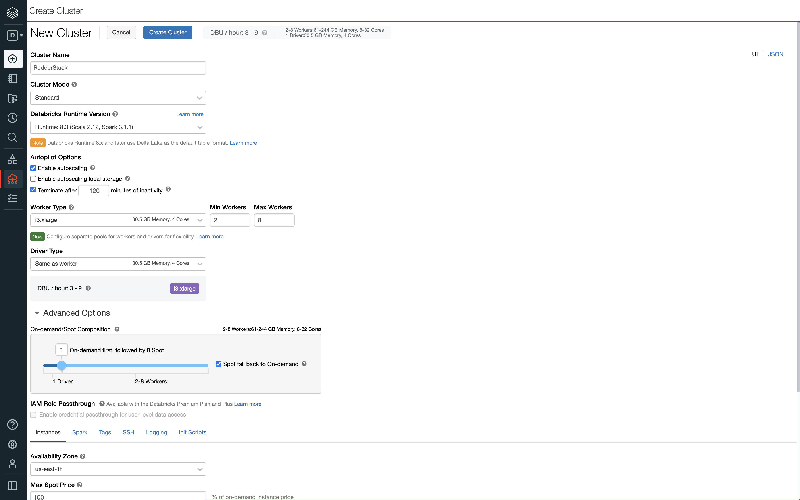

* Select the **Cluster Mode** depending on your use-case. The following image highlights the three cluster modes:

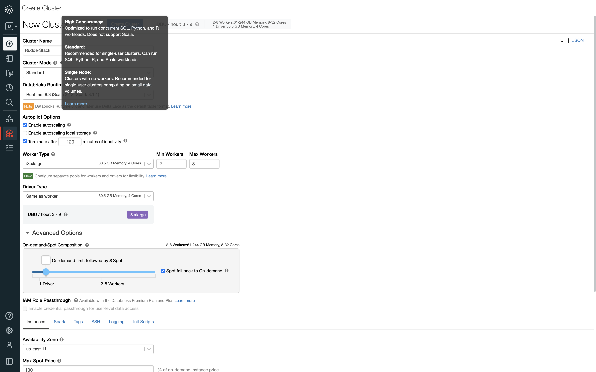

* Then, select the **Databricks Runtime Version** as **8.3** or higher, as shown:


* Configure the rest of the settings as per your requirement.

* In the **Advanced Options** section, configure the **Instances** field as shown in the following image:

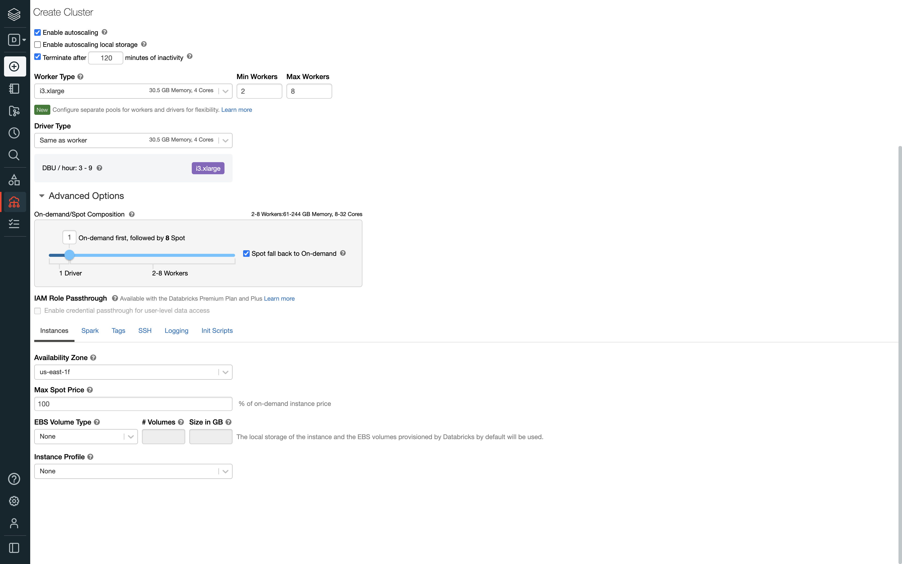

* In the **Instance Profile** dropdown menu, select the Databricks instance profile that you added to your account in the previous step.

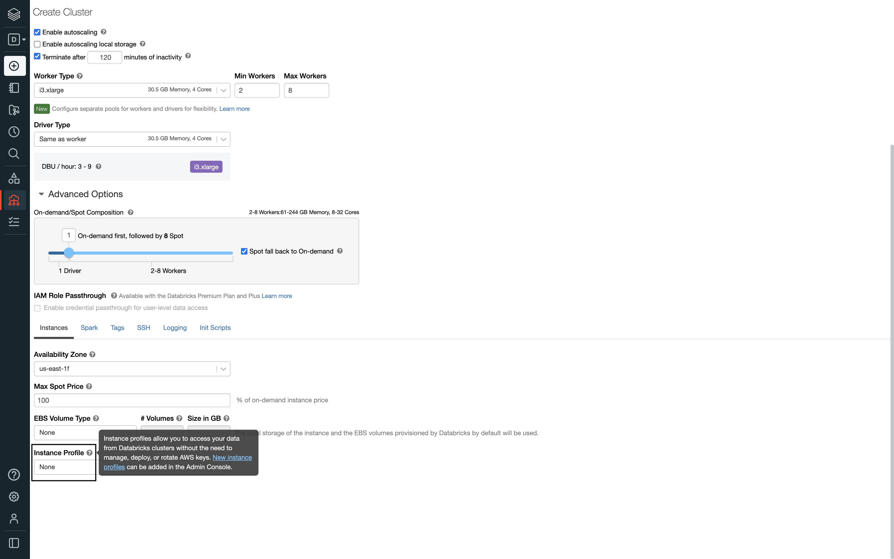

* Finally, click on the **Create Cluster** button to complete the configuration and create the Databricks cluster.

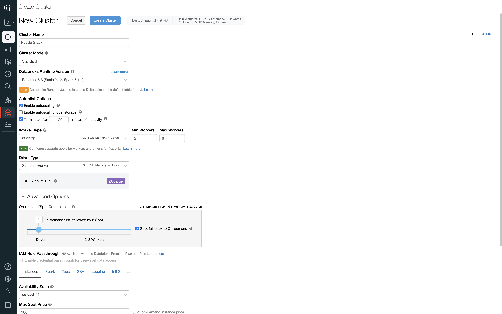


## Step 4: Obtaining the JDBC/ODBC configuration

Follow these steps to get the JDBC/ODBC configuration:

* In your Databricks dashboard, click on the **Compute** option, as shown:


* Then, select the cluster you created in the previous section.

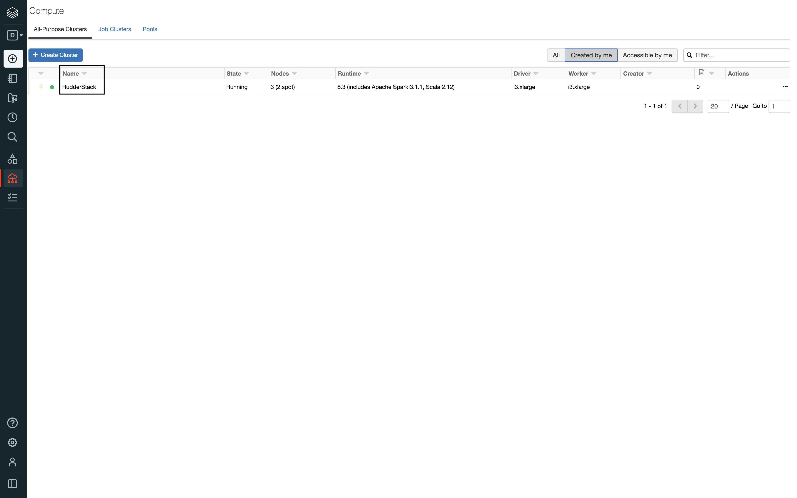

* In the **Advanced Options** section, select the **JDBC/ODBC** field and copy the **Server Hostname**, **Port**, and **HTTP Path** values, as shown:

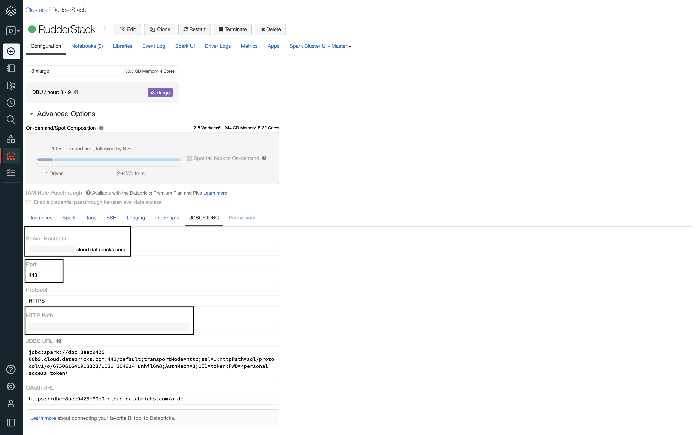

<div class="infoBlock">

The <strong>Server Hostname</strong>, <strong>Port</strong>, and <strong>HTTP Path</strong> values are required to configure Delta Lake as a destination in RudderStack.
</div>

## Step 5: Generating the Databricks access token

To generate the Databricks access token, follow these steps:

* In your Databricks dashboard, go to **Settings** and click on **User Settings**, as shown:

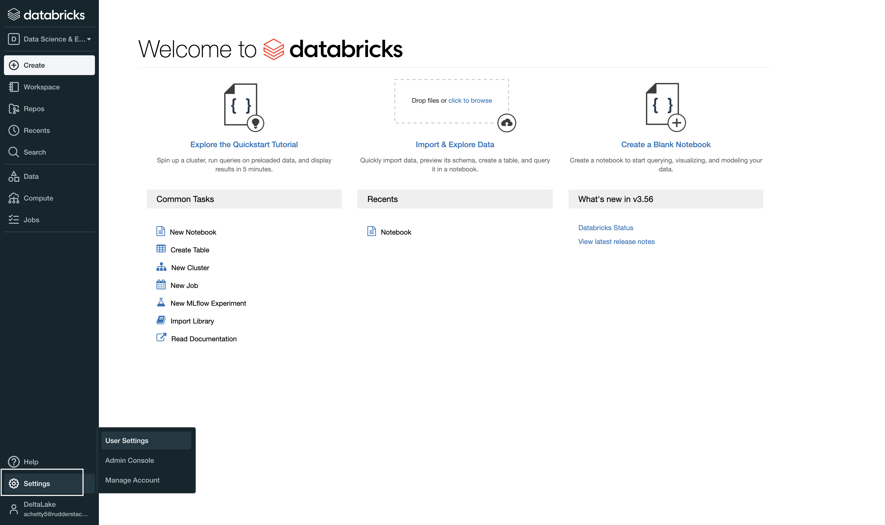

* Then, go to the **Access Tokens** section and click on **Generate New Token**, as shown:

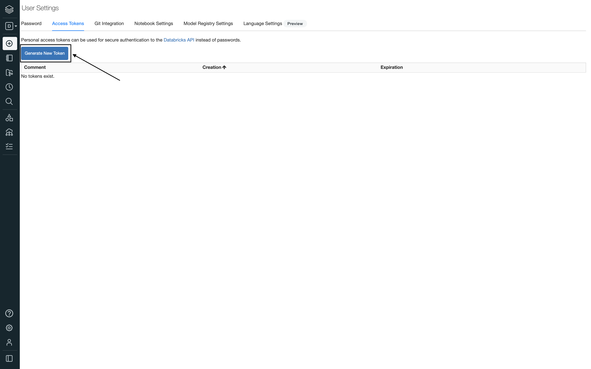

* Enter your comment in the Comment field and click on **Generate**, as shown:

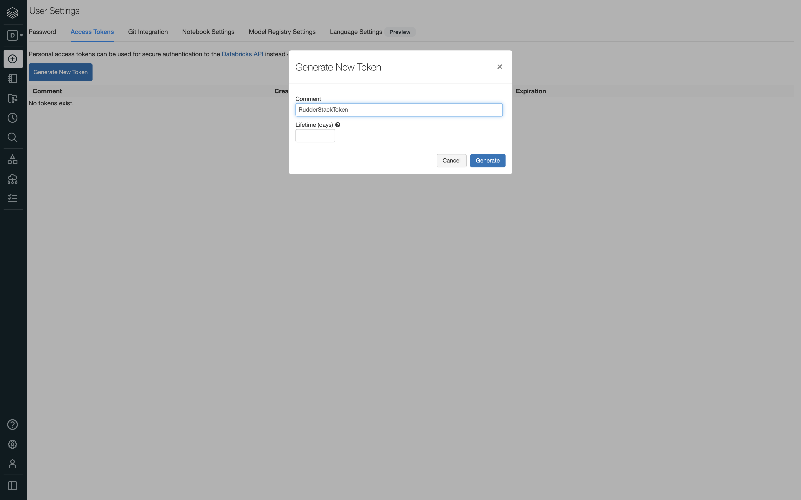

<div class="warningBlock">

Keep the <strong>Lifetime (days)</strong> field blank. If you enter a number, your access token will expire after that number of days.
</div>

* Finally, copy the access token as it will be used during the Delta Lake destination setup in RudderStack.


## Setting up the Delta Lake destination in RudderStack

To start sending data to Delta Lake, you will first need to add it as a destination in RudderStack and connect it to a data source. Follow these steps to configure Delta Lake as a destination in RudderStack:

* From your [**RudderStack dashboard**](https://app.rudderstack.com/), configure the data source. Then, select **Delta Lake** from the list of destinations.

<div class="infoBlock">

Refer to the <a href="https://rudderstack.com/docs/connections/adding-source-and-destination-rudderstack//">Adding a Source and Destination in RudderStack</a> guide for more information.
</div>

* Assign a name to your destination and click on **Next**. You should then see the following **Connection Settings** screen:

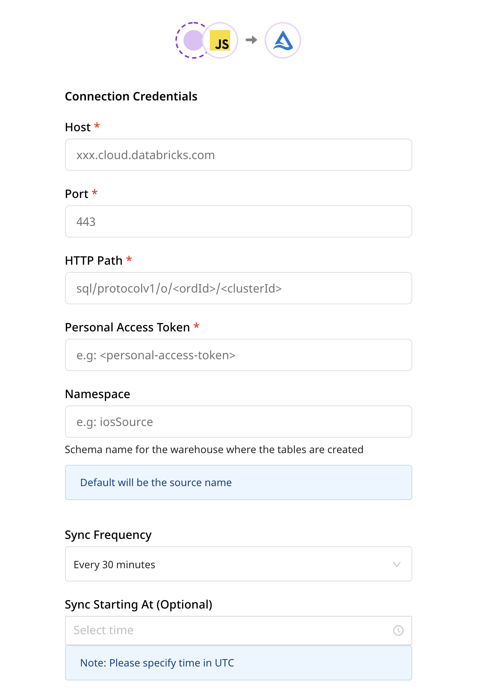
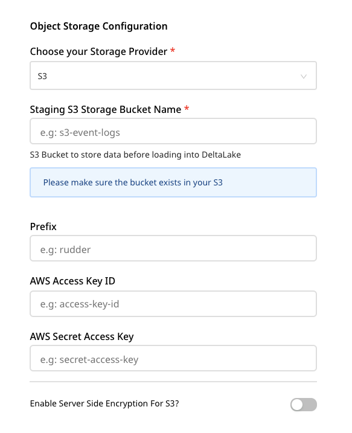

### Connection settings

Add the following credentials in the **Connection Settings** to successfully configure Delta Lake as a destination:

* **Host**: Enter the server hostname you copied in the [**Obtaining the JDBC/ODBC configuration**](https://rudderstack.com/docs/data-warehouse-integrations/delta-lake/#obtaining-the-jdbc-odbc-configuration) section above.

* **Port**: Enter the port which you copied in the [**Obtaining the JDBC/ODBC configuration**](https://rudderstack.com/docs/data-warehouse-integrations/delta-lake/#obtaining-the-jdbc-odbc-configuration) section above.

* **HTTP Path**: Enter the HTTP path which you copied in the [**Obtaining the JDBC/ODBC configuration**](https://rudderstack.com/docs/data-warehouse-integrations/delta-lake/#obtaining-the-jdbc-odbc-configuration) section above.

* **Personal Access Token**: Enter your access token obtained in the [**Generating the Databricks access token**](https://rudderstack.com/docs/data-warehouse-integrations/delta-lake/#generating-the-databricks-access-token) section above.

* **Namespace**: Enter the the name of the schema where RudderStack will create the tables.

<div class="infoBlock">

If you don't specify a namespace in the settings, RudderStack will set it to the source name.
</div>

* **Sync Frequency**: Specify the frequency at which RudderStack should sync the data.

* **Sync Starting At**: This optional setting lets you set a specific time of the day (in UTC) when RudderStack performs the sync.

* **Exclude Window**: This optional setting lets you specify the time window (in UTC) when RudderStack will **skip** the data sync.

* **Staging S3 Storage Bucket Name**: Enter your S3 bucket name in this field.

* **AWS Access Key ID**: Enter the access key ID from your AWS console. For more information, refer to this [**AWS guide**](https://docs.aws.amazon.com/general/latest/gr/aws-sec-cred-types.html).

* **AWS Secret Access Key**: Enter the secret access key from your AWS console. For more information, refer to this [**AWS guide**](https://docs.aws.amazon.com/general/latest/gr/aws-sec-cred-types.html).

* **Enable Server Side Encryption for S3**: You can enable this setting to enable server-side encryption for S3. Finally, click on **Next** to complete the configuration. 

## FAQs

### How does RudderStack handle the reserved words in a column, table, or schema?

There are some limitations when it comes to using reserved words as a schema, table, or column name. If such words are used in event names, traits or properties, they will be prefixed with a `_` when RudderStack creates tables or columns for them in your schema.

Also, integers are **not** allowed at the start of a schema or table name. Hence, such schema, column, or table names will be prefixed with a `_`. For example, `'25dollarpurchase'` will be changed to `'_25dollarpurchase'`.

## Contact us

For queries on any of the sections covered in this guide, you can [**contact us**](mailto:%20docs@rudderstack.com) or start a conversation on our [**Slack**](https://rudderstack.com/join-rudderstack-slack-community) channel.