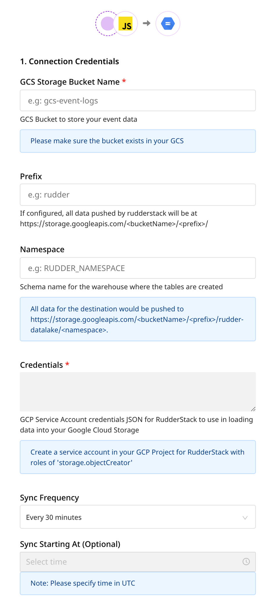

# Google Cloud Storage Data Lake

The [Google Cloud Storage (GCS) data lake](https://cloud.google.com/architecture/build-a-data-lake-on-gcp) leverages [Google Cloud Storage](https://cloud.google.com/storage) for storing and accessing your data in the GCP infrastructure. It offers state-of-the-art performance and scalability, along with ensuring the security and privacy of your data.

RudderStack lets you configure GCS data lake as a destination to which you can send your event data seamlessly.

## Setting user permissions in GCS data lake

To set up GCS data lake as a destination in RudderStack, you will need to create a new user role and grant the required permissions to create schemas and temporary tables.

### Creating the role and adding permissions

1. Go to the [Google Cloud IAM Admin console](https://console.cloud.google.com/iam-admin/roles) and click on **CREATE ROLE**.
2. Then, fill in the details as shown:


3. Fill the details and click on **ADD PERMISSIONS**.
4. Under **Filter permissions by role**, select **Storage Object Admin** and grant the required permissions:


5. The permission required to successfully use the GCS data lake destination is shown:

```
storage.objects.create
```
6. Then, click on **CREATE**. This will successfully create the role.

### Creating the service account and attaching the role

1. Go to the **Service Accounts** option in the [Google Cloud IAM Admin console](https://console.cloud.google.com/iam-admin/serviceaccounts).
2. Then, select the project containing the dataset that you want to use.
3. Next, click on **CREATE SERVICE ACCOUNT**.
4. Fill in the details as shown below and click on **CREATE**.


5. Then, select the previously created role and click on **CONTINUE**.


6. Finally, click on **DONE**.

### Creating and downloading the JSON key

1. Click on the three dots under **Actions** in the service account that you just created and select **Manage keys**, as shown:


2. Click on **ADD KEY**, followed by **Create new key**, as shown:


3. In the resulting pop-up, select **JSON** and click on **CREATE**.


4. Finally, download this JSON file. This file is required while setting up the GCS data lake destination in RudderStack.

## Configuring GCS data lake destination in RudderStack

To send event data to GCS data lake, you first need to add it as a destination in RudderStack and connect it to your data source. Once the destination is enabled, events will automatically start flowing to GCS data lake via RudderStack.

To configure GCS data lake as a destination in RudderStack, follow these steps:

1. In your [RudderStack dashboard](https://app.rudderstack.com), set up the data source. Then, select **Google Cloud Storage Data Lake** from the list of destinations.

<div class="infoBlock">

Refer to the <a href="https://rudderstack.com/docs/connections/adding-source-and-destination-rudderstack/">Adding a Source and Destination in RudderStack</a> guide for more information.
</div>

2. Assign a name to your destination and then click on **Next**.

### Connection settings



Enter the following credentials in the **Connection Credentials** page:
    - **GCS Storage Bucket Name**: The name of the GCS bucket used to store data before loading it into the GCS data lake.
    - **Prefix**: If specified, RudderStack will create a folder in the bucket with this prefix and push all the data within that folder. For example, `https://storage.googleapis.com/<bucketName>/<prefix>/`.
    - **Namespace**: If specified, all the data for the destination will be pushed to `https://storage.googleapis.com/<bucketName>/<prefix>/rudder-datalake/<namespace>`. If you don't specify a namespace in the settings, RudderStack sets it to the source name, by default.
    - **Credentials**: Enter the content of the downloaded credentials JSON file in this field.
    - **Sync Frequency**: Specify how often RudderStack should sync the data to your GCS data lake.
    - **Sync Starting At**: This optional setting lets you specify the particular time of the day (in UTC) when you want RudderStack to sync the data to the data lake.

## Finding your data in the GCS data lake

RudderStack converts your events into Parquet files and dumps them into the configured GCS bucket. Before dumping the events, RudderStack groups the files by the event name based on the time (in UTC) they were received. 

The folder structure is similar to the following format:

```
https://storage.googleapis.com/<bucketName>/<prefix>/rudder-datalake/<namespace>/<tableName>/YYYY/MM/DD/HH
```

As specified in the [Connnection settings](#connection-settings) section above:

* `<prefix>` is the GCS prefix used while configuring the GCS data lake destination in RudderStack. If not specified, RudderStack will omit this value.
* `<namespace>` is the namespace specified in the destination settings. If not specified, RudderStack sets it to the source name.
* `<tableName>` is set to the event name.
* `YYYY`, `MM`, `DD`, and `HH` are replaced by the actual time values.

<div class="infoBlock">

A combination of the `YYYY`, `MM`, `DD`, and `HH` values represents the UTC time.
</div>

### Use case

Suppose that RudderStack tracks the following two events:

| Event Name             | Timestamp                                        |
| :-------------------| :----------------------------------|
| Product Purchased | `"2019-10-12T08:40:50.52Z" UTC` |
| Cart Viewed             | `"2019-11-12T09:34:50.52Z" UTC`  |

RudderStack then converts these events into Parquet files and dumps them into the following folders:

| Event Name             | Folder Location  |
| :-------------------| :----------------|
| Product Purchased | `https://storage.googleapis.com/<bucketName>/<prefix>/rudder-datalake/<namespace>/product_purchased/2019/10/12/08` |
| Cart Viewed             | `https://storage.googleapis.com/<bucketName>/<prefix>/rudder-datalake/<namespace>/cart_viewed/2019/11/12/09`              |

## IPs to be whitelisted

To enable network access to RudderStack, you will need to whitelist the following RudderStack IPs:

- 3.216.35.97
- 34.198.90.241
- 54.147.40.62
- 23.20.96.9
- 18.214.35.254
- 35.83.226.133
- 52.41.61.208
- 44.227.140.138
- 54.245.141.180
- 3.66.99.198
- 3.64.201.167

<div class="infoBlock">

If you have your deployment in the EU region, you can whitelist only the following two IPs:
<ul>
<li>3.66.99.198</li>
<li>3.64.201.167</li>
</ul>
</div>

<div class="infoBlock">

All the outbound traffic is routed through these RudderStack IPs.
</div>

## Contact us

For queries on any of the sections covered in this guide, you can [contact us](mailto:%20docs@rudderstack.com) or start a conversation in our [Slack](https://rudderstack.com/join-rudderstack-slack-community) community.
