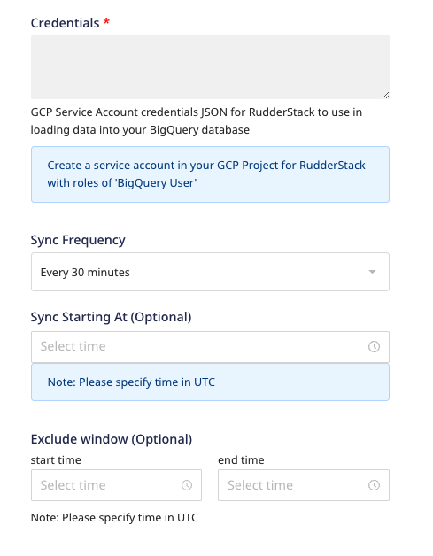

# Google BigQuery

[Google BigQuery](https://cloud.google.com/bigquery) is an industry-leading, fully-managed cloud data warehouse that lets you efficiently store and analyze petabytes of data.

RudderStack lets you configure BigQuery as a destination to which you can send your event data seamlessly.

Refer to the <a href="https://rudderstack.com/docs/data-warehouse-integrations/warehouse-schemas/">Warehouse Schemas</a> guide for more information on how the events are mapped to the tables in BigQuery.

Find the open-source transformer code for this destination in the <a href="https://github.com/rudderlabs/rudder-transformer/tree/master/v0/destinations/bq">GitHub repository</a>.

## Setting up the BigQuery project

Before you set up BigQuery as a destination in RudderStack, follow these steps to set up your BigQuery project:

1. Create a Google Cloud Platform \(**GCP**\) project if you don't have one already. For more details, refer to this [guide](https://cloud.google.com/resource-manager/docs/creating-managing-projects?hl=en&ref_topic=6158848&visit_id=637219216155418807-3094012232&rd=1).
2. Enable the BigQuery API for your existing project if it's not done already. For more information, refer to this [BigQuery guide](https://cloud.google.com/bigquery/docs/quickstarts/quickstart-web-ui).
3. Log into your [BigQuery console](https://console.cloud.google.com/). Copy the project **ID** as shown in the following image:

This project ID is required for configuring BigQuery as a destination in RudderStack.

To enable RudderStack to load data into your BigQuery cluster, make sure that <a href="https://cloud.google.com/billing/docs/how-to/modify-project">billing</a> is enabled for the project.

4. Create a new Google Cloud Storage \(**GCS**\) bucket or provide an existing one to store files before loading the data into your BigQuery instance.

To make sure that the data loads from GCS to BigQuery, co-locate your GCS storage bucket with BigQuery. For more information, refer to the <a href="https://cloud.google.com/bigquery/docs/loading-data-cloud-storage#data-locations">BigQuery documentation</a>.

## Setting up the service account for RudderStack

For RudderStack to successfully send events to your BigQuery instance, you also need to set up a service account with the necessary permissions. 

Make sure that you create the service account for the same BigQuery project.

Follow the steps below to set up a service account:

1. Create a new service account by going to **IAM & Admin** > **Service Accounts**.
2. Add the service account permissions as specified below:
  - Add the `Storage Object Creator` and `Storage Object Viewer` roles to the account.
  - Add the `BigQuery Job User` and `BigQuery Data Owner` roles to the account.

If a dataset name (configurable by the setting: <strong>Namespace</strong> in the RudderStack dashboard) already exists, the role of <strong>BigQuery Data Editor</strong> would suffice instead of <strong>BigQuery Data Owner</strong>.

3. Create a key for the service account with **JSON** as the type and store it.

4. Create and download the private JSON key required for configuring BigQuery as a destination in RudderStack, as shown:

## IPs to be whitelisted

You will need to whitelist the following RudderStack IPs to enable network access:

- 3.216.35.97
- 34.198.90.241
- 54.147.40.62
- 23.20.96.9
- 18.214.35.254
- 35.83.226.133
- 52.41.61.208
- 44.227.140.138
- 54.245.141.180
- 3.66.99.198
- 3.64.201.167

If you have your deployment in the EU region, you can whitelist only the following two IPs:
<ul>
<li>3.66.99.198</li>
<li>3.64.201.167</li>
</ul>

All the outbound traffic is routed through these RudderStack IPs.

## Configuring Google BigQuery destination in RudderStack

To send event data to SQL Server, you first need to add it as a destination in RudderStack and connect it to your data source. Once the destination is enabled, events will automatically start flowing to SQL Server via RudderStack.

To configure SQL Server as a destination in RudderStack, follow these steps:

1. In your [RudderStack dashboard](https://app.rudderstack.com), set up the data source. Then, select **BigQuery** from the list of destinations.

Refer to the <a href="https://rudderstack.com/docs/connections/adding-source-and-destination-rudderstack/">Adding a Source and Destination in RudderStack</a> guide for more information.

2. Assign a name to your destination and then click on **Next**.

### Connection settings

Enter the following credentials in the **Connection Credentials** page:
  - **Project**: The GCP project ID where the BigQuery database is located.
  - **Location**: The GCP region for your dataset.
  - **Staging GCS Storage Bucket Name**: The name of the storage bucket as specified in the [Setting up the BigQuery Project](https://rudderstack.com/docs/data-warehouse-integrations/google-bigquery/#setting-up-the-bigquery-project) section.
  - **Prefix**: If specified, RudderStack creates a folder in the bucket with this prefix and pushes all the data within that folder.
  - **Namespace**: Enter the schema name where RudderStack will create all the tables. If you don't specify any namespace, RudderStack will set this to the source name, by default.
  - **Credentials**: Your GCP service account credentials JSON as created in the [Setting up the service account for RudderStack](#setting-up-the-service-account-for-rudderstack) section.
  - **Sync Frequency**: Specify how often RudderStack should sync the data to your BigQuery dataset.
  - **Sync Starting At**: This optional setting lets you specify the particular time of the day (in UTC) when you want RudderStack to sync the data to BigQuery.
  - **Exclude Window**: This optional setting lets you set a time window when RudderStack will **not sync** the data to your database.

## Schema, partitioned tables, and views

RudderStack uses the source name (written in snake case, for example, `source_name`) to create a dataset in BigQuery.

For more details on the tables and columns created by RudderStack, refer to the <a href="https://rudderstack.com/docs/data-warehouse-integrations/warehouse-schemas/">Warehouse Schema</a> guide.

RudderStack creates ingestion-time partition tables based on the load date, so you can take advantage of it to query a subset of data.

More details on the BigQuery partitioned tables can be found in this <a href="https://cloud.google.com/bigquery/docs/partitioned-tables">BigQuery documentation</a>. Information on how RudderStack creates these tables on load can be found in <a href="https://cloud.google.com/bigquery/docs/creating-partitioned-tables#creating_an_ingestion-time_partitioned_table_when_loading_data">this section</a>.

In addition to tables, a **view** \(`<table_name>_view`\) is created for every table for de-duplication purposes.

More information on views can be found in this <a href="https://cloud.google.com/bigquery/docs/views-intro">BigQuery guide</a>.

It is highly recommended that you use the corresponding view \(containing the events from the last 60 days\) to avoid duplicate events in your query results. Since BigQuery [views](https://cloud.google.com/bigquery/docs/views-intro#view_pricing) are merely logical views and are not cached, you can create a native table from it to save money - by avoiding running the query that defines the view every time.

Users can modify the view query to change the time window of the view. The default value is set to <strong>60 days</strong>.

## FAQs

### How are reserved words handled by RudderStack?

There are some limitations when it comes to using [reserved words](https://cloud.google.com/bigquery/docs/reference/standard-sql/lexical#reserved_keywords) in a schema, table, or column names. If such words are used in event names, traits or properties, they will be prefixed with a `_`when RudderStack creates tables or columns for them in your schema.

Besides, integers are not allowed at the start of the schema or table name. Hence, such schema, column or table names will be prefixed with a `_`.

For instance, `'25dollarpurchase`' will be changed to `'_25dollarpurchase`'.

### When sending data into a data warehouse, how can I change the table where this data is sent?

By default, RudderStack sends the data to the table/dataset based on the source it is connected to. For example, if the source is Google Tag Manager, RudderStack sets the schema name as `gtm_*`. However, you can override this behavior by setting the **Namespace** field in the BigQuery destination settings, as shown:

### I'm looking to send data to BigQuery through RudderStack and I'm trying to understand what data is populated in each column. How do I go about this?

Refer to the [RudderStack Warehouse Schema](https://www.rudderstack.com/docs/data-warehouse-integrations/warehouse-schemas/) documentation for details on how RudderStack generates the schema in the warehouse and populates the data in each column.

### I am trying to load data into my BigQuery destination and I get the error "Cannot read and write in different locations". What should I do?

Make sure that both your BigQuery dataset and the bucket have the same region.

### When piping data to a BigQuery destination, I can set the bucket but not a folder within the bucket. Is there a way to put Rudderstack data in a specific bucket folder?

Yes, you can set the desired folder name in the **Prefix** field while setting up your BigQuery destination in RudderStack.

### Does open source RudderStack support near real-time syncing to BigQuery and event replay?

The near-realtime BigQuery syncing feature is currently under development and is planned to be released in the coming months. Unfortunately, Event Replay is not a part of open-source RudderStack currently.

### What is the current sync frequency for BigQuery?

If you're using open source RudderStack, the minimum sync frequency is **30 minutes**. If you're self-hosting the data plane or using RudderStack Cloud Pro / Enterprise, you can tweak the config to set `uploadFreqInS` in `config.yaml` to `0` and determine the best possible value for near real-time sync.

For more information, refer to this [**FAQ**](https://rudderstack.com/docs/data-warehouse-integrations/warehouse-faqs#is-there-a-way-to-force-my-data-load-into-the-warehouses).

### Do I need to stop the running pipeline to change my sync frequency? Or will the new change be effective even without stopping the pipeline?

To change the sync frequency, you **need not** stop the pipeline.

### When configuring the BigQuery destination, where does Google use the credentials JSON from?

BigQuery uses the credentials JSON from the dashboard configuration when setting up the destination. For more information, refer to the [Setting up the service account for RudderStack](#setting-up-the-service-account-for-rudderstack) section.

### When configuring the BigQuery destination, should the user permissions be set for the specific dataset or the whole project?

You need to set the user permissions for the whole project. Otherwise, you may encounter issues.

### How long are the failed syncs retried before being aborted?

RudderStack retries the failed syncs for up to 3 hours before aborting them. For more information, refer to this  [FAQ](https://rudderstack.com/docs/faqs#1-how-does-rudderstack-handle-retries-for-failed-events-in-case-of-destination-failure).

## Contact us

For queries on any of the sections covered in this guide, you can [contact us](mailto:%20docs@rudderstack.com) or start a conversation in our [Slack](https://rudderstack.com/join-rudderstack-slack-community) community.

