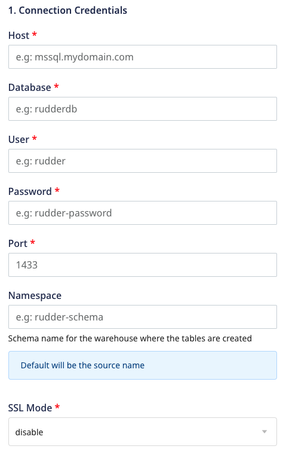
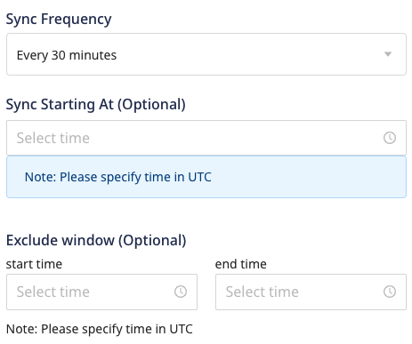

# Microsoft SQL Server

[Microsoft SQL Server](https://www.microsoft.com/en-in/sql-server/sql-server-downloads) is a popular relational database management system (RDBMS). ideal for a variety of data workloads - from small-scale, single-machine data applications to large data applications with thousands of concurrent users.

RudderStack lets you configure Microsoft SQL Server as a destination to which you can send your event data seamlessly.

<div class="infoBlock">

Refer to the <a href="https://rudderstack.com/docs/data-warehouse-integrations/warehouse-schemas/">Warehouse Schemas</a> guide for more information on how the events are mapped to the tables in SQL Server.
</div>

<div class="successBlock">

Find the open source transformer code for this destination in the <a href="https://github.com/rudderlabs/rudder-transformer/tree/master/v0/destinations/mssql">GitHub repository</a>.
</div>

## Setting user permissions in SQL Server

After setting up your SQL Server database, create a user with the necessary privileges to create schemas and temporary tables in this database.

To create a SQL Server instance on Docker, run the following commands:

```bash
docker run -e "ACCEPT_EULA=Y" -e "SA_PASSWORD=Test@123" -p 1433:1433 --name rudder_mssql -h rudder_mssql -d mcr.microsoft.com/mssql/server:2019-latest
```

```bash
docker exec -it rudder_mssql "bash" /opt/mssql-tools/bin/sqlcmd -S localhost -U SA [-P "Test@123"]
```

In the above commands, the user is `SA` (System Admin) and password is `Test@123`.

The following queries let you create a user and grant the above-mentioned privileges \(creating schemas and temporary tables on the database\) to that user:

```sql
CREATE LOGIN testuser WITH PASSWORD = 'Test@123';
CREATE USER testuser FOR LOGIN testuser ;

CREATE DATABASE test_db
USE test_db
-- GRANT individual permissions like this or
GRANT CREATE TABLE TO testuser
-- Provides owner permissions to user
EXEC sp_addrolemember N'db_owner', N'testuser'
```

### Using AWS RDS instance

You can execute the same commands via Azure Studio or using the **sqlcmd** utility (`cmdline sqlcmd`).

## Configuring SQL Server destination in RudderStack

To send event data to SQL Server, you first need to add it as a destination in RudderStack and connect it to your data source. Once the destination is enabled, events will automatically start flowing to SQL Server via RudderStack.

To configure SQL Server as a destination in RudderStack, follow these steps:

1. In your [RudderStack dashboard](https://app.rudderstack.com), set up the data source. Then, select **Microsoft SQL Server** from the list of destinations.

<div class="infoBlock">

Refer to the <a href="https://rudderstack.com/docs/rudderstack-cloud/destinations/#adding-a-destination">Adding a Destination</a> guide for more information.
</div>

2. Assign a name to your destination and then click on **Next**.

### Connection settings




Enter the following credentials in the **Connection Credentials** page:
  - **Host**: The host name of your SQL Server service.
  - **Database**: The database name in your SQL Server instance where the data will be sent.
  - **User**: The name of the user with the required read/write access to the above database.
  - **Password**: The password for the above user.
  - **Port**: The port number associated with the SQL Server database instance.
  - **Namespace**: Enter the schema name where RudderStack will create all the tables. If you don't specify any namespace, RudderStack will set this to the source name, by default.
  - **SSL Mode**: Choose the SSL mode through which RudderStack will connect to your SQL Server instance. RudderStack provides three options - **disable**, **true**, and **false**.
  - **Sync Frequency**: Specify how often RudderStack should sync the data to your SQL Server database.
  - **Sync Starting At**: This optional setting lets you specify the particular time of the day (in UTC) when you want RudderStack to sync the data to the warehouse.
  - **Exclude Window**: This optional setting lets you set a time window when RudderStack will **not sync** the data to your database.

### Configuring the object storage

RudderStack lets you configure the following object storage configuration settings while setting up your Microsoft SQL Server destination:

- **Use RudderStack-managed object storage**: Enable this setting to use RudderStack-managed buckets for object storage.

<div class="warningBlock">

This option is applicable only for RudderStack-hosted data planes. For self-hosted data planes, you will have to specify your own object storage configuration settings.
</div>

- **Choose your storage provider**: If **Use RudderStack-managed object storage** is **disabled** in the dashboard, select the cloud provider for your object storage and enter the relevant settings:

   - [Amazon S3 bucket storage settings](https://www.rudderstack.com/docs/destinations/storage-platforms/amazon-s3/#setting-up-amazon-s3)
   - [Azure Blob Storage settings](https://www.rudderstack.com/docs/destinations/storage-platforms/microsoft-azure-blob-storage/#setting-up-azure-blob-storage)
   - [Google Cloud Storage bucket settings](https://www.rudderstack.com/docs/destinations/storage-platforms/google-cloud-storage/#setting-up-google-cloud-storage)
   - [MinIO bucket storage settings](https://www.rudderstack.com/docs/destinations/storage-platforms/minio/#setting-up-minio)

## IPs to be whitelisted

To enable network access to RudderStack, you will need to whitelist the following RudderStack IPs:

- 3.216.35.97
- 34.198.90.241
- 54.147.40.62
- 23.20.96.9
- 18.214.35.254
- 35.83.226.133
- 52.41.61.208
- 44.227.140.138
- 54.245.141.180
- 3.66.99.198
- 3.64.201.167

<div class="infoBlock">

If you have your deployment in the EU region, you can whitelist only the following two IPs:
<ul>
<li>3.66.99.198</li>
<li>3.64.201.167</li>
</ul>
</div>

<div class="infoBlock">

All the outbound traffic is routed through these RudderStack IPs.
</div>

## FAQ

### How does RudderStack handle cases when loading the data into SQL Server?

RudderStack converts the event keys into lower case before exporting the data into SQL Server, so that it does not create two tables if the event name has two different cases.

### How are reserved words handled by RudderStack?

There are some limitations when it comes to using [reserved words](https://docs.microsoft.com/en-us/sql/t-sql/language-elements/reserved-keywords-transact-sql?view=sql-server-ver15) in a schema, table, or column names. If such words are used as event names, traits or properties, they will be prefixed with a `_` when RudderStack creates tables or columns for them in your schema.

Also, it is important to note that integers are not allowed at the start of the schema or table name. Hence, RudderStack prefixes such schema, column or table names with a `_`.

For instance, `'25dollarpurchase'` will be changed by RudderStack to `'_25dollarpurchase`'.

### What are the SSL mode options provided by RudderStack?

While setting up the SQL Server destination, RudderStack provides the following three SSL options:

- **disable**: The data sent from RudderStack to your database is not encrypted.
- **false**: The data sent from RudderStack to your database is not encrypted beyond the login packet.
- **true**: The data sent from RudderStack to your database is encrypted.

For more information on the above options, refer to this [readme](https://github.com/denisenkom/go-mssqldb#common-parameters) section.

## Contact us

For queries on any of the sections covered in this guide, you can [contact us](mailto:%20docs@rudderstack.com) or start a conversation in our [Slack](https://rudderstack.com/join-rudderstack-slack-community) community.
