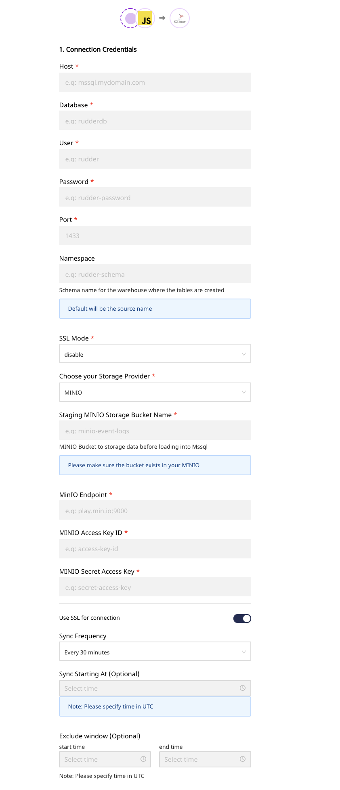

# MSSQL

MS SQL Server is a relational database management system (RDBMS) developed by Microsoft. This product is built for the basic function of storing retrieving data 
as required by other applications. It can be run either on the same computer or on another across a network.Microsoft markets at least a dozen different editions 
of Microsoft SQL Server, aimed at different audiences and for workloads ranging from small single-machine applications to large Internet-facing applications with 
many concurrent users.

RudderStack allows you to configure MSSQL as a destination to which you can dump your event data seamlessly.


Please check our [Warehouse Schemas](https://docs.rudderstack.com/data-warehouse-integration-guides/warehouse-schemas) guide to know how events are mapped to the 
tables in MSSQL.



**Find the open-source transformer code for this destination in our** [**GitHub repo**](https://github.com/rudderlabs/rudder-transformer/tree/master/v0/destinations/mssql)**.**


## Setting up MSSQL

After setting up your MSSQL database, create a user. You should also assign privileges to the created user in order to create schemas and temporary tables on the 
specified database.
For spawning a local MSSQL server:
docker run -e "ACCEPT_EULA=Y" -e "SA_PASSWORD=Test@123" -p 1433:1433 --name rudder_mssql -h rudder_mssql  -d mcr.microsoft.com/mssql/server:2019-latest
//creates a sqlServer instance with below credentials
user : sa (SystemAdmin)
password : Test@123

docker exec -it rudder_mssql "bash"
/opt/mssql-tools/bin/sqlcmd -S localhost -U SA [-P "Test@123"]

Below are the SQL queries that let you create a user, and grant the above-mentioned privileges to that created user:

```text
CREATE LOGIN testuser WITH PASSWORD = 'Test@123';
CREATE USER testuser FOR LOGIN testuser ;

CREATE DATABASE test_db
USE test_db
//GRANT individual permissions like this or
GRANT CREATE TABLE TO testuser
//Provides owner permissions to user
EXEC sp_addrolemember N'db_owner', N'testuser'
```
#Using AWS RDS instance
Execute the same commands above via AzureStudio or cmdline sqlcmd


## Configuring MSSQL in RudderStack

In order to enable dumping data to MSSQL, you will first need to add it as a destination to the source from which you are sending the event data. Once the 
destination is enabled, events from RudderStack will automatically start to flow to MSSQL.

To configure MSSQL as a destination, please follow these steps:

* Choose a source to which you would like to add MSSQL as a destination. You can also simply create a destination and connect it to a source later.


Please follow our [Adding a Source and Destination](https://docs.rudderstack.com/how-to-guides/adding-source-and-destination-rudderstack) guide to know how to 
add a source in RudderStack.


* After choosing a source, select **MSSQL** from the list of destinations.
* Give your destination a name and then click on **Next**. You should then see the following screen:



* Add the required credentials in the **Connection Settings** as mentioned below:
  * **Host -** The host name of your MSSQL service.
  * **Database -** The database name in your MSSQL instance where the data gets loaded.
  * **User** - The username which has the required read/write access to the above database.
  * **Password** - The password for the above user.
  * **SSL Mode** - SSL modes for connecting to your MSSQL instance.
  * **Bucket Provider** - Intermediate storage for storing staging files. Currently we support S3, MinIO, Google Cloud Storage, and Azure Blob Storage.

## FAQs

### **How are reserved words handled by RudderStack?**

There are some limitations when it comes to using [reserved words](https://www.postgresql.org/docs/current/sql-keywords-appendix.html) in a schema, table, or column names. 
If such words are used as event names, traits or properties, they will be prefixed with a `_` when  RudderStack creates tables or columns for them in your schema.

Also, it is important to note that integers are not allowed at the start of the schema or table name. Hence, RudderStack prefixes such schema, column or table names with a `_`.

For instance, `'25dollarpurchase'` will be changed by RudderStack to `'_25dollarpurchase`'.

### How does RudderStack handle cases when loading data into MSSQL?

RudderStack converts the event keys into lower case before exporting the data into MSSQL, so that it does not create two tables if the event name has two different cases.

## Contact Us

If you come across any issues while configuring MSSQL with RudderStack, please feel free to [contact us](mailto:%20docs@rudderstack.com) or start a conversation on 
our [Slack](https://resources.rudderstack.com/join-rudderstack-slack) channel. We will be happy to help you.

