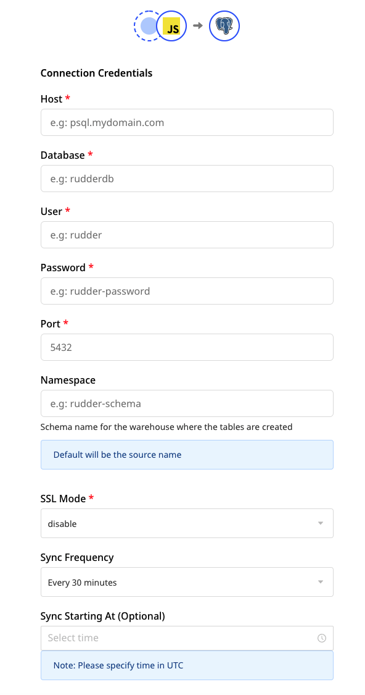
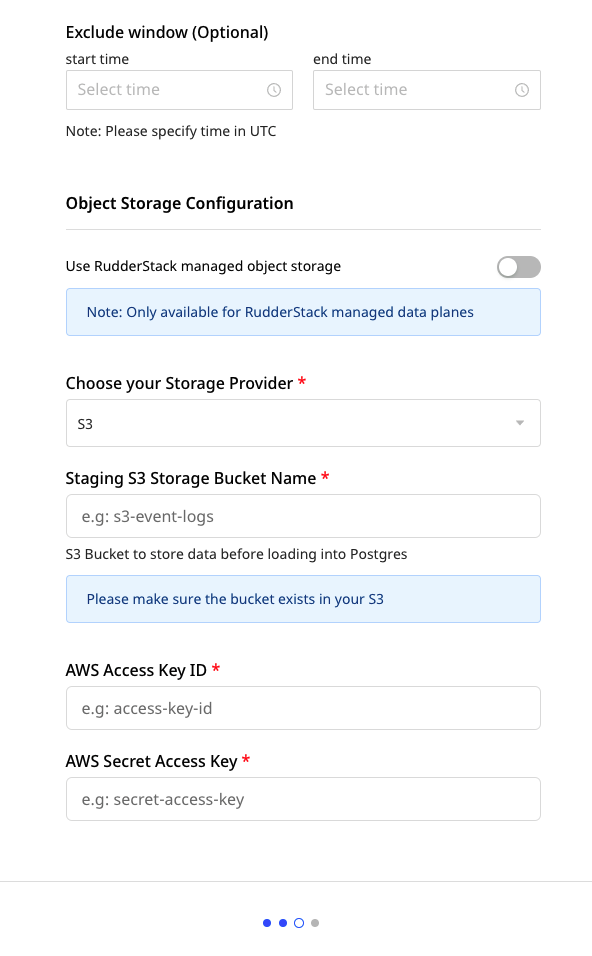
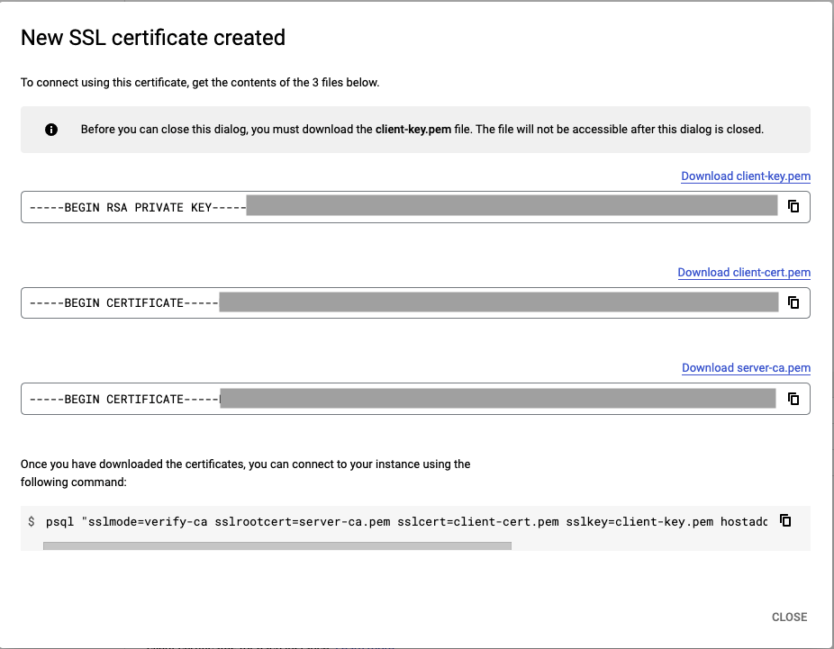
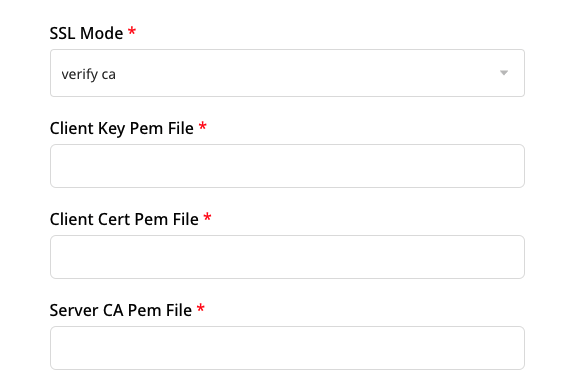

# PostgreSQL

PostgreSQL is an enterprise-grade, open source database management system. It supports both SQL and JSON for relational and non-relational queries respectively. Many companies in the market use PostgreSQL as their low-cost data warehousing solution in order to deliver efficient analytics and user insights.

RudderStack lets you configure PostgreSQL as a destination to which you can seamlessly send your event data.

<div class="infoBlock">

Refer to the <a href="https://rudderstack.com/docs/data-warehouse-integrations/warehouse-schemas/">Warehouse Schemas</a> guide to know how events are mapped to your PostgreSQL tables.
</div>

<div class="successBlock">

Find the open-source transformer code for this destination in this <a href="https://github.com/rudderlabs/rudder-transformer/tree/master/v0/destinations/postgres">GitHub repo</a>.
</div>

## Setting user permissions in PostgreSQL

After setting up your PostgreSQL database, you need to create a new user. This user should have the required permissions for RudderStack to create schemas and temporary tables in the specified database.

Run the following query to create a new user in PostgreSQL:

```sql
CREATE USER <username> WITH PASSWORD '<password>';
```

Run the following query to grant the above user permissions to create new schemas and temporary tables in the database:

```sql
GRANT CREATE, TEMPORARY ON DATABASE <databasename> TO <username>;
```

<div class="warningBlock">

You must grant the <code class="inline-code">CREATE, TEMPORARY</code> privileges to the user. Otherwise, RudderStack will not be able to export the events to PostgreSQL.
</div>

## Setting up network access

You will need to whitelist the following RudderStack IPs to enable network access:

- 3.216.35.97
- 34.198.90.241
- 54.147.40.62
- 23.20.96.9
- 18.214.35.254
- 35.83.226.133
- 52.41.61.208
- 44.227.140.138
- 54.245.141.180
- 3.66.99.198
- 3.64.201.167

<div class="infoBlock">

If your deployment is in the EU region, you can whitelist only the following two IPs:
<ul>
<li>3.66.99.198</li>
<li>3.64.201.167</li>
</ul>
</div>

<div class="infoBlock">

All the outbound traffic is routed through these RudderStack IPs.
</div>

## Configuring PostgreSQL destination in RudderStack

To start sending data to PostgreSQL, you will first need to add it as a destination in RudderStack and connect it to a data source. Once the destination is enabled, the events will automatically start flowing to PostgreSQL.

Follow these steps to configure PostgreSQL as a destination in RudderStack:

- From your [RudderStack dashboard](https://app.rudderstack.com), configure the data source. Then, select **PostgreSQL** from the list of destinations.

<div class="infoBlock">

Refer to the <a href="https://rudderstack.com/docs/connections/adding-source-and-destination-rudderstack/">Adding a Source and Destination in RudderStack</a> guide for more information.
</div>

- Assign a name to your destination and click on **Next**. You should then see the following screen:




### Connection settings

Add the following credentials to set up the PostgreSQL destination:

  - **Host**: Enter the host name of your PostgreSQL service.
  - **Database**: Enter your PostgreSQL database name where RudderStack will load the data.
  - **User**: Enter the name of the user created in the [Setting user permissions in PostgreSQL](#setting-user-permissions-in-postgresql) section above.
  - **Password**: Enter the password you set for the above user.
  - **Port**: Enter the port number associated with your PostgreSQL instance.
  - **Namespace**: Enter the schema name where RudderStack will create all the tables.

  <div class="infoBlock">
  
  If you don't specify any namespace, RudderStack will set this to the source name by default.
  </div>

  - **SSL Mode**: Choose the SSL mode through which RudderStack will connect to your PostgreSQL instance. RudderStack provides three options - **disable**, **require**, and **verify-ca**. For more information on these options, refer to the [SSL Modes](#ssl-modes) section below.
  - **Sync Frequency**: Specify how often RudderStack should sync the data to your PostgreSQL database.
  - **Sync Starting At**: This optional setting lets you specify the particular time of the day (in UTC) when you want RudderStack to sync the data to the warehouse.
  - **Exclude Window**: This optional setting lets you set a time window when RudderStack will not sync the data to your database.

### Configuring the object storage

RudderStack lets you configure the following object storage configuration settings while setting up your PostgreSQL destination:

  - **Use RudderStack-managed object storage**: Enable this setting to use RudderStack-managed buckets for object storage.

<div class="warningBlock">

This option is applicable only for RudderStack-hosted data planes. For self-hosted data planes, you will have to specify your own object storage configuration settings.
</div>

 - **Choose your storage provider**: If **Use RudderStack-managed object storage** is disabled in the dashboard, you can select the cloud provider for your object storage and enter the relevant settings.

 ## SSL modes

 RudderStack lets you specify the SSL mode through which you can send the data to PostgreSQL, based on your security preferences.

RudderStack supports the following three SSL modes defined by PostgreSQL:

| SSL mode | Eavesdropping protection | MITM (Man in the middle) protection | Description |
| :----------| :--------------------------| :------------------------------------|:-------------|
| disable      |  No                                        | No                                                         | SSL mode is disabled. Use it in cases where security is not an issue and you don't want the encryption overhead. |  
| require      | Yes                                        | No                                                         | Use this mode when you want to encrypt your data and can deal with the resulting encryption overhead. |
| verify-ca   | Yes                                        | Dependent on the CA policy              | Use this mode when you want to encrypt your data and bear the encryption overhead, and want to be sure that you connect to a server you trust. |

<div class="infoBlock">

For more information, refer to the <a href="https://www.postgresql.org/docs/9.1/libpq-ssl.html">PostgreSQL SSL Support</a> documentation.
</div>

### Using verify-ca to configure PostgreSQL destination

To use verify-ca as the SSL mode while configuring your PostgreSQL destination, you will need to copy the contents of the following three files from your SSL certificate:

- **Client Key Pem File** 
- **Client Cert Pem File**
- **Server CA Pem File**

<div class="infoBlock">

Although you can use an existing certificate to obtain the above credentials, it is recommend you create a new SSL certificate to avoid any issues.
</div>

The following steps demonstrate how you can create a new SSL certificate in [Google Cloud SQL](https://cloud.google.com/sql/) and obtain the above-mentioned credentials:

1. Go to your PostgreSQL instance in your [Cloud SQL console](https://console.cloud.google.com/sql/).
2. In the left panel, click on **Connections** and go to the **SECURITY** tab.
3. Under **Manage client certificates**, click on **CREATE CLIENT CERTIFICATE**.
4. Assign a unique identifier for your SSL certificate and click on **CREATE**. Your new SSL certificate will be created, as shown:



5. Finally, copy the contents of the three fields and paste it in the RudderStack dashboard settings as seen below:



<div class="infoBlock">

For other cloud providers, this procedure might vary slightly.
</div>

## FAQs

### RudderStack does not create the corresponding PostgreSQL tables when I press on 'sync'. What do I do?

- Firstly, check the status of your data sync in the [RudderStack dashboard](https://app.rudderstack.com/syncs).
- Make sure you have set up the [required user permissions](https://rudderstack.com/docs/data-warehouse-integrations/postgresql#setting-postgresql-user-permissions) for your PostgreSQL instance.
- Check if your database is accessible to RudderStack by [whitelisting the RudderStack IPs](#setting-up-network-access).
- Ensure that all the security group policies are appropriately set.

### How does RudderStack handle reserved words?

There are some limitations when it comes to using [reserved words](https://www.postgresql.org/docs/current/sql-keywords-appendix.html) in a schema, table, or column names. If such words are used as event names, traits or properties, they will be prefixed with a `_` when RudderStack creates tables or columns for them in your schema.

Also, it is important to note that integers are not allowed at the start of the schema or table name. Hence, RudderStack prefixes such schema, column or table names with a `_`.

For instance, `'25dollarpurchase'` will be changed by RudderStack to `'_25dollarpurchase`'.

### How does RudderStack handle cases when loading data into PostgreSQL?

RudderStack converts the event keys into the lower case before exporting the data into PostgreSQL, so that it does not create multiple tables if the event name is written in different cases.

## Contact us

For queries on any of the sections covered in this guide, you can [**contact us**](mailto:%20docs@rudderstack.com) or start a conversation in our [**Slack**](https://rudderstack.com/join-rudderstack-slack-community) community.
