# Amazon S3 Data Lake

Amazon S3 is a popular object storage service used to store both structured and unstructured data. You can leverage S3 to securely and cost-effectively build a data lake of any size or scale. With an S3-powered data lake, you can easily use the native AWS services for data processing, analytics, machine learning, and more.

RudderStack lets you configure S3 data lake as a destination to which you can send your event data seamlessly.

<div class="infoBlock">

Refer to the <a href="https://rudderstack.com/docs/data-warehouse-integrations/warehouse-schemas/">Warehouse Schemas</a> guide for more information on how the events are mapped to the tables in S3 data lake.
</div>

<div class="successBlock">

Find the open source transformer code for this destination in the <a href="https://github.com/rudderlabs/rudder-transformer/tree/master/v0/destinations/s3_datalake">GitHub repository</a>.
</div>

## Configuring S3 Data Lake destination in RudderStack

To send event data to SQL Server, you first need to add it as a destination in RudderStack and connect it to your data source. Once the destination is enabled, events will automatically start flowing to SQL Server via RudderStack.

To configure SQL Server as a destination in RudderStack, follow these steps:

1. In your [RudderStack dashboard](https://app.rudderstack.com), set up the data source. Then, select **S3 Data Lake** from the list of destinations.

<div class="infoBlock">

Refer to the <a href="https://rudderstack.com/docs/connections/adding-source-and-destination-rudderstack/">Adding a Source and Destination in RudderStack</a> guide for more information.
</div>

2. Assign a name to your destination and then click on **Next**.

### Connection settings

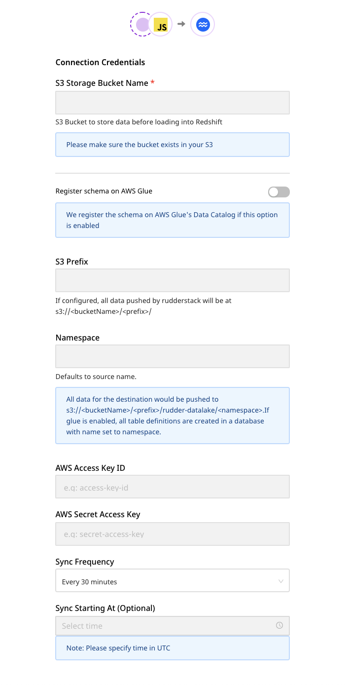

Enter the following credentials in the **Connection Credentials** page:

* **S3 Storage Bucket Name**: The name of the S3 bucket that will be used to store the data before loading it into the S3 data lake. 
* **Register schema on AWS Glue**: If you enable this option, RudderStack registers the schema of your incoming data on AWS Glue's data catalog.

<div class="infoBlock">

For more information on registering your schema in AWS Glue, refer to the <a href="https://docs.aws.amazon.com/glue/latest/dg/schema-registry.html">AWS Glue documentation</a>.
</div>

* **AWS Glue Region**: Your AWS Glue region. For example, for `N.Virginia`, it would be `us-east-1`.
* **S3 Prefix**: If specified, RudderStack creates a folder in the bucket with this prefix and push all the data within that folder. 
* **Namespace**: If specified, all the data for the destination will be pushed to `s3://<bucketName>/<prefix>/rudder-datalake/<namespace>`. If you don't specify a namespace in the settings, it is set to the source name, by default.

<div class="infoBlock">

If AWS Glue is enabled, all the table definitions are created in a database with the name set to this namespace.
</div>

* **AWS Access Key ID**: Your AWS access key ID. 
* **AWS Secret Access Key**: Your AWS secret access key.

<div class="warningBlock">

Make sure the above credentials (<strong>Access Key ID</strong> and <strong>Secret Access Key</strong>) have the permissions to read and write into the configured bucket.
</div>

<div class="warningBlock">
 If AWS Glue is enabled, make sure that the following permissions are granted to it:
<ul>
<li>glue:CreateTable</li>
<li>glue:UpdateTable</li>
<li>glue:CreateDatabase</li>
<li>glue:GetTables</li>
</ul>
</div>

### Finding your data in S3 data lake

RudderStack converts your events into Parquet files and dumps them to the configured S3 bucket. Before dumping the events, RudderStack groups them by the event name based on the time \(UTC\) they were received. 

The folder structure is shown below:

```
s3://<bucketName>/<prefix>/rudder-datalake/<namespace>/<tableName>/YYYY/MM/DD/HH
```

As mentioned in the [Connection Settings](#connection-settings) section:

* `prefix`: This is the S3 prefix in the destination settings. If not specified, RudderStack will omit this value. 
* `namespace`: The namespace specified in the destination settings. If not specified, RudderStack sets this field to the source name by default.
* `tableName`: RudderStack sets this to the event name.

**`YYYY`**, **`MM`**, **`DD`**, and **`HH`** are replaced by actual time values. A combination of these values represents the UTC time.

Suppose that RudderStack tracks the following two events:

| Event name | Timestamp |
| :--- | :--- |
| `Product Purchased` | `"2019-10-12T08:40:50.52Z" UTC` |
| `Cart Viewed` | `"2019-11-12T09:34:50.52Z" UTC` |

RudderStack will convert these events into Parquet files and dump them into the following folders:

| Event Name | Folder Location |
| :--- | :--- |
| `Product Purchased` | `s3://<bucketName>/<prefix>/rudder-datalake/<namespace>/product_purchased/2019/10/12/08` |
| `Cart Viewed` | `s3://<bucketName>/<prefix>/rudder-datalake/<namespace>/cart_viewed/2019/11/12/09` |

<div class="infoBlock">

If AWS Glue is enabled, all the table definitions are created in a database with the name set to the namespace specified in the destination settings.
</div>

## Creating a crawler

<div class="warningBlock">

 Refer to this section <strong>only</strong> if you haven't enabled the <strong>Register Schema on AWS Glue</strong> setting while configuring the S3 data lake destination in RudderStack.
</div>

In the absence of AWS Glue, you can create a crawler to go through your data and create table definitions out of it. 

Follow these steps to create a crawler:

1. Go to your AWS Glue console and select **Crawler** from the left pane. 
2. Select **Add Crawler**. 
3. Specify a name for your crawler and click **Next**, as shown:

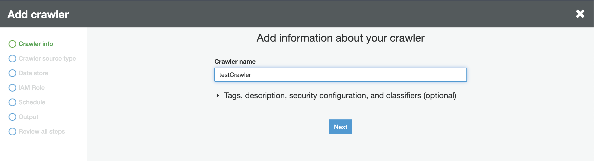

* Next, under the **Crawler source type** section, choose **Data stores**.

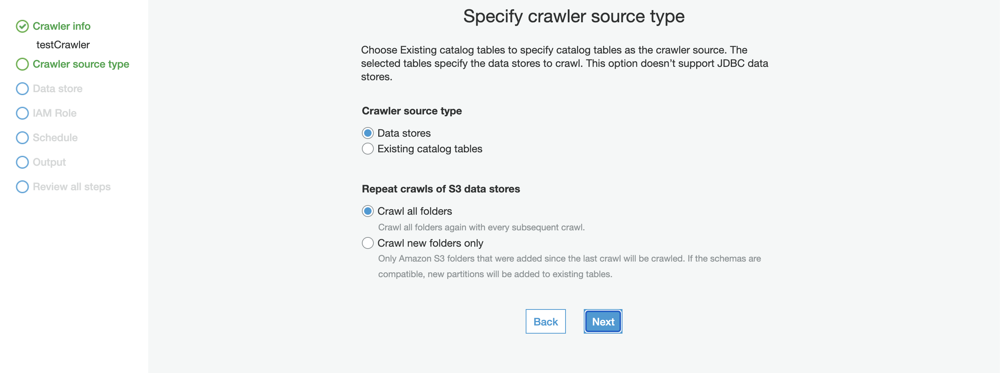

4. Configure the **Repeat crawls of S3 data stores** based on your requirement.
5. Then, under the **Data store** section, select **S3** from the dropdown for the **Choose a data store** setting, as shown:

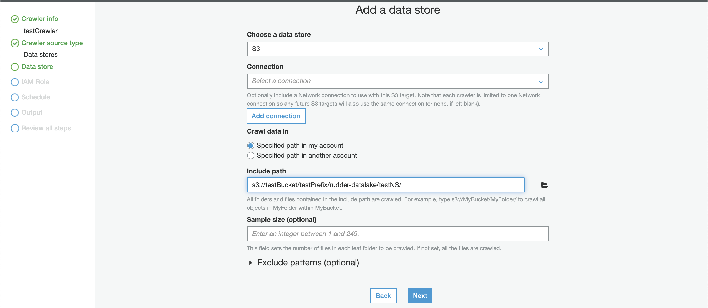

6. For the **Crawl data in** setting, choose the option **Specified path in my account**. 
7. In the **Include path** setting, enter the S3 URI of your configured bucket followed by the suffix `/<prefix>/rudder-datalake/<namespace>/`.

<div class="infoBlock">

If your S3 bucket name is <code class="inline-code">testBucket</code> and the configured prefix and namespace are <code class="inline-code">testPrefix</code> and <code class="inline-code">testNameSpace</code> respectively, then your path should be:
<code class="inline-code">s3://testBucket/testPrefix/rudder-datalake/testNameSpace/</code>
</div>

<div class="warningBlock">

If you have not configured any prefix while setting up the S3 data lake destination in RudderStack, omit the prefix. The path would then be:
<code class="inline-code">s3://testBucket/rudder-datalake/testNameSpace/</code>.
</div>

8. Then, under the **Add another data store** setting, select **No**, as shown:

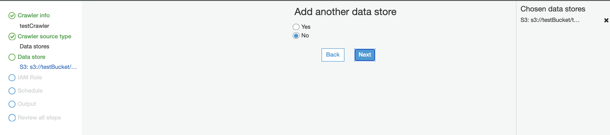

9. In the **IAM Role** section, configure a suitable IAM role.

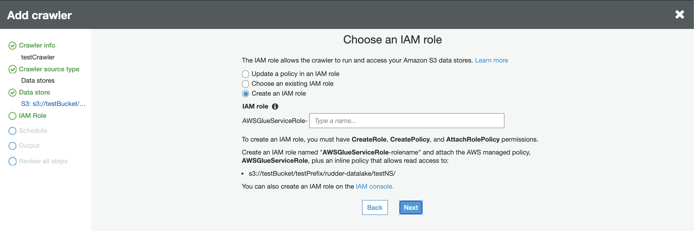

10. In the **Schedule** section, select the frequency of your crawler from the dropdown options, as shown:

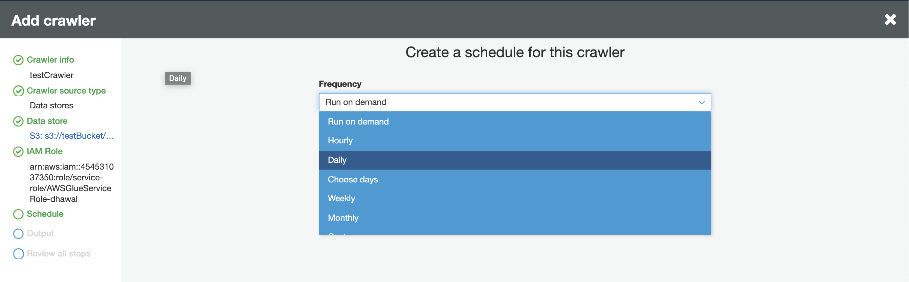

11. In the **Output** section, configure the database that stores all the tables. Under the Grouping behavior for S3 data section, enable the **Create a single schema for each S3 path** option, as shown:

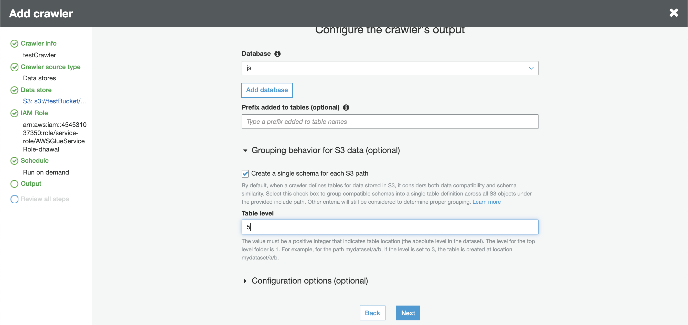

12. Specify the **Table level** as **5** or **4** \(refer to the tips below\). This value indicates the absolute level of the table location in the bucket.

<div class="infoBlock">

The level for the top-level folder is 1. For example, for the path <code class="inline-code">mydataset/a/b</code>, if the level is set to 3, the table will be created at the location <code class="inline-code">mydataset/a/b</code>. Similarly, if the level is set to 2, the table will be created at the location <code class="inline-code">mydataset/a</code>.
</div>

<div class="warningBlock">

Since all tables are created in the path <code class="inline-code">s3://testBucket/&lt;prefix&gt;/rudder-datalake/&lt;namespace&gt;/</code>, make sure the table level is set to:
<ul>
<li><strong>5</strong>:  If a prefix is configured.</li>
<li><strong>4</strong>: If a prefix is <strong>not</strong> configured.</li>
</ul>
</div>

13. Review your crawler configuration, as shown:

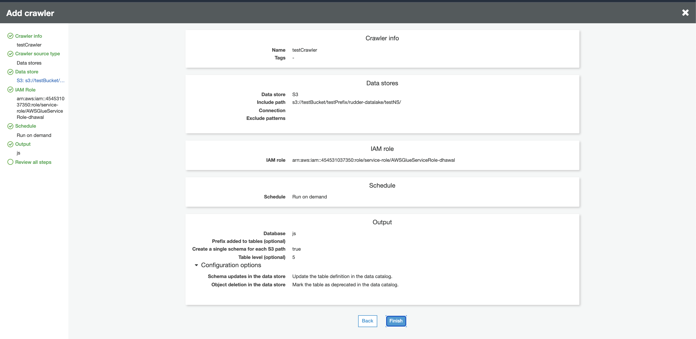

14. Click on **Finish** to confirm the configuration. 
15. Finally, click on your crawler and run it. Wait for the process to finish - you should see some tables created in your configured database.

## Querying data using AWS Athena

You can query your S3 data using a tool like [AWS Athena](https://aws.amazon.com/athena/) which lets you run SQL queries on S3.

<div class="warningBlock">

Before querying your data on S3, make sure that you have sent some data to S3 and that the sync has been completed.
</div>

Follow these steps to start querying your data on s3 -

1. Open your AWS Athena console. Then, go to the same AWS region which was used while to configure AWS Glue.
2. In the left pane, select `AwsDataCatalog` as your data source, as shown:

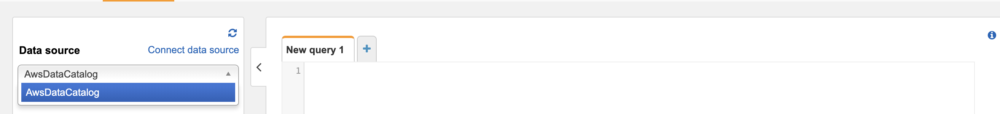

3. Select your configured namespace \(or the database you specified while configuring the crawler\) from the database dropdown menu.

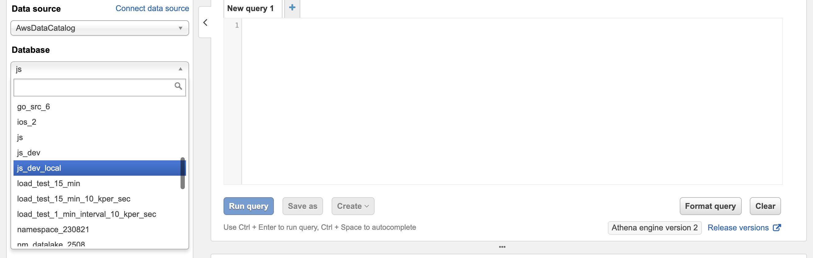

<div class="infoBlock">

By default, the namespace is set to your source name if you did not specify it in the destination settings.
</div>

4. You should see some tables already created under the **Tables** section in the left pane. 
5. You can preview the data by clicking on the three dots next to the table and selecting the **Preview Data** option. Alternatively, you can run your own SQL queries in the workspace on the right, as shown:

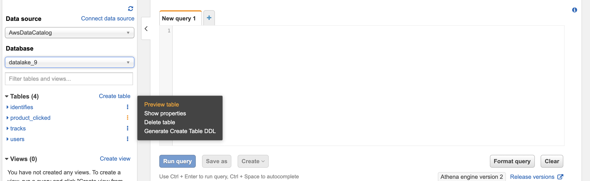

## IPs to be whitelisted

To enable network access to RudderStack, you will need to whitelist the following RudderStack IPs:

- 3.216.35.97
- 34.198.90.241
- 54.147.40.62
- 23.20.96.9
- 18.214.35.254
- 35.83.226.133
- 52.41.61.208
- 44.227.140.138
- 54.245.141.180
- 3.66.99.198
- 3.64.201.167

<div class="infoBlock">

If you have your deployment in the EU region, you can whitelist only the following two IPs:
<ul>
<li>3.66.99.198</li>
<li>3.64.201.167</li>
</ul>
</div>

<div class="infoBlock">

All the outbound traffic is routed through these RudderStack IPs.
</div>

## Contact us

For queries on any of the sections covered in this guide, you can [contact us](mailto:%20docs@rudderstack.com) or start a conversation in our [Slack](https://rudderstack.com/join-rudderstack-slack-community) community.
