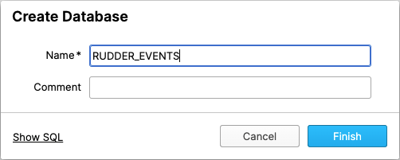
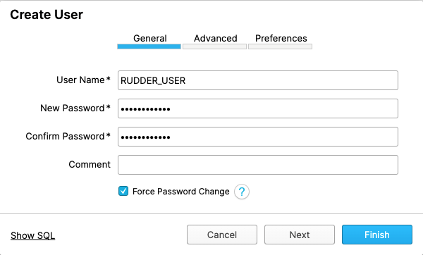
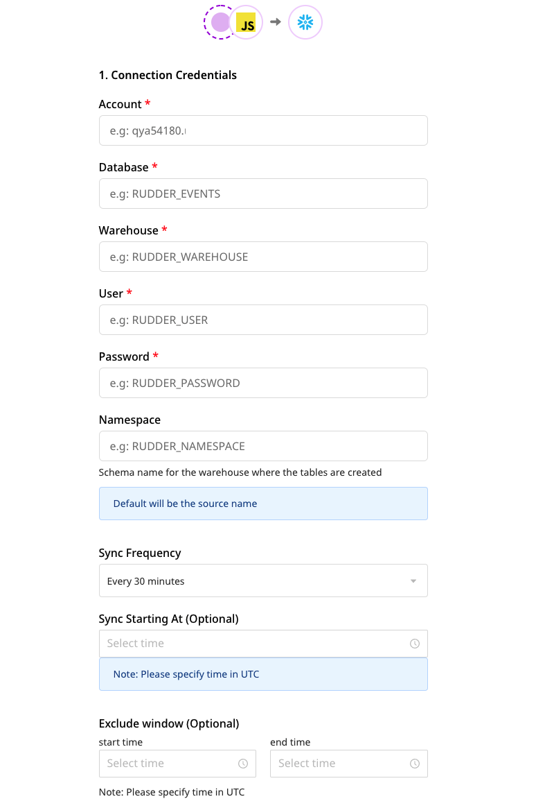
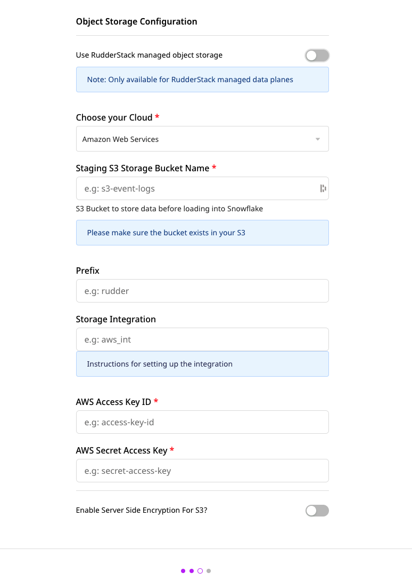

# Snowflake

[Snowflake](https://www.snowflake.com/) is a cloud-based data warehouse provided as Software-as-a-Service \(SaaS\). It offers all the modern data warehouse features like scalability, ease of use, secure access to your data, advanced analytics capabilities, and more.

RudderStack lets you configure Snowflake as a destination to seamlessly store your event data.

<div class="infoBlock">

Refer to the <a href="https://rudderstack.com/docs/data-warehouse-integrations/warehouse-schemas/">Warehouse Schemas</a> guide for information on how the events are mapped to the Snowflake tables.
</div>

<div class="successBlock">

<strong>Find the open-source transformer code for this destination in the <a href="https://github.com/rudderlabs/rudder-transformer/tree/master/v0/destinations/snowflake">RudderStack GitHub</a> repo.</strong>
</div>

## Setting up a user in Snowflake

To enable RudderStack access, make sure you have an `ACCOUNTADMIN`, or an account that has the `MANAGE GRANTS` privilege.

The following sections illustrate how to set up a virtual warehouse, a database, a role, and an user in Snowflake:

### Creating a virtual warehouse

In your Snowflake console, create a `X-Small` warehouse:


<div class="infoBlock">

Set your data warehouse size as per your data volume requirements.
</div>

Alternatively, you can create a new warehouse by running the following SQL commands:

```sql
CREATE WAREHOUSE "RUDDER_WAREHOUSE"
  WITH WAREHOUSE_SIZE = 'XSMALL'
    WAREHOUSE_TYPE = 'STANDARD'
    AUTO_SUSPEND = 600
    AUTO_RESUME = TRUE;
```

<div class="infoBlock">

You can set <code class="inline-code">AUTO_SUSPEND</code> to ~10 mins and enable <code class="inline-code">AUTO_RESUME</code> to avoid any extra costs.
</div>

### Creating a database

<div class="warningBlock">

Create a new database to avoid conflicts with your existing data, as RudderStack creates its own tables while storing your events.
</div>

The following image demonstrates the **Create Database** option in Snowflake.



Alternatively, you can create a new database by running the following SQL command:

```sql
CREATE DATABASE "RUDDER_EVENTS";
```

### Creating a role for RudderStack

Run the following SQL commands to create a new role with the required permissions to load your data into the newly-created warehouse:

1. Create a new role called `RUDDER`:

```sql
CREATE ROLE "RUDDER";
```

2. Grant access to the warehouse `RUDDER_WAREHOUSE`:

```sql
GRANT USAGE ON WAREHOUSE "RUDDER_WAREHOUSE" TO ROLE "RUDDER";
```

3. Grant access to the database `RUDDER_EVENTS`:

```sql
GRANT USAGE ON DATABASE "RUDDER_EVENTS" TO ROLE "RUDDER";
GRANT CREATE SCHEMA ON DATABASE "RUDDER_EVENTS" TO ROLE "RUDDER";
GRANT ALL ON ALL SCHEMAS IN DATABASE "RUDDER_EVENTS" TO ROLE "RUDDER";
```

### Creating a user

Finally, create a user to connect RudderStack to the newly-created Snowflake warehouse, as shown:



Alternatively, you can use SQL to create a user in Snowflake, as shown:

```sql
CREATE USER "RUDDER_USER"
  MUST_CHANGE_PASSWORD = FALSE
  DEFAULT_ROLE = "RUDDER"
  PASSWORD = "<your_password>";
GRANT ROLE "RUDDER" TO USER "RUDDER_USER";
```

## Configuring Snowflake destination in RudderStack

To start sending data to Snowflake, you will first need to add it as a destination in RudderStack and connect it to a data source. Once the destination is enabled, the events will automatically start flowing to your Snowflake instance.

Follow these steps to configure your Azure data lake as a destination in RudderStack:

1. From your [RudderStack dashboard](https://app.rudderstack.com/), configure the data source. Then, select **Snowflake** from the list of destinations.

<div class="infoBlock">

Refer to the <a href="https://rudderstack.com/docs/connections/adding-source-and-destination-rudderstack//">Adding a Source and Destination in RudderStack</a> guide for more information.
</div>

2. Assign a name to your destination and click on **Next**. You should then see the following screen:




### Connection settings

Add the following credentials to set up the Snowflake destination:

  - **Account**: Enter the account ID of your Snowflake warehouse. This account ID is part of the Snowflake URL. 
  
  The following examples illustrate the slight differences in the account ID for various cloud providers:

  | Account ID example            | Corresponding Snowflake URL                                                    | Snowflake cloud provider                                        |
  | :-------------------------- | :--------------------------------------------------------------- | :-------------------------------------------------------------- |
  | `qya56091.us-east-1`         | `https://`**`qya56091.us-east-1`**`.snowflakecomputing.com`      | AWS                                   |
  | `rx18795.east-us-2.azure` | `https://`**`rx18795.east-us-2.azure`**`.snowflakecomputing.com` | Microsoft Azure  |
  | `ah76025.us-central1.gcp` | `https://`**`ah76025.us-central1.gcp`**`.snowflakecomputing.com` | Google Cloud Platform                          |

  - **Database**: Enter the name of the database created in the [Creating a database](#creating-a-database) section above.
  - **Warehouse**: Enter the name of the warehouse created in the [Creating a virtual warehouse](#creating-a-virtual-warehouse) section above.
  - **User**: Enter the name of the user created in the [Creating a user](#creating-a-user) section above.
  - **Password**: Enter the password you set for the above user.
  - **Namespace**: Enter the schema name for the warehouse where RudderStack will create all the tables.

  <div class="infoBlock">

  If you don't specify any namespace, RudderStack will set this to the source name by default.
  </div>

  - **Sync Frequency**:  Specify how often RudderStack should sync the data to your Snowflake warehouse.
  - **Sync Starting At**: This optional setting lets you specify the particular time of the day (in UTC) when you want RudderStack to sync the data to the warehouse.
  - **Exclude Window**: This optional setting lets you set a time window when RudderStack **will not** sync the data to the warehouse.

### Configuring the object storage

RudderStack lets you configure the following object storage configuration settings while setting up your Snowflake destination:

  - **Use RudderStack-managed Object Storage**: Enable this setting to use RudderStack-managed buckets for object storage.

   <div class="warningBlock">

  This option is applicable only for RudderStack-hosted data planes. For self-hosted data planes, you will have to specify your own object storage configuration settings.
  </div>

  - **Choose your Cloud**: Select the cloud provider for your Snowflake instance.

Refer to the following settings depending on your cloud provider:

<Tabs>
  <TabList>
    <Tab>AWS</Tab>
    <Tab>Azure</Tab>
    <Tab>GCP</Tab>
  </TabList>
  <TabPanels>
    <TabPanel>
    <ul>
      <li><strong>Staging S3 Storage Bucket Name</strong>: Specify the name of your S3 bucket where RudderStack will store the data before loading it into Snowflake.</li>
      <li><strong>Prefix</strong>: If specified, RudderStack will create a folder in the bucket with this prefix and push all the data within that folder.</li>
      <li><strong>Storage Integration</strong>: Refer to the <a href="#configuring-snowflake-integration">Configuring Snowflake integration</a> section for details.</li>
      <li><strong>AWS Access Key ID</strong>: Enter your AWS access key ID obtained from the AWS console.</li>
      <li><strong>AWS Secret Access Key</strong>:  Enter the AWS secret access key.  Refer to this <a href="https://rudderstack.com/docs/destinations/storage-platforms/amazon-s3#setting-up-amazon-s3">Permissions</a> section for more information. </li>
      <li><strong>Enable Server-side Encryption for S3</strong>: Toggle on this setting to enable server-side encryption for your S3 bucket.</li>
    </ul>
    </TabPanel>
    <TabPanel>
    <ul>
      <li><strong>Staging Azure Blob Storage Container Name</strong>: Specify the name of your Azure container where RudderStack will store the data before loading it into Snowflake.</li>
      <li><strong>Prefix</strong>: If specified, RudderStack will create a folder in the bucket with this prefix and push all the data within that folder.</li>
      <li><strong>Storage Integration</strong>: Refer to the <a href="#configuring-snowflake-integration">Configuring Snowflake integration</a> section for details.</li>
      <li><strong>Azure Blob Storage Account Name</strong>: Enter the account name for the Azure container.</li>
      <li><strong>Azure Blob Storage Account Key</strong>:  Enter the account key for your Azure container.  Refer to the <a href="https://www.rudderstack.com/docs/destinations/storage-platforms/microsoft-azure-blob-storage/#setting-up-azure-blob-storage">Blob Storage setup</a> section for more information. </li>
    </ul>
    </TabPanel>
    <TabPanel>
    <ul>
      <li><strong>Staging GCS Object Storage Bucket Name</strong>: Specify the name of your GCS bucket where RudderStack will store the data before loading it into Snowflake.</li>
      <li><strong>Prefix</strong>: If specified, RudderStack will create a folder in the bucket with this prefix and push all the data within that folder.</li>
      <li><strong>Storage Integration</strong>: Refer to the <a href="#configuring-snowflake-integration">Configuring Snowflake integration</a> section for details.</li>
      <li><strong>Credentials</strong>: Paste the contents of your GCP service account credentials JSON. The service account should have a role with <code class="inline-code">storage.objectCreator</code> access. </li>
    </ul>
    </TabPanel>
  </TabPanels>
</Tabs>

## Configuring cloud storage integration with Snowflake

This section lists the steps required to configure the **Storage Integration** setting specified in the [Configuring the object storage](#configuring-the-object-storage) section above, depending on your cloud provider.

### AWS

If you have Amazon Web Services (AWS) as your cloud provider and want to use S3 as your object storage, you will need to follow a few more steps to configure your cloud storage integration with Snowflake. You can find the detailed instructions in this [Snowflake documentation](https://docs.snowflake.com/en/user-guide/data-load-s3-config.html#option-1-configuring-a-snowflake-storage-integration).

1. **Create a policy in AWS**: In the following JSON, replace `<bucket_name>` and `<prefix>` with the name of your S3 bucket and the prefix set in the [Configuring the object storage](#configuring-the-object-storage) section above, and create the policy with a name of your choice.

```javascript
{
  "Version": "2012-10-17",
  "Statement": [
    {
      "Effect": "Allow",
      "Action": [
        "s3:PutObject",
        "s3:GetObject",
        "s3:GetObjectVersion",
        "s3:DeleteObject",
        "s3:DeleteObjectVersion"
      ],
      "Resource": "arn:aws:s3:::<bucket_name>/<prefix>/*"
    },
    {
      "Effect": "Allow",
      "Action": "s3:ListBucket",
      "Resource": "arn:aws:s3:::<bucket_name>",
      "Condition": {
        "StringLike": {
          "s3:prefix": ["<prefix>/*"]
        }
      }
    }
  ]
}
```

2. **Create a role and attach the above policy in AWS**: Follow the steps listed below:

    1. Create a role of type **Another AWS account**.
    2. Enter your AWS account ID and enable the **Require External ID** option.
    3. For external ID, you can add a dummy value like 0000. This can be modified later.
    4. Attach the policy created in Step 1. Assign a name to this role and keep the role ARN handy for the next step.

<div class="infoBlock">

Keep this role ARN handy for the next step.
</div>

3. **Create the cloud storage integration in Snowflake**: Replace `<integration_name>` with the name of your choice and `<iam_role>` with the role ARN obtained in Step 2 and run the following command:

```sql
CREATE STORAGE INTEGRATION <integration_name>
  TYPE = EXTERNAL_STAGE
  STORAGE_PROVIDER = S3
  ENABLED = TRUE
  STORAGE_AWS_ROLE_ARN = '<iam_role>'
  STORAGE_ALLOWED_LOCATIONS = ('s3://<bucket_name>/<path>/', 's3://<bucket_name>/<path>/')
  [ STORAGE_BLOCKED_LOCATIONS = ('s3://<bucket_name>/<path>/', 's3://<bucket_name>/<path>/') ]
```

<div class="infoBlock">

Record the value for <code class="inline-code">&lt;integration_name&gt;</code>.
</div>

4. Retrieve the AWS IAM user for your Snowflake account as shown:

```
Copy
DESC INTEGRATION <integration_name>;
```

5. Grant the IAM user permissions to access the bucket objects in AWS. Choose the role you created in Step 2 and edit the trust relationship as shown in the following JSON:

```JSON
{
  "Version": "2012-10-17",
  "Statement": [
    {
      "Sid": "",
      "Effect": "Allow",
      "Principal": {
        "AWS": "<snowflake_user_arn>"
      },
      "Action": "sts:AssumeRole",
      "Condition": {
        "StringEquals": {
          "sts:ExternalId": "<snowflake_external_id>"
        }
      }
    }
  ]
}
```
Note that `<snowflake_user_arn>` is the `STORAGE_AWS_ROLE_ARN` option seen in Step 4, whereas `<snowflake_external_id>` is the `STORAGE_AWS_EXTERNAL_ID`.

6. Grant integration access to the Snowflake role you created in the [Creating a role for RudderStack](#creating-a-role-for-rudderStack) section by running the following command:

```sql
GRANT usage ON integration <integration_name> TO ROLE "RUDDER"
```
Here, `<integration_name>` is the integration created in the Step 3.

### Azure

If you have Microsoft Azure as your cloud provider and want to leverage Azure Blob Storage as your object storage, you will need to follow a few more steps to configure your storage integration with Snowflake. You can find the detailed instructions in this [Snowflake documentation](https://docs.snowflake.com/en/user-guide/data-load-azure-config.html#option-1-configuring-a-snowflake-storage-integration).

1. **Create a storage account and container in Azure**:  First, create a storage account in Azure. Then, navigate to **Storage Explorer** > **Blob Containers** > **Create a Blob Container**.
2. Run the following commands to create a cloud storage integration in Snowflake:

```sql
CREATE STORAGE INTEGRATION <integration_name>
TYPE = EXTERNAL_STAGE
STORAGE_PROVIDER = AZURE
ENABLED = TRUE
AZURE_TENANT_ID = '<tenant_id>'
STORAGE_ALLOWED_LOCATIONS = ('azure://<account>.blob.core.windows.net/<container>/<path>/', 'azure://<account>.blob.core.windows.net/<container>/<path>/')
[ STORAGE_BLOCKED_LOCATIONS = ('azure://<account>.blob.core.windows.net/<container>/<path>/', 'azure://<account>.blob.core.windows.net/<container>/<path>/') ]
```

You can get your `<tenant_id>` by navigating to **Azure Active Directory** > **Properties** > **Directory ID**.

3. **Grant Snowflake access to the storage locations**: Run the following command and replace `<integration_name>` with the integration name created in Step 2.

```sql
DESC INTEGRATION <integration_name>;
```
<div class="infoBlock">

Record the values for <code class="inline-code">AZURE_CONSENT_URL</code> and <code class="inline-code">AZURE_MULTI_TENANT_APP_NAME</code>.
</div>

4. Go to the URL obtained in `AZURE_CONSENT_URL` and accept the consent requirements.
5. **Grant Snowflake access to the container**: Navigate to **Azure Services** > **Storage Accounts** and select the storage account created in Step 1. 
6. **Add the role**: Navigate to **Access Control (IAM)** > **Add Role Assignment**. Select either **Storage Blob Data Reader** with **Read** access, or **Storage Blob Data Contributor** with **Read and Write** access.
7. **Add Assign Access**: Add **Service Principal** as the security principal type for the role. Search for `AZURE_MULTI_TENANT_APP_NAME` that you obtained in Step 3.
8. Grant integration access to the Snowflake role you created in the [Creating a role for RudderStack](#creating-a-role-for-rudderStack) section by running the following command:

```sql
GRANT USAGE ON integration <integration_name> to role "RUDDER";
```
Here, `<integration_name>` is the integration you created in Step 2.

### GCP

If you have Google Cloud Platform as your cloud provider and want to leverage Google Cloud Storage as your object storage, you will need to follow a few more steps to configure your storage integration with Snowflake. You can find the detailed instructions in this [Snowflake documentation](https://docs.snowflake.com/en/user-guide/data-load-gcs-config.html#configuring-an-integration-for-google-cloud-storage).

1. **Create a Cloud Storage integration in Snowflake**: Run the following command:

```sql
CREATE STORAGE INTEGRATION <integration_name>
  TYPE = EXTERNAL_STAGE
  STORAGE_PROVIDER = GCS
  ENABLED = TRUE
  STORAGE_ALLOWED_LOCATIONS = ('gcs://<bucket>/<path>/', 'gcs://<bucket>/<path>/')
```

Replace `<integration_name>` with the name of your Cloud Storage integration, `<bucket>` with **Staging GCS Object Storage Bucket Name**, and `<path>` with the prefix set in the [Configuring the object storage](#configuring-the-object-storage) section above.

2. The following command retrieves the Cloud Storage service account ID created for your Snowflake account, where `<integration_name>` is the integration name you specified in Step 1.

```sql
DESC STORAGE INTEGRATION <integration_name>;
```

<div class="infoBlock">

The output of this command will have a property named as <code class="inline-code">STORAGE_GCP_SERVICE_ACCOUNT</code>. Retrieve this property value. It should be of the format <code class="inline-code">service-account-id@UNIQUE_STRING.iam.gserviceaccount.com</code>.
</div>

3. **Grant service account permissions to access the bucket objects**: Create a custom IAM role with the required permissions to access the bucket and fetch the objects by following these steps:

    1. Log into the GCP console as a Project Editor.
    2. From the dashboard, go to **IAM & Admin** > **Roles**.
    3. Click on **CREATE ROLE**.
    4. Enter the title and description for the custom role.
    5. Click on **ADD PERMISSIONS**.
    6. Filter the following permissions in the **Enter property name or value** and add them to the list. Then, click on **ADD**.


   | Permission name |
   | :-----------------|
   | `storage.buckets.get` |
   | `storage.objects.get` |
   | `storage.objects.list` |
   | `storage.objects.create` |

4. **Assign the custom role to the Cloud Storage service account**:

   1. In your GCP console dashboard, go to **Cloud Storage** > **Browser**.
   2. Select the bucket to configure the access.
   3. Select **SHOW INFO PANEL** in the upper right corner. The information panel for the bucket will pop out.
   4. In the **Add Members** section, get the service account name from the `DESC` command run in Step 2. 
   5. From the **Select a role** dropdown, select **Storage** > **Custom** > `<role>`, where `<role>` is the custom Cloud Storage role.
   6. Click on the **ADD** button. The service account name will be added to the **Storage Object Viewer** role dropdown in the information panel.

5. Grant integration access to the Snowflake role you created in the [Creating a role for RudderStack](#creating-a-role-for-rudderStack) section by running the following command:

```sql
GRANT USAGE ON INTEGRATION <integration_name> TO ROLE "RUDDER";
```
Here, `<integration_name>` is the integration name you set up in Step 1.

## Setting up network access

You will need to whitelist the following RudderStack IPs to enable network access:

- 3.216.35.97
- 34.198.90.241
- 54.147.40.62
- 23.20.96.9
- 18.214.35.254
- 35.83.226.133
- 52.41.61.208
- 44.227.140.138
- 54.245.141.180
- 3.66.99.198
- 3.64.201.167

<div class="infoBlock">

If you have your deployment in the EU region, you can whitelist only the following two IPs:
  <ul>
    <li>3.66.99.198</li>
    <li>3.64.201.167</li>
  </ul>
</div>

<div class="infoBlock">

All the outbound traffic is routed through these RudderStack IPs.
</div>

## Contact us

For queries on any of the sections covered in this guide, you can [**contact us**](mailto:%20docs@rudderstack.com) or start a conversation in our [**Slack**](https://rudderstack.com/join-rudderstack-slack-community) community.
