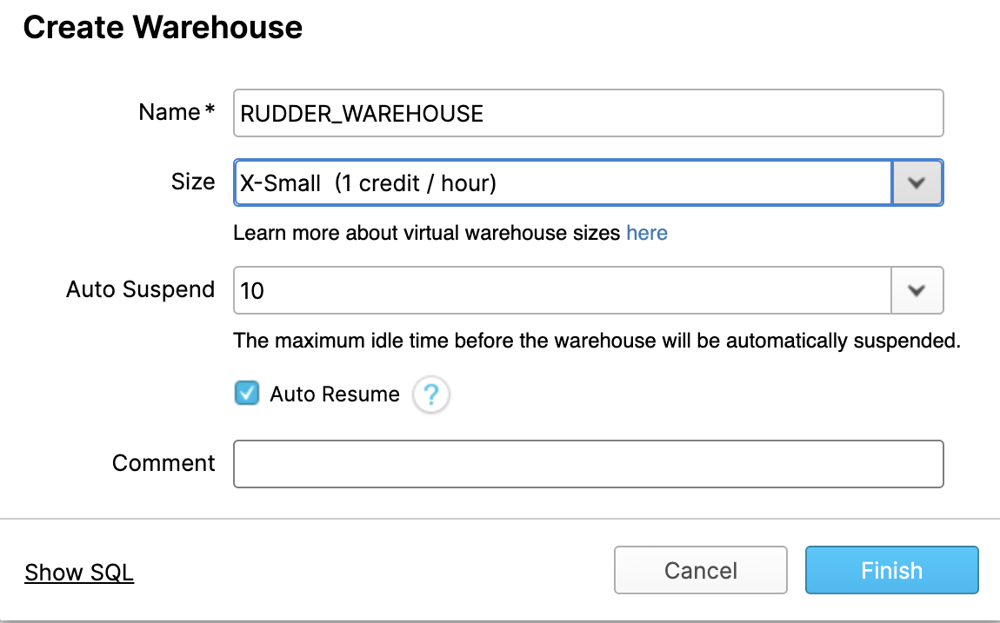
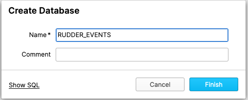
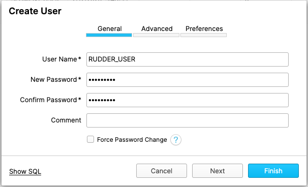

# Snowflake

Snowflake is a cloud-based data warehouse provided as Software-as-a-Service \(SaaS\). It offers all the features of a modern data warehouse, including scalability, ease of use, secure access to your data, accelerated analytics capabilities, and much more.

RudderStack allows you to configure Snowflake as a destination to dump your event data seamlessly.

<div class="infoBlock">

Please check our <a href="https://rudderstack.com/docs/data-warehouse-integrations/warehouse-schemas/">Warehouse Schemas</a> guide to know how events are mapped to the tables in Snowflake.

</div>

<div class="successBlock">

  **Find the open-source transformer code for this destination in our <a href="https://github.com/rudderlabs/rudder-transformer/tree/master/v0/destinations/snowflake">GitHub repo</a>.**
</div>

## Snowflake User Setup

To enable RudderStack access, please make sure you have an `ACCOUNTADMIN`, or an account that has `MANAGE GRANTS`.

The following sections illustrate how to create a virtual warehouse, a database, a role, and an user in Snowflake:

### Creating a Virtual Warehouse

Create a `X-Small warehouse`by following the wizard on Snowflake's website as shown in the screenshot below:

<span class="imageTitle">creating x-small warehouse screenshot</span>

<div class="infoBlock">

You can set your data warehouse size as per your future data volume.

</div>

Alternatively, you can also use SQL to create a warehouse, as shown:

```sql
CREATE WAREHOUSE "RUDDER_WAREHOUSE"
  WITH WAREHOUSE_SIZE = 'XSMALL'
    WAREHOUSE_TYPE = 'STANDARD'
    AUTO_SUSPEND = 600
    AUTO_RESUME = TRUE;
```

<div class="infoBlock">

It is recommended that you set <code class="inline-code">AUTO_SUSPEND</code> to ~10 mins, and enable <code class="inline-code">AUTO_RESUME</code> to avoid any extra costs.

</div>

### Creating a Database

<div class="warningBlock">

Please create a new database to avoid conflicts with your existing data, as RudderStack creates its own tables.

</div>

The following screenshot demonstrates the **Create Database** option in Snowflake.

<span class="imageTitle">Creating a database in Snowflake</span>

Alternatively, you can also use SQL to create a database, as shown:

```sql
CREATE DATABASE "RUDDER_EVENTS";
```

### Creating a Role for RudderStack

Please execute the following SQL commands to create a new role with the required permissions to load your data into the warehouse:

- Create a new role

```sql
CREATE ROLE "RUDDER";
```

- Grant access to the virtual warehouse

```sql
GRANT USAGE ON WAREHOUSE "RUDDER_WAREHOUSE" TO ROLE "RUDDER";
```

- Grant access to the database

```sql
GRANT USAGE ON DATABASE "RUDDER_EVENTS" TO ROLE "RUDDER";
GRANT CREATE SCHEMA ON DATABASE "RUDDER_EVENTS" TO ROLE "RUDDER";
GRANT ALL ON ALL SCHEMAS IN DATABASE "RUDDER_EVENTS" TO ROLE "RUDDER";
```

### Creating a User

Finally, please create a user to connect RudderStack to the previously created Snowflake warehouse, as shown:

<span class="imageTitle">Creating a user in Snowflake</span>

Alternatively, you can use SQL to create a user in Snowflake, as shown:

```sql
CREATE USER "RUDDER_USER"
  MUST_CHANGE_PASSWORD = FALSE
  DEFAULT_ROLE = "RUDDER"
  PASSWORD = "strong_unique_password";
GRANT ROLE "RUDDER" TO USER "RUDDER_USER";
```

## Configuring Snowflake in RudderStack

In order to enable dumping data to Snowflake, you will first need to add it as a destination to the source from which you are sending event data. Once the destination is enabled, events from RudderStack will start to flow to Snowflake.

To do so, please follow these steps:

- Choose a source to which you would like to add Snowflake as a destination. You can also simply create a destination and connect it to a source later.

<div class="infoBlock">

Please follow our <a href="https://rudderstack.com/docs/connections/adding-source-and-destination-rudderstack/">Adding a Source and Destination</a> guide to know how to add a source in RudderStack.

</div>

- After choosing a source, select **Snowflake** from the list of destinations.
- Give your destination a name and then click on **Next**. You should then see the following screen:
<span class="imageTitle">Connection Settings for configuring Snowflake as a Destination</span>

<span class="imageTitle">Connection Settings for configuring Snowflake as a Destination</span>

- Add the required credentials in the **Connection Settings** as described below:

  - **Account** - This is the account ID of your warehouse. Account ID is part of the Snowflake URL. The following examples illustrate the slight differences in the account ID for various cloud providers**.**

  | Account ID sample           | Snowflake URL                                                    | Snowflake cloud provider                                        |
  | :-------------------------- | :--------------------------------------------------------------- | :-------------------------------------------------------------- |
  | **qya56091.us-east-1**      | `https://`**`qya56091.us-east-1`**`.snowflakecomputing.com`      | Amazon Web Services \(AWS\)                                     |
  | **rx18795.east-us-2.azure** | `https://`**`rx18795.east-us-2.azure`**`.snowflakecomputing.com` | Microsoft Azure \(Azure[\)](https://azure.microsoft.com/en-us/) |
  | **ah76025.us-central1.gcp** | `https://`**`ah76025.us-central1.gcp`**`.snowflakecomputing.com` | Google Cloud Platform \(GCP\) _\*\*_                            |

  - **Database** - The name of the database, as created in the [Creating a Database](https://rudderstack.com/docs/data-warehouse-integrations/snowflake#creating-a-database) section
  - **Warehouse** - The name of the warehouse, as created in the [Creating a Virtual Warehouse](https://rudderstack.com/docs/data-warehouse-integrations/snowflake#creating-a-virtual-warehouse) section
  - **User** - This is the username, as created in [Creating a User](https://rudderstack.com/docs/data-warehouse-integrations/snowflake#creating-a-user) section.
  - **Password** - This is the password, as created in [Creating a User](https://rudderstack.com/docs/data-warehouse-integrations/snowflake#creating-a-user) section.

- The following settings are applicable if you are using an Amazon S3 bucket for object storage:
  - **S3 bucket name** - This is your unique S3 bucket name.
  - **AWS Access Key ID** - This can be obtained from the AWS Console.
  - **AWS Secret Access Key** - This can be obtained from AWS Console. Please refer to the [Setting Up Amazon S3](https://rudderstack.com/docs/destinations/storage-platforms/amazon-s3#setting-up-amazon-s3) section for more details.
- Please grant the following permissions to the IAM user:

```javascript
"Effect": "Allow",
"Action": [
  "s3:GetObject",
  "s3:PutObject",
  "s3:PutObjectAcl",
  "s3:ListBucket"
]
```

## Configuring Snowflake Integration

<Tabs>
  <TabList>
    <Tab>AWS</Tab>
    <Tab>Azure</Tab>
    <Tab>GCP</Tab>
  </TabList>
  <TabPanels>
    <TabPanel>

        If you have Amazon Web Services (AWS) as your cloud provider and want to leverage S3 as your object storage, you will need to follow a few more steps to configure your Snowflake destination with a snowflake integration.

Detailed instructions can be found <a href="https://docs.snowflake.com/en/user-guide/data-load-s3-config.html#option-1-configuring-a-snowflake-storage-integration">here</a>

**Configuring snowflake integration with AWS **

<ol>
<li>Create a policy in AWS:</li>

Replace <code class="inline-code">&lt;bucket&gt;</code> and <code class="inline-code">&lt;prefix&gt;</code> with your values in the JSON below. And create the policy with a name of your choice.
<span>

```javascript
{
  "Version": "2012-10-17",
  "Statement": [
    {
      "Effect": "Allow",
      "Action": [
        "s3:PutObject",
        "s3:GetObject",
        "s3:GetObjectVersion",
        "s3:DeleteObject",
        "s3:DeleteObjectVersion"
      ],
      "Resource": "arn:aws:s3:::<bucket>/<prefix>/*"
    },
    {
      "Effect": "Allow",
      "Action": "s3:ListBucket",
      "Resource": "arn:aws:s3:::<bucket>",
      "Condition": {
        "StringLike": {
          "s3:prefix": ["<prefix>/*"]
        }
      }
    }
  ]
}
```
</span>
<li>
  Create a role and attach the above policy in AWS: - Create role of type <strong>
    Another AWS account
  </strong> - Enter your AWS account ID and enable <strong>
    Require External ID
  </strong> - For external ID enter a dummy ID such as 0000. We will modify this
  later on. - And attach the policy created in Step 1. - Give your role a name and
  keep the role ARN handy for the next step.
</li>
<li> Create cloud storage integration in Snowflake </li>
<span>

```sql
CREATE STORAGE INTEGRATION <integration_name>
  TYPE = EXTERNAL_STAGE
  STORAGE_PROVIDER = S3
  ENABLED = TRUE
  STORAGE_AWS_ROLE_ARN = '<iam_role>'
  STORAGE_ALLOWED_LOCATIONS = ('s3://<bucket>/<path>/', 's3://<bucket>/<path>/')
  [ STORAGE_BLOCKED_LOCATIONS = ('s3://<bucket>/<path>/', 's3://<bucket>/<path>/') ]
```
</span>
<code class="inline-code">&lt;integration_name&gt;</code> with an integration
name of your choice.
<code class="inline-code">&lt;iam_role&gt;</code> with the role ARN from the
previous step.

Record the values: <code class="inline-code">&lt;integration_name&gt;</code>.

<li> Retrieve the AWS IAM user for your Snowflake account as shown:</li>
<span>

```sql
DESC INTEGRATION <integration_name>;
```
</span>
<code class="inline-code">&lt;integration_name&gt;</code> - The integration name
used in the previous step.

Record the values - <code class="inline-code">STORAGE_AWS_ROLE_ARN</code> and <code class="inline-code">STORAGE_AWS_EXTERNAL_ID</code> .

<li> Grant IAM user permission to access bucket objects in AWS </li>
Choose the role created in Step 2 and edit the trust relationship with the following
JSON.
<span>

```javascript
{
  "Version": "2012-10-17",
  "Statement": [
    {
      "Sid": "",
      "Effect": "Allow",
      "Principal": {
        "AWS": "<snowflake_user_arn>"
      },
      "Action": "sts:AssumeRole",
      "Condition": {
        "StringEquals": {
          "sts:ExternalId": "<snowflake_external_id>"
        }
      }
    }
  ]
}
```
</span>
<code class="inline-code">&lt;snowflake_user_arn&gt;</code> is the <code class="inline-code">
  STORAGE_AWS_ROLE_ARN
</code> in the previous step.
<code class="inline-code">&lt;snowflake_external_id&gt;</code> is the <code class="inline-code">
  STORAGE_AWS_EXTERNAL_ID
</code> in the previous step.

<li> Grant integration access to role in Snowflake:</li>
<span>

```sql
grant usage on integration <integration_name> to role <sf_role>
```
</span>
  <code class="inline-code">&lt;integration_name&gt;</code> is the integration created in the Step 3.
  <code class="inline-code">&lt;sf_role&gt;</code> is the role in Snowflake you want to grant access to.
</ol>
      </TabPanel>
      <TabPanel>
        If you have Microsoft Azure as your cloud provider and want to leverage Azure Blob Storage as your object storage, you will need to follow a few more steps to configure your Snowflake destination with a snowflake integration.

Detailed instructions can be found <a href="https://docs.snowflake.com/en/user-guide/data-load-azure-config.html#option-1-configuring-a-snowflake-storage-integration">here</a>.

**Configuring snowflake integration with Azure **
<ol>
<li>Create a storage account in Azure.</li>
<li>

Create a container in the storage account created above by navigating to **&lt;storage_account&gt;** - **Storage Explorer** - **Blob Containers** - **Create a Blob Container**.
</li>
<li>Create cloud storage integration in Snowflake:
<span>

```sql
CREATE STORAGE INTEGRATION <integration_name>
TYPE = EXTERNAL_STAGE
STORAGE_PROVIDER = AZURE
ENABLED = TRUE
AZURE_TENANT_ID = '<tenant_id>'
STORAGE_ALLOWED_LOCATIONS = ('azure://<account>.blob.core.windows.net/<container>/<path>/', 'azure://<account>.blob.core.windows.net/<container>/<path>/')
[ STORAGE_BLOCKED_LOCATIONS = ('azure://<account>.blob.core.windows.net/<container>/<path>/', 'azure://<account>.blob.core.windows.net/<container>/<path>/') ]
```
</span>
<code class="inline-code">&lt;tenant_id&gt;</code> - Get your tenant id by
navigating to <strong>Azure Active Directory</strong> - <strong>
  Properties.
</strong> The tenant ID is displayed in the <strong>Directory ID</strong> field.
<strong>&lt;account&gt;</strong> - <strong>&lt;storage_account&gt;</strong> - <strong>
  Access keys
</strong> - &lt;<code class="inline-code">storageAccountName</code>&gt;

</li>
<li> Grant Snowflake access to the storage locations </li>

Replace <code class="inline-code">&lt;integration_name&gt;</code> with the integration name created in the previous step.
<span>

```sql
DESC INTEGRATION <integration_name>;
```
</span>
And record the values <code class="inline-code">AZURE_CONSENT_URL</code> and <code class="inline-code">AZURE_MULTI_TENANT_APP_NAME</code> .
<li>
  Navigate to the URL in the <code class="inline-code">
    AZURE_CONSENT_URL
  </code> obtained in the previous step and accept.
</li>
<li>

  Grant snowflake access to the container created in Step 2: - Navigate to
  <strong>Azure Services</strong> - <strong>Storage Accounts</strong> and select
  the storage account created in Step 1. - Add role : Navigate to
  <strong>Access Control (IAM)</strong> - <strong>Add Role Assignment</strong>
  and select either <strong>Storage Blob Data Reader(Read Access)</strong> or
  <strong>Storage Blob Data Contributor (Read and Write Access)</strong> - Add
  <strong>Assign Access</strong> : Add <strong>Service Principal</strong> as the
  type of security principal to assign the role to. And search for
  <code class="inline-code">AZURE_MULTI_TENANT_APP_NAME</code> obtained in step
  4.
</li>
<li>Grant integration access to role in Snowflake:</li>
<span>

```sql
grant usage on integration <integration_name> to role <sf_role>;
```
</span>
  <code class="inline-code">&lt;integration_name&gt;</code> is the integration created in the Step 4.
  <code class="inline-code">&lt;sf_role&gt;</code> is the role in Snowflake you want to grant access to.
</ol>
      </TabPanel>
      <TabPanel>
        If you have Google Cloud Platform (GCP) as your cloud provider and want to leverage Google Cloud Storage as your object storage, you will need to follow a few more steps to configure your Snowflake destination with a snowflake integration.

Detailed instructions can be found <a href="https://docs.snowflake.com/en/user-guide/data-load-gcs-config.html#configuring-an-integration-for-google-cloud-storage">here</a>.

**Configuring Snowflake Integration with Google Cloud Platform **

<ol>
<li>Create a Cloud Storage integration in Snowflake.</li>
<span>

```sql
CREATE STORAGE INTEGRATION <integration_name>
  TYPE = EXTERNAL_STAGE
  STORAGE_PROVIDER = GCS
  ENABLED = TRUE
  STORAGE_ALLOWED_LOCATIONS = ('gcs://<bucket>/<path>/', 'gcs://<bucket>/<path>/')
```
</span>
<ul>
  <li>
    <code class="inline-code">&lt;integration_name&gt;</code> is the name of the
    new integration being created
  </li>
  <li>
    <code class="inline-code">&lt;bucket&gt;</code> is the name of the Cloud
    Storage bucket that you created
    <a href="https://rudderstack.com/docs/data-warehouse-integrations/snowflake/#configuring-snowflake-in-rudderstack">
      above
    </a>
  </li>
  <li>
    <code class="inline-code">&lt;path&gt;</code> is an optional path that can
    be used to provide granular control over objects in the bucket
  </li>
</ul>
<li>
  Retrieve the Cloud Storage Service Account for your Snowflake account. The
  following <code class="inline-code">DESCRIBE</code> command will retrieve the
  ID for the Cloud Storage service account that was created for your Snowflake
  account.
</li>
<span>

```sql
DESC STORAGE INTEGRATION <integration_name>;
```
</span>
<ul>
  <li>
    Where <code class="inline-code">&lt;integration_name&gt;</code> is the name
    of the integration you specified above in step 1.
  </li>
  <li>
    The output will be a table that has a property called
    <code class="inline-code">STORAGE_GCP_SERVICE_ACCOUNT</code>. Retrieve that
    property value.
  </li>
  <li>
    The value that should be retrieved will have the following format:
    <code class="inline-code">
      service-account-id@&lt;unique_string&gt;.iam.gserviceaccount.com
    </code>
  </li>
</ul>
<li> Grant the Service Account Permissions to Access Bucket Objects</li>
<ul>
  <li>
    Create a custom IAM role that has the permissions required to access the
    bucket and get objects.
  </li>
</ul>

     1. Log into the Google Cloud Platform Console as a project editor
     2. From the home dashboard, choose IAM & admin » Roles.
     3. Click Create Role.
     4. Enter a name, and description for the custom role.
     5. Click Add Permissions.
     6. Filter the list of permissions, and add the following from the list below:
        | Permission Property Name |
        | :----------------------- |
        | <code class="inline-code">storage.buckets.get</code>    |
        | <code class="inline-code">storage.objects.get</code>    |
        | <code class="inline-code">storage.object.list</code>    |
        | <code class="inline-code">storage.objects.create</code> |
     7. Click Create

<li> Assigning the Custom Role to the Cloud Storage Service Account</li>

  <ul>
   <li>Log into the Google Cloud Platform Console as a project editor.</li>
   <li>From the home dashboard, choose Cloud Storage » Browser:</li>
   <li>Select the checkbox of the bucket you would like to configure for access.</li>
   <li>Click SHOW INFO PANEL in the upper-right corner. The information panel for the bucket will slide out from the right.</li>
   <li>In the Add members field, search for the service account name from the DESCRIBE INTEGRATION output in Step 2: Retrieve the Cloud Storage Service Account for your Snowflake Account (in this topic).</li>
   <li>From the Select a role dropdown, select Storage » Custom » <code class="inline-code">&lt;role&gt;</code>, where <code class="inline-code">&lt;role&gt;</code> is the custom Cloud Storage role you created in Creating a Custom IAM Role (in this topic).</li>
   <li>Click the Add button. The service account name is added to the Storage Object Viewer role dropdown in the information panel.</li>
  </ul>

  <li> Grant usage to an external (i.e. Cloud Storage) stage that references the integration you created.
<span>

```sql
GRANT USAGE ON INTEGRATION <integration_name> TO ROLE "RUDDER";
```
</span>
</li>
</ol>
        <div class="infoBlock">
        <ul>
            <li>
              <code class="inline-code">"RUDDER"</code> is the name of the role that you
              created above <a href="https://rudderstack.com/docs/data-warehouse-integrations/snowflake/#creating-a-role-for-rudderstack">
                here
              </a>
            </li>
            <li>
              <code class="inline-code">&lt;integration_name&gt;</code> is the name of
              the integration that you set above in step 1
            </li>
          </ul>
        </div>
    </TabPanel>
  </TabPanels>
</Tabs>

## Setting Up the Network Access

You will need to whitelist the RudderStack IPs to enable network access to it.

<div class="infoBlock">

**The IPs to be whitelisted are : <code class="inline-code">3.216.35.97</code>, <code class="inline-code">34.198.90.241</code> , <code class="inline-code">54.147.40.62</code> , <code class="inline-code">23.20.96.9</code>, and <code class="inline-code">18.214.35.254</code>.**
</div>

## Contact Us

If you come across any issues while configuring Snowflake with RudderStack, please feel free to [contact us](mailto:%20docs@rudderstack.com) or start a conversation on our [Slack](https://rudderstack.com/join-rudderstack-slack-community) channel. We will be happy to help you.
