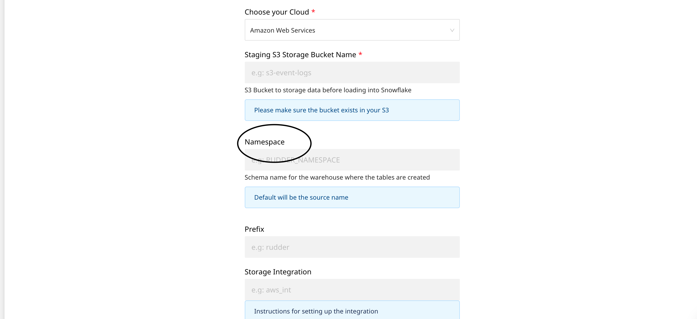
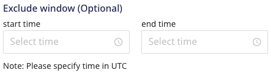
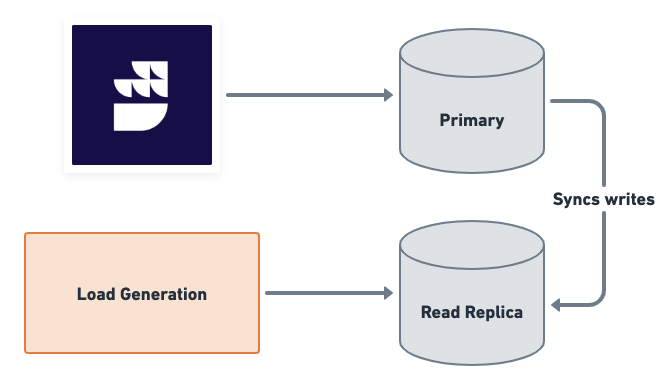

# FAQ

### When does Rudderstack load data into the data warehouse/s?

Rudderstack gives you the flexibility to choose when to sync the latest data into the warehouse. The default option is 30 minutes, but you can choose to extend this value to go up to 24 hours. You can also configure the time at which the data is to be loaded.

### Is there a way to force my data load into the warehouses?

Yes, there is - configure the below values in your `config.yaml` file:

```
warehouseSyncFreqIgnore = true #if set true this will ignore syncFrequency and syncStartingAt values which are configured in UI. By default this is false
uploadFreqInS=1800 #This field lets you control syncPeriod if above field set to true
```

### Where can I view the status of my data load?

The warehouse upload status can be viewed in **Live Events** section of the destination on the RudderStack dashboard.

### Can I change the namespace (schema name) of my data warehouse in RudderStack?

Yes, you can. Although the default namespace will be the source name with some modifications to it, RudderStack also provides an option in the dashboard to explicitly set the namespace of the dataset in the warehouse.

**Refer to the warehouse-specific destination settings for configuring the namespace in the RudderStack dashboard.**

### How can I achieve identity resolution with multiple sources connected to one warehouse destination?

The default namespace will be the source name with some modifications to it. This will cause issues while trying to create mappings for Identity Resolution across different sources, leading to multiple `RUDDER_ID` being created for the same user.

To avoid this, simply match the namespace for each source.



Doing this will ensure that the mapping will be on the consistent namespace and only one `RUDDER_ID` will be created for each user no matter how many sources are connected to your warehouse destination.

### How can I delete the staging files in my buckets?

RudderStack will load all events into staging buckets that are configured with your warehouse. You can set a retention policy to delete these files in your staging bucket after a certain amount of time. If no retention policy is set, then the files will accumulate. Make sure your retention policy duration is longer than your warehouse sync frequency duration. It is recommeded to set the retention duration to **30 days/1 month**. The longer the duration, the longer RudderStack can re-run event uploads, if required.

### Which IPs should be whitelisted?

You will need to whitelist the following RudderStack IPs to enable network access:

- 3.216.35.97
- 34.198.90.241
- 54.147.40.62
- 23.20.96.9
- 18.214.35.254
- 35.83.226.133
- 52.41.61.208
- 44.227.140.138
- 54.245.141.180

The EU cluster IPs are listed below:

- 3.66.99.198
- 3.64.201.167

<div class="infoBlock">

All the outbound traffic is routed through these RudderStack IPs.
</div>

### How to avoid lags in data sync while running heavy load on a warehouse?

You can use either of the following ways to avoid lags in warehouse data sync while running a heavy load:

- In the warehouse destination connection settings, set an **exclusion window** which lets you set a start and end time when Rudderstack will not sync data to the warehouse. You can run heavy loads during this time interval.



- In the warehouse destination connection settings, increase the **Sync frequency** interval so that there are lesser number of warehouse syncs throughout the day. You can run the data syncs during the non peak hours by setting the **Sync Starting At** time interval.


- If you are performing only writes/updates to your data warehouse, set up a read replica of your database and connect it to your load generation tool. Connect the read/write replica to RudderStack.



### How can I speed-up my warehouse uploads?

| Parameter | Description | Tip | Default value |
| :-----| :-------| :---------| :----|
| `RSERVER_WAREHOUSE_REDSHIFT_MAX_PARALLEL_LOADS`  |  Defines the number of concurrent tables that are synced to redshift in a given upload. | Increase this as per your infra capability. | `3`. |
| `RSERVER_WAREHOUSE_STAGING_FILES_BATCH_SIZE` | Defines the number of staging files that are batched and synced in a single upload. | Increase this to batch together more files and reduce the number of uploads needed for a given volume of data. | `960` | 
| `RSERVER_WAREHOUSE_NO_OF_WORKERS` | Number of concurrent uploads to a warehouse. For example, 8 uploads to different schemas in Redshift can be done simultaneously. | - | `8` |
| `warehouse_slave.replicaCount` | Number of warehouse slaves (responsible for load file generation) when the warehouse is run as separate service in Kubernetes. | Increase this for speeding up the load file generation step of the upload. |  `2` |
| `RSERVER_WAREHOUSE_NO_OF_SLAVE_WORKER_ROUTINES` | Number of go-routines creating load files in a warehouse slave process. | Increase or decrease this as per memory allocated to the warehouse slave pod. | `4` | 

## Contact us

For any other queries on the RudderStack warehouse integrations, you can [contact us](mailto:%20docs@rudderstack.com) or start a conversation in our [Slack](https://rudderstack.com/join-rudderstack-slack-community) community.
