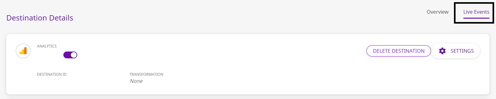

# Warehouse FAQs

### When does Rudderstack load data into the data warehouse/s?

Rudderstack gives you the flexibility to choose when to sync the latest data into the warehouse. The default option is 30 minutes, but you can choose to extend this value to go up to 24 hours. You can also configure the time at which the data is to be loaded.

### Is there a way to force my data load into the warehouses?

Yes, there is! You could do that by configuring below values in `config.yaml` file.

```
warehouseSyncFreqIgnore = true #if set true this will ignore syncFrequency and syncStartingAt values which are configured in UI. By default this is false
uploadFreqInS=1800 #This field lets you control syncPeriod if above field set to true
```

### Where can I view the status of my data load?

The warehouse upload status can be viewed in Live Events section of the destination on the RudderStack dashboard, as shown:

<span class="imageTitle">Live Events Option in the RudderStack Dashboard</span>

### Can I change the namespace (schema name) of my data warehouse in RudderStack?

Yes, you can. Although the default namespace will be the source name with some modifications to it, RudderStack also provides an option in the dashboard to explicitly set the namespace of the dataset in the warehouse.

**Refer to the warehouse-specific destination settings for configuring the namespace in the RudderStack dashboard.**

### How can I achieve Identity Resolution with multiple sources connected to one warehouse destination?

The default namespace will be the source name with some modifications to the name. This will cause issues while trying to create mappings for Identity Resolution across different sources, leading to multiple `RUDDER_ID` being created for the same user.

To avoid this, simply match the `Namespace` for each source in the Source Settings Config.


Doing this will ensure that the mapping will be on the consistent Namespace and only one `RUDDER_ID` will be created for each user no matter how many sources are connected to your warehouse destination.

### How can I delete my staging files in my buckets?

RudderStack will load all events into staging buckets that are configured with your warehouse. You can set a retention policy to delete these files in your staging bucket after a certain amount of time. If no retention policy is set, then the files will accumulate. Make sure your retention policy duration is longer than your warehouse sync frequency duration. We generally suggest a retention duration of **1 month**. The longer the duration, the longer we can rerun event uploads if necessary.

### Which IPs should be whitelisted?

You will need to whitelist the following RudderStack IPs to enable network access:

- 3.216.35.97
- 34.198.90.241
- 54.147.40.62
- 23.20.96.9
- 18.214.35.254

The EU cluster IPs are listed below:

- 3.66.99.198
- 3.64.201.167

<div class="infoBlock">

All the outbound traffic is routed through these RudderStack IPs.
</div>

### How can I speed-up my warehouse uploads

<table>
  <thead>
    <tr>
      <th style="text-align:left">Parameter</th>
      <th style="text-align:left">Description</th>
      <th style="text-align:left">Default</th>
    </tr>
  </thead>
  <tbody>
    <tr>
      <td style="text-align:left">
        <code class="inline-code">RSERVER_WAREHOUSE_REDSHIFT_MAX_PARALLEL_LOADS</code>
      </td>
      <td style="text-align:left">
        <p>
          Defines the number of concurrent tables that are synced to redshift in
          a given upload.
        </p>
        <p>Increase this as per your infra capability.</p>
      </td>
      <td style="text-align:left">3</td>
    </tr>
    <tr>
      <td style="text-align:left">
        <code class="inline-code">RSERVER_WAREHOUSE_STAGING_FILES_BATCH_SIZE</code>
      </td>
      <td style="text-align:left">
        <p>
          Defines the number of staging files that are batched and synced in a
          single upload.
        </p>
        <p>
          Increase this to batch together more files and reduce the number of
          uploads needed for a given volume of data
        </p>
      </td>
      <td style="text-align:left">960`</td>
    </tr>
    <tr>
      <td style="text-align:left">
        <code class="inline-code">RSERVER_WAREHOUSE_NO_OF_WORKERS</code>
      </td>
      <td style="text-align:left">
        Number of concurrent uploads to a warehouse. Eg. 8 uploads to different
        schemas in redshift can be done simultaneously
      </td>
      <td style="text-align:left">8</td>
    </tr>
    <tr>
      <td style="text-align:left">
        [k8s] <code class="inline-code">warehouse_slave.replicaCount</code>
      </td>
      <td style="text-align:left">
        <p>
          Number of warehouse slaves (responsible for load file generation) when
          warehouse is run as separate service in k8s.
        </p>
        <p>
          Increase this for speeding up the load file generation step of the
          upload
        </p>
      </td>
      <td style="text-align:left">2</td>
    </tr>
    <tr>
      <td style="text-align:left">
        <code class="inline-code">RSERVER_WAREHOUSE_NO_OF_SLAVE_WORKER_ROUTINES</code>
      </td>
      <td style="text-align:left">
        <p>
          Number of go-routines creating load files in a warehouse slave
          process.
        </p>
        <p>
          Increase/Decrease this as per memory allocated to the warehouse slave
          pod
        </p>
      </td>
      <td style="text-align:left">4</td>
    </tr>
  </tbody>
</table>

## Contact Us

In case you have any other queries related to using the RudderStack data warehouse integrations, please feel free to [contact us](mailto:%20docs@rudderstack.com). You can also join our [Slack](https://rudderstack.com/join-rudderstack-slack-community) community and start a conversation with us any time. We will be happy to help you.
