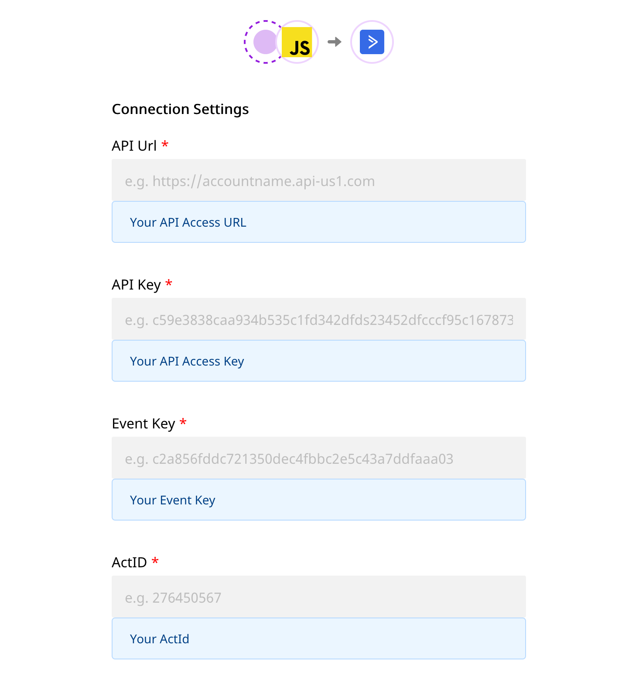

# ActiveCampaign

[ActiveCampaign](https://www.activecampaign.com/) is a popular marketing automation and CRM platform that makes it easy for you to drive customer engagement and retention. With ActiveCampaign's all-in-one email marketing and growth platform, you can easily monitor your customers' product behavior and use the insights to design and drive highly personalized customer experiences.

You can now send your event data directly to ActiveCampaign through RudderStack.


**Find the open-source transformer code for this destination in our** [**GitHub repo**](https://github.com/rudderlabs/rudder-transformer/tree/master/v0/destinations/active_campaign)**.**


## Getting Started

Before configuring your source and destination on the RudderStack, please check whether the platform you are sending the events from is supported by ActiveCampaign. Please refer the following table to do so:

| **Connection Mode** | **Web** | **Mobile** | **Server** |
| :--- | :--- | :--- | :--- |
| **Device mode** | - | - | - |
| **Cloud mode** | **Supported** | **Supported** | **Supported** |


To know more about the difference between Cloud mode and Device mode in RudderStack, read the [RudderStack connection modes](https://docs.rudderstack.com/get-started/rudderstack-connection-modes) guide.


Once you have confirmed that the platform supports sending events to ActiveCampaign, perform the steps below:

* From your [RudderStack dashboard](https://app.rudderstack.com/), add the source and ActiveCampaign as a destination.


Please follow our guide on [How to Add a Source and Destination in RudderStack](https://docs.rudderstack.com/how-to-guides/adding-source-and-destination-rudderstack) to add a source and destination in RudderStack.




## ActiveCampaign Configuration Settings on the RudderStack Dashboard

To successfully configure ActiveCampaign as a destination, you will need to configure the following settings:

* **API URL:** Your API URL is the unique URL generated against your account. It can be found in your account on the **Settings** page under the **Developer** tab.
* **API Key:** Your API key can be found in your account on the **Settings** page under the **Developer** tab. Each user in your ActiveCampaign account has their own unique API key.
* **Event Key:** This value is unique to your ActiveCampaign account and can be found as the **Event Key** in **Settings** - **Tracking** - **Event Tracking**, in your ActiveCampaign account.
* **ActID:** This value is unique to your ActiveCampaign account, and can be found as **actid** in **Settings** - **Tracking** - **Event Tracking API**.

## Page

The `page` call allows you to record information whenever a user sees a web page, along with the associated optional properties of that page. This method must be called at least once per page load.

When you call `page`, RudderStack will send that event to ActiveCampaign as a `site tracking event`. This will add your domain to whitelist for tracking purposes.

A sample `page` call looks like the following:

```javascript
rudderanalytics.page("home", {
  path: "path",
  url: "url",
  title: "title",
  search: "search",
  referrer: "referrer",
});
```

In the above sample, RudderStack captures the information related to the page being viewed, the URL `property` is used to whiltelist the website in the destination.


A `page` call will only work if **Site Tracking** is enabled. You can enable this by visiting the **Tracking** tab in the settings page of your ActiveCampaign account.


## Screen

The `screen` method allows you to record whenever a user sees the mobile screen, along with any associated optional properties. This call is similar to the `page` call, but is exclusive to your mobile device.

A sample `screen` call looks like the following code snippet:

```javascript
rudderanalytics.screen("Screen Viewed", {
  category: "category",
  label: "label",
  value: "value",
  url: "www.rudderlabs.com",
  info: "Rudder_Event_Screen_Test",
});
```

In the above snippet, RudderStack captures information related to the screen being viewed, along with any additional info on that screen view event.

## Track

The `track` call allows you to capture any action that the user might perform, and the properties associated with that action. Each action is considered to be an event.

A sample `track` call looks like the following:

```javascript
rudderanalytics.track("Product Purchased", {
  category: "category",
  label: "label",
  name: "Rubik's Cube",
});
```

In the above snippet, RudderStack captures the information related to the `Product Purchased` event, along with any additional info about that event - in this case the name of the product.

## Identify

The `identify` call lets you associate a user with their actions and capture all the relevant traits about them. This information includes unique `userid` as well as any optional information such as name, email address, etc.

A sample `identify` call looks like the following:

```javascript
rudderanalytics.identify({
  userId: "userid",
  anonymousId: "d80b66d5-b33d-412d-866f-r4fft5841af",
  traits: {
    email: "name@surname.com",
    name: "John Doe",
    phone: "2364556",
  },
});
```

In the above snippet, RudderStack captures relevant information about the user such as the `userId` as well as the associated traits such as `email`, `phone`, and `name` of that user.


The `email` trait is a mandatory trait for mapping a user to ActiveCampaign. If a user already exists, the new values will be updated for that user.


### Custom tags

You can associate a user with custom tags by passing in the `tags` trait, as shown:

```javascript
rudderanalytics.identify({
  userId: "userid",
  anonymousId: "d80b66d5-b33d-412d-866f-r4fft5841af",
  traits: {
    email: "name@surname.com",
    name: "John Doe",
    phone: "2364556",
    tags: ["Returning User", "Coupon Used"],
  },
});
```


The `tags` property should contain an array of tags which you want to associate with the user. If any tag is already created in the destination previously, RudderStack will automatically skip the creation of that tag.


### Custom Fields

ActiveCampaign also supports updating a contact’s custom fields with this RudderStack integration.

To send custom fields to ActiveCampaign, you will need to first create the custom fields in ActiveCampaign for each custom field that you want to send. Then when you call `identify` with keys that match those traits, the custom fields for that contact will be updated. You can use the `fieldInfo` trait to set values to the custom fields.

```javascript
rudderanalytics.identify({
  userId: "userid",
  anonymousId: "d80b66d5-b33d-412d-866f-r4fft5841af",
  traits: {
    email: "name@surname.com",
    name: "John Doe",
    phone: "2364556",
    tags: ["Returning User", "Coupon Used"],
    fieldInfo: {
      Interest: "Electronics",
      Country: "USA",
      Hobbies: ["Cricket", "Tennis"],
    },
  },
});
```


The `fieldInfo` property contains the value of the field information that you want to store for that contact. For using this feature, you have to create the fields from your ActiveCampaign dashboard \(For example - `Interest, Country`\) before passing in the values for the given user.



To send in multichoice field values for fields having a checkbox, or list values as input, you need to send the values as an array. For example: `"Hobbies": ["Cricket","Tennis"]`. Note that for date field, the date format should be `YYYY-MM-DD`. Also, the values for the date-time field should be in a ISO Date-Time format, such as `yyyy-MM-dd'T'HH:mm:ss. SSSXXX`.


### List

You can subscribe or unsubscribe a contact from any number of lists by passing in a trait called `lists`. As shown in the example below, this trait should be an array, with each element having an `id` and a `status`. The value of status must be either `subscribe` or `unsubscribe`.

```javascript
rudderanalytics.identify({
  userId: "userid",
  anonymousId: "d80b66d5-b33d-412d-866f-r4fft5841af",
  traits: {
    email: "name@surname.com",
    name: "John Doe",
    phone: "2364556",
    tags: ["Returning User", "Coupon Used"],
    fieldInfo: {
      Interest: "Electronics",
      Country: "USA",
      Hobbies: ["Cricket", "Tennis"],
    },
    lists: [
      {
        id: 2,
        status: "subscribe",
      },
      {
        id: 3,
        status: "unsubscribe",
      },
    ],
  },
});
```


For associating a contact to any field, you need to create the list from ActiveCampaign and use the `id` parameter for mapping that contact.


## Contact Us

If you come across any issues while configuring ActiveCampaign with RudderStack, please feel free to [contact us](mailto:docs@rudderstack.com). You can also start a conversation on our [Slack](https://resources.rudderstack.com/join-rudderstack-slack) channel; we will be happy to talk to you!

