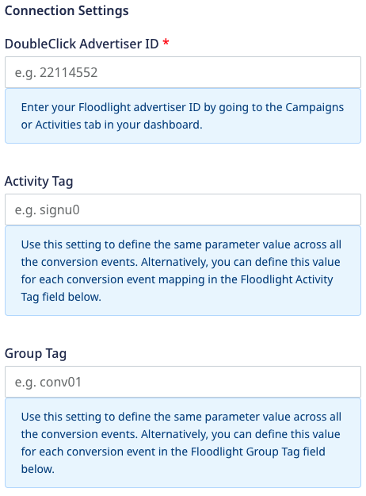
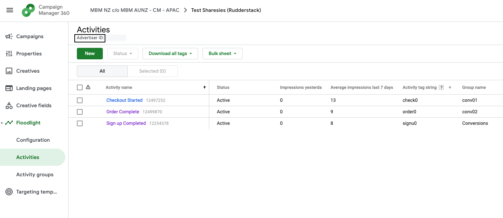

# DCM Floodlight

**DCM Floodlight** is a conversion tracking system for [Google Marketing Platform](https://marketingplatform.google.com/about/). It lets you track the users' activity on your site, compiles their list, adds conversion data to your reports, and then targets those users by subsequent campaigns.

<div class="successBlock">

Find the open-source transformer code for this destination in our <a href="https://github.com/rudderlabs/rudder-transformer/tree/master/v0/destinations/dcm_floodlight">GitHub repo</a>.
</div>


## Getting Started

Before configuring DCM Floodlight as a destination in RudderStack, verify if the source platform is supported by DCM Floodlight by referring to the table below:

| **Connection Mode** | **Web** | **Mobile** | **Server** |
| :--- | :--- | :--- | :--- |
| **Device mode** | - | - | - |
| **Cloud mode** | **Supported**  | **Supported** | **Supported** |

<div class="infoBlock">
    
To know more about the difference between cloud mode and device mode in RudderStack, refer to the <a href="https://rudderstack.com/docs/connections/rudderstack-connection-modes/">RudderStack Connection Modes</a> guide.
</div>

Once you have confirmed that the source platform supports sending events to DCM Floodlight, follow these steps:

- From your [RudderStack dashboard](https://app.rudderstack.com/), add a source. Then, from the list of destinations, select **DCM Floodlight**.

<div class="infoBlock">

Follow our guide on <a href="https://rudderstack.com/docs/connections/adding-source-and-destination-rudderstack/">Adding a Source and Destination in RudderStack</a> for more information.
</div>

### Connection Settings

To successfully configure DCM Floodlight as a destination, you will need to configure the following settings:




- **DoubleClick Advertiser ID:** Enter your Advertiser ID visible in the **Campaigns** or **Activities** tab in your dashboard.

<div class="infoBlock">
    
Refer to the <a href="faq">FAQ</a> section to know more on how to obtain the Advertiser ID.
</div>

- **Activity Tag:** Enter the `cat` of your tag string to define the same parameter value across all the conversion events. Alternatively, you can define this value for each conversion event mapping in the **Floodlight Activity Tag** field below.
- **Group Tag:** Enter the `type` of your tag string to define the same parameter value across all the group conversion events. Alternatively, you can define this value for each conversion event in the **Floodlight Group Tag** field below.
- **RudderStack Event Name:** Enter your RudderStack event name which will be mapped to the Floodlight tag.
- **Floodlight Activity Tag:** Enter the `cat` of your tag string. If left blank, RudderStack will pick the value from the **Activity Tag** field mentioned above.
- **Floodlight Group Tag:** Enter the `type` of your tag string. If left blank, RudderStack will pick the value from the **Group Tag** field mentioned above.
- **Fire as Sales Tag:** There are two types of tags:
    - **Counter tag**: Used to count the number of conversions. Keep the toggle button disabled in this case.
    - **Sales tag**: Same as counter tag except it is supposed to be placed on the confirmation page after a sale with information about the sales, like `cost`,`qty`,`ord` passed to the tag. Enable the toggle button if it is a Sales tag.

- **Custom Floodlight variables:** Enter the custom Floodlight variables which will be mapped to the RudderStack event properties.

## Track

The `track` call lets you capture user events along with the properties associated with them.

A sample `track` call is as shown below:

```javascript
client.track({
  userId: "1hKOmRA4el9Zt1WSfVJIVo4GRlm",
  event: "Checkout Started",
  properties: {
    orderId: 1234,
    quantity: 45,
    revenue: 800,
  },
  context: {
    device: {
      advertisingId: "2a3e36d172-5e28-45a1-9eda-ce22a3e36d1a",
    },
    userAgent: "Mozilla/5.0 (Macintosh; Intel Mac OS X 10_15_2) AppleWebKit/537.36 (KHTML, like Gecko) Chrome/79.0.3945.88 Safari/537.36",
  },
  integrations: {
    All: true,
    "DCM Floodlight": {
      COPPA: "false",
      GDPR: "1",
      npa: "true",
    },
  },
});
```

The following table details the mapping between RudderStack and DCM Floodlight properties:

| **RudderStack Property Name** | **DCM Floodlight Property** | **Presence**|
| :--- | :--- |
| `context.device.advertisingId` | `dc_rdid` | Required |
| `properties.orderId` | `ord` | Optional |
| `properties.quantity` | `qty` | Optional |
| `properties.revenue` | `cost` | Optional | 
| `context.device.adTrackingEnabled` | `dc_lat` | Optional |


## FAQ

### Where can I find the Advertiser ID?

To get the Advertiser ID, go to your [Campaign Manager 360](https://campaignmanager.google.com/) account and navigate to the **Campaigns** or **Activities** tab in your dashboard to obtain the `Advertiser ID`:



## Contact Us

For queries on any of the sections covered in this guide, you can, [contact us](mailto:%20docs@rudderstack.com) or start a conversation in our [Slack](https://rudderstack.com/join-rudderstack-slack-community) community.
