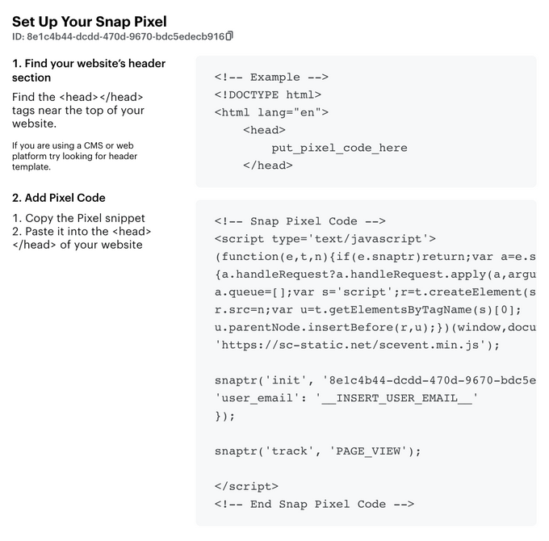

# DCM Floodlight

The [DCM Floodlight]() is the conversion tracking system for Google Marketing Platform. Like other conversion tracking systems, it consists of tags that track the activity on your site, along with reporting features for adding conversion data to your reports. It uses a cookie to recognize repeat visits from a specific browser.

<div class="successBlock">

  Find the open-source transformer code for this destination in our <a href="https://github.com/rudderlabs/rudder-transformer/tree/master/v0/destinations/dcm_floodlight">GitHub repo</a>.
</div>


## Getting Started

Before configuring DCM Floodlight as a destination in RudderStack, verify if the source platform is supported by DCM Floodlight by referring to the table below: ̦

| **Connection Mode** | **Web** | **Mobile** | **Server** |
| :--- | :--- | :--- | :--- |
| **Device mode** | - | - | - |
| **Cloud mode** | **Supported**  | - | - |

<div class="infoBlock">

To know more about the difference between Cloud mode and Device mode in RudderStack, refer to the [**RudderStack connection modes**](https://rudderstack.com/docs/connections/rudderstack-connection-modes/) guide.
</div>

Once you have confirmed that the source platform supports sending events to DCM Floodlight, follow these steps:

- From your [**RudderStack dashboard**](https://app.rudderstack.com/), add the source. Then, from the list of destinations, select **DCM Floodlight**.

<div class="infoBlock">

Follow our guide on [**How to Add a Source and Destination in RudderStack**](https://rudderstack.com/docs/connections/adding-source-and-destination-rudderstack/) for more information.
</div>

### Connection Settings

To successfully configure DCM Floodlight as a destination, you will need to configure the following settings:



- **Snap Pixel ID:** Enter your Snap Pixel ID here. To get your Snap Pixel ID, go to your [**Snap Ads Manager**](https://ads.snapchat.com/) account. Under **Events Manager**, select **View Pixel Details** then **Setup Pixel**. You can find the Pixel ID under **Pixel Code**, as shown:
- 
**Hashing Method:** Snap Pixel lets you pass a user parameter \(email or phone number\) in both hashed and non-hashed format during intialization. If **SHA-256** is chosen as an option, RudderStack will hash-encode the provided user parameter.

## Identify

<div class="warningBlock">

The Snap Pixel will not be initialized unless the `identify` call is fired.
</div>

<div class="infoBlock">

RudderStacks checks the cookies for the user parameter \(email or phone number\) before loading the Snap Pixel snippet. If found, the snippet is loaded. Otherwise, an `identify` call with the user's email or phone number is required to load the snippet.
</div>

In Snap Pixel, the `identify` call initializes the Snap Pixel code.

<div class="infoBlock">

For more information on the `identify` call, check out the [**RudderStack API spec**](https://rudderstack.com/docs/rudderstack-api/api-specification/rudderstack-spec/identify/).
</div>

A sample `identify` call is as shown:

```javascript
    rudderanalytics.identify({
        email: "sample@sample.com",
        phone: "8787857564"
    });
```

Either or both of the user parameters should be passed in the `identify` call. The following table lists the parameters along with the relative mapping to the Snap Pixel parameters:

| **RudderStack User Parameter** | **Snap Pixel User Parameter** |
| :--- | :--- |
| `email` | `user_email` |
| `phone` | `user_phone_number` |

## Page

When the `page` call is made, RudderStack sends the following:

`snaptr("track", "PAGE_VIEW")`.

You can make the `page` call with or without the event payload.

<div class="infoBlock">

For more information on the `page` call, check out the [**RudderStack API spec**](https://rudderstack.com/docs/rudderstack-api/api-specification/rudderstack-spec/page/).
</div>

A sample `page` call is as shown:

```javascript
    rudderanalytics.page();
```

## Track

The `track` call lets you send Snap Pixel events.

<div class="infoBlock">

For more information on the `track` call, check out the [**RudderStack API spec**](https://rudderstack.com/docs/rudderstack-api/api-specification/rudderstack-spec/track/).
</div>

A sample `track` call is as shown below:

```javascript
    rudderanalytics.track('PURCHASE', {
        'currency': 'USD',
        'price': 333.33,
        'transaction_id': '11111111'
    });
```

You can also send the following RudderStack E-Commerce Events:

| **RudderStack Event Name** | **Snap Pixel Standard Event** |
| :--- | :--- |
| `Order Completed` | `PURCHASE` |
| `Checkout Started` | `START_CHECKOUT` |
| `Product Added` | `ADD_CART` |
| `Payment Info Entered` | `ADD_BILLING` |
| `Promotion Clicked` | `AD_CLICK` |
| `Promotion Viewed` | `AD_VIEW` |
| `Product Added To Wishlist` | `ADD_TO_WISHLIST` |

<div class="warningBlock">

For more information on the Snap Pixel events, visit this [**Snapchat page**](https://businesshelp.snapchat.com/s/article/pixel-website-install?language=en_US)
</div>

Snap Pixel supports upto 5 custom events. They are listed in the table below:

| **Custom Events** |
| :--- |
| `CUSTOM_EVENT_1` |
| `CUSTOM_EVENT_2` |
| `CUSTOM_EVENT_3` |
| `CUSTOM_EVENT_4` |
| `CUSTOM_EVENT_5` |

## FAQs

**Where can I find the Snap Pixel ID?**

To get your Snap Pixel ID, go to your [**Snap Ads Manager**](https://ads.snapchat.com/) account. Under **Events Manager**, select **View Pixel Details** then **Setup Pixel**. You can find the Pixel ID under **Pixel Code**, as shown:

<!---->


## Contact Us

In case of any issues while configuring or using Snap Pixel with RudderStack, you can [**contact us**](mailto:%20docs@rudderstack.com) or start a conversation in our [**Slack**](https://rudderstack.com/join-rudderstack-slack-community) community.
