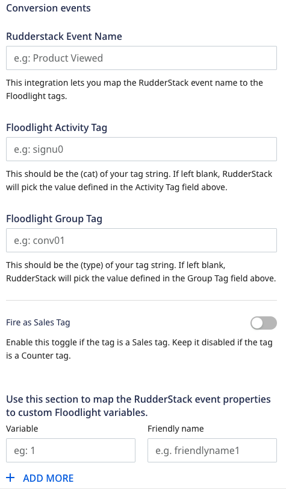

# DCM Floodlight

**DCM Floodlight** is a conversion tracking system for [Google Marketing Platform](https://marketingplatform.google.com/about/). It lets you track the users' activity on your site, compiles their list, adds conversion data to your reports, and then targets those users by subsequent campaigns.

<div class="successBlock">

Find the open-source transformer code for this destination in the <a href="https://github.com/rudderlabs/rudder-transformer/blob/master/cdk/dcm_floodlight/transform.js">GitHub repository</a>.
</div>

## Getting started

Before configuring DCM Floodlight as a destination in RudderStack, verify if the source platform is supported by DCM Floodlight by referring to the table below:

| **Connection Mode** | **Web** | **Mobile** | **Server** |
| :--- | :--- | :--- | :--- |
| **Device mode** | - | - | - |
| **Cloud mode** | **Supported**  | **Supported** | **Supported** |

<div class="infoBlock">
    
To know more about the difference between cloud mode and device mode in RudderStack, refer to the <a href="https://rudderstack.com/docs/connections/rudderstack-connection-modes/">RudderStack Connection Modes</a> guide.
</div>

Once you have confirmed that the source platform supports sending events to DCM Floodlight, follow these steps:

- From your [RudderStack dashboard](https://app.rudderstack.com/), add a source. Then, from the list of destinations, select **DCM Floodlight**.

<div class="infoBlock">

Follow our guide on <a href="https://rudderstack.com/docs/connections/adding-source-and-destination-rudderstack/">Adding a Source and Destination in RudderStack</a> for more information.
</div>

### Connection settings

To successfully configure DCM Floodlight as a destination, you will need to configure the following settings:




- **DoubleClick Advertiser ID:** Enter your Advertiser ID visible in the **Campaigns** or **Activities** tab in your dashboard.

<div class="infoBlock">
    
Refer to the <a href="faq">FAQ</a> section to know more on how to obtain the Advertiser ID.
</div>

- **Activity Tag:** Enter the Floodlight Activity Tag (`cat`) to define the same parameter value across all the conversion events. Alternatively, you can define this value for each conversion event mapping in the **Floodlight Activity Tag** field below.
- **Group Tag:** Enter the Floodlight Group Tag (`type`) to define the same parameter value across all the group conversion events. Alternatively, you can define this value for each conversion event in the **Floodlight Group Tag** field below.

<div class="infoBlock">

For more information on finding <code class="inline-code">cat</code> and <code class="inline-code">type</code> in your Campaign Manager dashboard, refer to the <a href="#faq">FAQ</a> section below.
</div>

- **RudderStack Event Name:** Enter your RudderStack event name which will be mapped to the Floodlight tag.
- **Floodlight Activity Tag:** Enter the `cat` of your tag string. If left blank, RudderStack will pick the value from the **Activity Tag** field mentioned above.
- **Floodlight Group Tag:** Enter the `type` of your tag string. If left blank, RudderStack will pick the value from the **Group Tag** field mentioned above.
- **Fire as Sales Tag:** Enable the toggle button for Sales tag. Keep it disabled if it is a Counter tag.
 
<div class="infoBlock">

There are two types of tags:
    <ul>
    <li> <strong>Counter tag</strong>: Used to count the number of conversions. It is supposed to be placed on the confirmation page after a sale with information about the `ord` property passed to the tag. </li> 
    <li><strong>Sales tag</strong>: Used to count the number of conversions, the total number of sales that take place, and the total associated revenue. It is supposed to be placed on the confirmation page after a sale with information about the sales, like `cost`, `qty`, or `ord` properties passed to the tag.</li> 
        </ul>
</div>

- **Custom Floodlight variables:** Enter the custom Floodlight variables to capture additional reporting data beyond the usual metrics (like visits and revenue).

<div class="infoBlock">

For more information on finding the custom Floodlight variables, refer to the <a href="#faq">FAQ</a> section below.
</div>

## Track

The [`track`](https://www.rudderstack.com/docs/rudderstack-api/api-specification/rudderstack-spec/track/) call lets you capture user events along with the properties associated with them.

A sample `track` call is as shown below:

```javascript
client.track({
  userId: "1hKOmRA4el9Zt1WSfVJIVo4GRlm",
  event: "Checkout Started",
  properties: {
    orderId: 1234,
    quantity: 45,
    revenue: 800,
  },
  context: {
    device: {
      advertisingId: "2a3e36d172-5e28-45a1-9eda-ce22a3e36d1a",
    },
    userAgent: "Mozilla/5.0 (Macintosh; Intel Mac OS X 10_15_2) AppleWebKit/537.36 (KHTML, like Gecko) Chrome/79.0.3945.88 Safari/537.36",
  },
  integrations: {
    All: true,
    "DCM Floodlight": {
      COPPA: "false",
      GDPR: "1",
      npa: "true",
    },
  },
});
```

<div class="warningBlock">

<code class="inline-code">userAgent</code> is a required field and must be passed. Otherwise, you will get an error.
</div>

The following table details the mapping of `integrations` object (as seen in the above code snippet) for DCM Floodlight:

| **RudderStack property** | **DCM Floodlight property** | **Description** |
| :--- | :--- | :---|
| `COPPA`| `tag_for_child_directed_treatment`  | Imposes requirements on the websites/online services operators directed to children under 13 years of age. More reference [here](https://www.ftc.gov/tips-advice/business-center/privacy-and-security/children%27s-privacy). |
| `GDPR` | `tfua` |  EU law on general data protection and privacy. More reference [here](http://eur-lex.europa.eu/legal-content/EN/TXT/?uri=CELEX%3A32016R0679). |
| `npa` | `npa` | Law catering to users to wish to opt-out of remarketing. | 

The following table details the mapping between RudderStack and DCM Floodlight properties:

| **RudderStack property** | **DCM Floodlight property** | **Presence**| **Tag**|
| :--- | :--- |:--- |:--- |
| `context.device.advertisingId` | `dc_rdid` | Required | Counter/Sales|
| `context.device.adTrackingEnabled` | `dc_lat` | Optional |Counter/Sales|
| `messageId` | `ord` | Optional | Counter |
| `properties.orderId` | `ord` | Optional | Sales |
| `properties.quantity` | `qty` | Optional | Sales |
| `properties.revenue` | `cost` | Optional | Sales |

The following table gives some more context on the above DCM Floodlight properties:

| DCM Floodlight property | Description |
| :----| :-----|
| `dc_rdid` |  The IDFA or Android Advertising ID to be passed over SSL. |
| `dc_lat` | Indicates if the user has enabled the **Limited Ad Tracking** option for IDFA/Android Advertising ID. |
| `ord` | Used to make the Floodlight tag unique and prevent browser caching. |
| `qty` | Applicable for **Sales** tags only - RudderStack adds the quantity of all the products in the `products` array or refers to the top-level `quantity` property. |
| `cost` | Applicable for **Sales** tags only - RudderStack sends the `revenue` parameter to DCM Floodlight. |

## FAQ

### Where can I find the activity tag string (cat) and group tag string (type)?

In your Campaign Manager dashboard, go to **Floodlight** > **Activities**. Here you can see all the activity names along with their **Activity tag string** (`cat`) and Group tag string (`type`), as shown:


### Where can I find the Advertiser ID?

To get the Advertiser ID, go to your [Campaign Manager 360](https://campaignmanager.google.com/) account and navigate to the **Campaigns** or **Activities** tab in your dashboard to obtain the `Advertiser ID`:


### Where can I find the custom Floodlight variables?

To create custom Floodlight variables, refer to this [Campaign Manager guide](https://support.google.com/campaignmanager/answer/2823222?hl=en).

You can find the custom Floodlight variables for your activities by going to **Floodlight** > **Activities**. Then, click on any activity to view the custom variables associated with it, as shown:


### How can I get the reports of the events in DCM Floodlight?

In your Campaign Manager dashboard, you get two reporting options under **Report Builder** - **Instant Reporting** and **Offline Reporting**, as shown:


To generate an offline report of the events, follow these steps:

1. Go to **New** > **Floodlight**.
2. Select the **Floodlight Configuration** and other fields like **Activities**, **Dimensions**, and **Metrics** as per your requirement.


### What are unattributed cookie conversions?

A conversion is said to be unattributed if the user has a DoubleClick cookie but it is converted without any exposure. This means that the user did not click or view any ad from the advertiser within Floodlight, or the interaction happened outside the lookback window.

## Contact us

For queries on any of the sections covered in this guide, you can, [contact us](mailto:%20docs@rudderstack.com) or start a conversation in our [Slack](https://rudderstack.com/join-rudderstack-slack-community) community.
