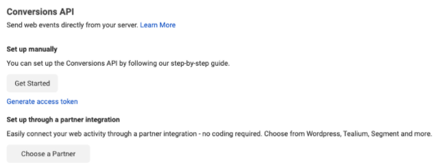

# Facebook Pixel

[Facebook Pixel](https://developers.facebook.com/docs/facebook-pixel/) is a simple JavaScript snippet that you can add to your website and track visitor activity as well as other important metrics required to build effective marketing and advertising campaigns.

<div class="infoBlock">

RudderStack leverages the <a href="https://developers.facebook.com/docs/marketing-api/conversions-api/">Conversions API</a> for sending server-side events to this destination.
</div>

<div class="successBlock">

  Find the open-source transformer code for this destination in our <a href="https://github.com/rudderlabs/rudder-transformer/tree/master/v0/destinations/facebook_pixel">GitHub repository</a>.
</div>

## Getting started

Before configuring Facebook Pixel as a destination in RudderStack, verify if the source platform is supported by Facebook Pixel, by referring to the table below:

| **Connection Mode** | **Web**       | **Mobile**    | **Server**    |
| :------------------ | :------------ | :------------ | :------------ |
| **Device mode**     | **Supported** | -             | -             |
| **Cloud mode**      | **Supported** | **Supported** | **Supported** |

<div class="infoBlock">

To know more about the difference between cloud mode and device mode in RudderStack, refer to the <a href="https://rudderstack.com/docs/rudderstack-cloud/rudderstack-connection-modes/">RudderStack Connection Modes</a> guide.
</div>

Once you have confirmed that the source platform supports sending events to Google Adwords Remarketing Lists, follow these steps:

1. From your [RudderStack dashboard](https://app.rudderstack.com/), add the source. Then, from the list of destinations, select **Facebook Pixel**.
2. Assign a name to your destination and click on **Next**.

### Connection settings

To successfully configure Facebook Pixel as a destination, you will need to configure the following settings:


The following sections explain these settings in more detail.

- **Facebook Pixel ID**: Enter your Facebook Pixel ID. This is required for sending events via both cloud and device modes. 
- **Business Access Token**: Enter your Facebook business access token required to send the events via the cloud mode.

<div class="infoBlock">

For more information on obtaining your Facebook Pixel ID and Business Access Token, refer to the <a href="#faq">FAQ</a> section below.
</div>

### Event settings


- **Map Categories to Facebook Content Types**: This option lets you specify the category fields to specific Facebook content type.
- **Enable Standard Event (PageView) for all Page and Screen Calls**: If this setting is enabled, RudderStack sets `pageview` as a standard event for all the `page` and `screen` calls.
- **Map your events with Facebook Standard Events**: This option lets you map your events to the standard events defined by Facebook.
- **Standard Events custom properties**: For the standard events, some predefined properties are taken by Facebook. If you want to send more properties for your events, mention those properties in this field.
- **Value Field Identifier**: You can set this field to `properties.price` or `properties.value`. RudderStack will then assign this to the value field of the Facebook payload.

### PII properties settings


- **Blacklist PII Properties**: The PII properties mentioned in this field will not be sent to Facebook if **Blacklist PII Hash Property** is not enabled. If it is enabled, the properties will be SHA256-hashed and sent to Facebook. The properties listed below are the **default blacklisted properties**. 

| Default blacklisted PII |
| :---------------------|
| `email` |
| `firstName` |
| `lastName` |
| `firstname` |
| `lastname` |
| `first_name` |
| `last_name` |
| `gender` |
| `city` |
| `country` |
| `phone` |
| `state` |
| `zip` |
| `birthday` |

<div class="infoBlock">

If you want to send any of the above properties hashed by SHA256, you need to enter the property name in the <strong>Blacklist PII Properties</strong> field and enable the <strong>Blacklist PII Hash Property</strong> toggle.
</div>

- **Whitelist PII Properties**: The PII properties mentioned in this field will be sent to Facebook if they are present in the properties of the events. This is only necessary for properties that match the **Default Blacklisted PII** properties listed above.

### Other settings


- **Limited Data Usage**: If enabled, RudderStack will take the data processing information from the payload and send it to Facebook. The data in the RudderStack payload should be as shown below:

```javascript
"context": {
  "dataProcessingOptions": [
    [
      "LDU"
    ],
    1,
    1000
  ],
  "fbc": "fb.1.1554763741205.AbCdEfGhIjKlMnOpQrStUvWxYz1234567890",
  "fbp": "fb.1.1554763741205.234567890",
  "fb_login_id": "fb_id",
  "lead_id": "lead_id",
  "device": {
    "id": "df16bffa-5c3d-4fbb-9bce-3bab098129a7R",
    "manufacturer": "Xiaomi",
    "model": "Redmi 6",
    "name": "xiaomi"
  },
  "network": {
    "carrier": "AirCarrier"
  },
  "os": {
    "name": "android",
    "version": "8.1.0"
  },
  "screen": {
    "height": "100",
    "density": 50
  },
  "traits": {
    "email": "john@example.com",
    "anonymousId": "c82cbdff-e5be-4009-ac78-cdeea09ab4b1"
  }
}
```

- **Use as Test Destination:** Enable this setting if you are using this destination for testing purposes and enter the **Test Event Code**. This code can be found in your Facebook Pixel dashboard.

<div class="infoBlock">

  The <code class="inline-code">context.dataProcessingOptions</code> will be mapped to <code class="inline-code">data_processing_options</code> in Facebook as is mentioned in the <a href="https://developers.facebook.com/docs/marketing-api/conversions-api/parameters/server-event#data-processing-options">Facebook developer docs</a>.
</div>

### Client-side event filtering

<div class="infoBlock">

RudderStack supports specifying which events should be discarded or allowed to flow through, when sending events via the device mode. For more information, refer to the <a href="https://www.rudderstack.com/docs/stream-sources/rudderstack-sdk-integration-guides/event-filtering/">Client-side Event Filtering</a> documentation.
</div>

### Web SDK settings


- **Use Updated Mapping**: If this setting is disabled, RudderStack will send the `identify` traits as received. If this setting is enabled, RudderStack takes the following example `identify` traits:

```JSON
{
  firstName: "Alex",
  lastName: "Keener",
  email: "alex@example.com",
  phone: "12345678910",
  gender: "Male",
  birthday: "01012001",
  city: "New Orleans",
  country: "USA",
  zip: "90009",
  state: "Louisiana",
  foo: "bar",
}
```

RudderStack then changes the traits as shown below, before sending them to Facebook:

```JSON
{
  fn: "Alex",
  ln: "Keener",
  em: "alex@example.com",
  ph: "12345678910",
  ge: "Male",
  db: "01012001",
  ct: "New Orleans",
  country: "USA",
  zp: "90009",
  state: "Louisiana",
  foo: "bar"
}
```

- **Legacy Conversion Pixel IDs**: With this setting, you can send specific events to a legacy conversion Pixel by specifying the event-Pixel ID mapping. Note that this option is available only when sending events via the device mode.
- **Use device-mode to send events**: Enable this setting to send events from the web SDK to Facebook Pixel via the device mode.

- Finally, click on **Next** to complete the configuration.

## Identify

In Facebook Pixel, the immediate updating of user properties via the `identify` call is not supported. If the **Enable Advanced Matching** is turned on in the dashboard, then the `identify` call will update Facebook Pixel with the user information.

The following snippet highlights the use of the `identify` call:

```javascript
rudderanalytics.identify("userId", userVars) // userVars is a JSON object
```

## Page

When you make the `page` call, RudderStack sends the data to Facebook Pixel with the event type as `pageView`. You can also pass properties to `page` - RudderStack automatically sends these properties along with the event ID to Pixel.

A sample `page` call is as shown:

```javascript
rudderanalytics.page()
```

## Track

The `track` call lets you track custom events as they occur in your web application.

A sample call looks like the following code snippet:

```javascript
rudderanalytics.track("Product Added", {
  order_ID: "123",
  category: "boots",
  product_name: "yellow_cowboy_boots",
  price: 99.95,
  currency: "EUR",
  revenue: 2000,
  value: 3000,
  checkinDate: "Thu Mar 24 2018 17:46:45 GMT+0000 (UTC)",
})
```

In addition to the above call, a `contentType` in the integrations options can be available. If present, it will precede the default value or dashboard settings of `contentType`.

```javascript
rudderanalytics.track(
  "Product Added",
  {
    order_ID: "123",
    category: "boots",
    product_name: "yellow_cowboy_boots",
    price: 99.95,
    currency: "EUR",
    revenue: 2000,
    value: 3000,
    checkinDate: "Thu Mar 24 2018 17:46:45 GMT+0000 (UTC)",
  },
  {
    "Facebook Pixel": { contentType: "mycustomtype" },
  }
)
```

<div class="infoBlock">
  
A string is the only valid data type for the <code class="inline-code">category</code> field. However, you can pass an array of string values which will be concatenated using a delimiter (,) before sending the events.  
</div>

## Standard events

In the dashboard, you have the option to **map your events to standard Facebook events**. RudderStack maps the events in the code and sends them to Facebook pixel as the standard event as specified. The properties will be sent according to what the standard event requires.

<div class="infoBlock">

Refer to the <a href="https://rudderstack.com/docs/rudderstack-api/api-specification/rudderstack-ecommerce-events-specification/">E-Commerce Event Specifications</a> guide for more information.
</div>

The mapping is done as follows in RudderStack:

| Rudder Event          | Facebook Standard Event |
| :-------------------- | :---------------------- |
| `Product List Viewed` | `ViewContent`           |
| `Product Viewed`      | `ViewContent`           |
| `Product Added`       | `AddToCart`             |
| `Order Completed`     | `Purchase`              |
| `Products Searched`   | `Search`                |
| `Checkout Started`    | `InitiateCheckout`      |

In Pixel, a currency for **Purchase** events is required to be specified. If not provided the default will be set to **`USD`**.

### Other standard events

If you map your event to any of the following Standard Events listed below, then RudderStack will treat it as an `Other Standard Event`. For any properties you would like to send with the other standard event you must specify them in the **Standard Events custom properties** settings field.

```javascript
"AddToWishlist"
"AddPaymentInfo"
"Lead"
"CompleteRegistration"
"Contact"
"CustomizeProduct"
"Donate"
"FindLocation"
"Schedule"
"StartTrial"
"SubmitApplication"
"Subscribe"
```

## Legacy events

In the dashboard, the legacy conversion Pixel IDs can be filled. The events which appear in the mapping are sent to Pixel with the mapped Pixel ID. The conversion events only support currency and value as their event properties.

<div class="infoBlock">

This is only available for device mode.
</div>

## Custom events

Custom events are used to send any event that does not appear in any of the mappings.

## Deduplication

Facebook Pixel allows you to send events via your web browser and your server via the Conversion API. Depending on how you send your events, with this duel set-up, redundant events may be received by Facebook. Therefore, to help get accurate representation of your data, Facebook tries to deduplicate events coming in.

<div class="infoBlock">

For more information on Facebook Deduplication, you can refer to <a href="https://www.facebook.com/business/help/823677331451951?id=1205376682832142">this article</a>.
</div>

#### `event_id` method \(Recommended\)

Facebook's \(and RudderStack's\) recommended form of deduplication is to leverage the `event_name` and `event_id` properties. When two events coming into Facebook meet the following criteria, they will be deduplicated.

- They are sent within 48 hours of each other
- They are received by the same Facebook Pixel ID
- They have the same `event_name` i.e. `Purchase` etc.
- They have the same `event_id`
  - The `event_id` must be unique to that specific event and the same for both of the events coming from the Pixel and Conversion API
  - For example: the `event_id` could be the purchase order number etc.

You can set the `event_id` in `traits` , `context.traits` or `properties` object as a unique identifier. This works for the [cloud mode](https://www.rudderstack.com/docs/rudderstack-cloud/rudderstack-connection-modes/#cloud-mode) as well as [device mode](https://www.rudderstack.com/docs/rudderstack-cloud/rudderstack-connection-modes/#device-mode). 

<div class="infoBlock">

If you don't set the <code class="inline-code">event_id</code>, RudderStack will use <code class="inline-code">messageId</code> to map to Facebook's <code class="inline-code">eventId</code>.
</div>

The `event_name` will be picked up from the name of the event.

<div class="infoBlock">

For more information regarding the logic behind the <code class="inline-code">event_id</code> deduplication, read <a href="https://developers.facebook.com/docs/marketing-api/conversions-api/deduplicate-pixel-and-server-events/#event-id-and-event-name---recommended">this article</a>.

</div>

#### `fbp` and `external_id` method \(Not Recommended\)

For this approach, it is necessary to send an event, first from the browser, then from the server. Both events must have the same `event_name`, and the same `fbp` parameter and the same `external_id`. If the browser event is received before the server event and both events have the same `event_name` and the same `fbp` and `external_id`, then the server event will be discarded. Below are a few shortcomings for this deduplication method.

- It will always discard the server event is Facebook identifies a redundant event.
- This method only works for deduplicating events sent first from the browser and then the server.
- There will be no deduplication if two consecutive browser events with the same information are sent to Facebook. The same is true if two server events with the same information is sent to Facebook

RudderStack maps the `event_name` from whatever the name of the event that is being sent is. The `fbp` parameter is taken from the `context.fbp` key-value pair. Finally, the `external_id` will just be the `userId` or `anonymousId` \(if `userId` is not present\).

<div class="infoBlock">

For more information regarding the logic behind the <code class="inline-code">fbp</code> and <code class="inline-code">external_id</code> deduplication, read <a href="https://developers.facebook.com/docs/marketing-api/conversions-api/deduplicate-pixel-and-server-events/#fbp-or-external-id">this article</a>.
</div>

## Timestamps

Facebook Pixel uses ISO 8601 timestamp without the timezone information.

Facebook expects them to be sent in the following format:

`"checkinDate", "checkoutDate", "departingArrivalDate", "departingDepartureDate", "returningArrivalDate", "returningDepartureDate", "travelEnd", "travelStart"`

## FAQ

#### Where can I find the Pixel ID?

To get your Pixel ID, go to your Facebook Ads Manager account. On the left navigation bar, select Business Tools, and click on **Events Manager** under **Manage Business**.


In the Data Sources, you should be able to see your Pixel ID underneath your site name.


#### Where can I find the Business Access Token?

In order to use the Facebook Conversions API, you need to generate an access token. We recommend using the Facebook Events Manager to do so, by following these steps:

- Choose the relevant Facebook Pixel and click on the **Settings** tab.
- In the Conversions API section, click on **Generate access token** under the **Set up manually** section, as shown:



<div class="infoBlock">

For more information on how to use this access token, or to generate your access token via your own app, check out Facebook's <a href="https://developers.facebook.com/docs/marketing-api/conversions-api/get-started/#via-events-manager">developer documentation</a>.

</div>

#### Can I hash my user data before sending it to RudderStack?

Yes. Facebook Pixel requires all user data, data coming from `context.traits`, to be hashed. This includes `email`, `phone`, `birthday`, `address`, etc. By default, RudderStack will automatically hash all of the necessary properties for you. However, if you would like to hash these traits before sending to RudderStack then you need to add this code to the event.

```javascript
rudderanalytics.track(
  "some_event_name",
  { some_properties },
  {
    integrations: {
      "Facebook Pixel": {
        hashed: true,
      },
    },
  }
)
```

The `integrations` object with these key-values will tell RudderStack not to hash the traits in `context.traits` because they are already hashed. Otherwise, RudderStack will hash your data again and Facebook will not be able to match the traits. Please keep in mind that Facebook will not accept un-hashed data.

## Contact us

For queries on any of the sections covered in this guide, you can [**contact us**](mailto:%20docs@rudderstack.com) or start a conversation in our [**Slack**](https://rudderstack.com/join-rudderstack-slack-community) community.
