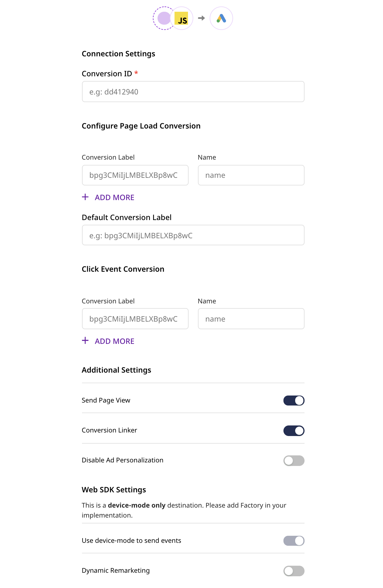

# Google Ads (gtag.js)

[**Google Ads**](https://ads.google.com/) is Google's premier online advertising platform. It can be used for efficient marketing strategies such as product listing, service offerings, as well as activities such as conversion tracking.

RudderStack's Google Ads integration leverages a global site tag - `gtag.js` - a JavaScript tagging framework and an API that lets you send your event data to Google Ads.

## Getting started

Before configuring Google Ads as a destination in RudderStack, verify if the source platform is supported by Google Ads by referring to the table below. Once the destination is enabled, events from the native web (JavaScript) SDK will start flowing to Google Ads.

<div class="infoBlock">

You can use the JavaScript SDK to send **Page Load Conversions** as well as **Click Conversions** events to Google Ads.
</div>

| **Connection Mode** | **Web**       | **Mobile** | **Server** |
| :------------------ | :------------ | :--------- | :--------- |
| **Device mode**     | **Supported** | -          | -          |
| **Cloud mode**      | -             | -          | -          |

<div class="infoBlock">

To know more about the difference between cloud mode and device mode in RudderStack, read the <a href="https://rudderstack.com/docs/rudderstack-cloud/rudderstack-connection-modes/">RudderStack Connection Modes</a> guide.
</div>

Once you have confirmed that the platform supports sending events to Google Ads, follow these steps:

* From your [**RudderStack dashboard**](https://app.rudderstack.com/), add the source. From the list of destinations, select **Google Ads**.

<div class="infoBlock">
 
 Follow our guide on <a href="https://rudderstack.com/docs/connections/adding-source-and-destination-rudderstack/">Adding a Source and Destination in RudderStack</a> for more information.
</div>

* Assign a name to the destination and click on **Next**. You should then see the following screen:



### Connection settings

- **Conversion ID**: Enter your Google Ads Conversion ID.

<div class="infoBlock">
 
 For more information on finding the Conversion ID, refer to this Google Ads <a href="https://support.google.com/tagmanager/answer/6105160?hl=en">support page</a>.
</div>

- **Configure Page Load Conversions**: For `page` calls, you can configure the page load conversions for multiple instances. 
  - In **Conversion Label** , provide the conversion label from Google Ads. 
  - In **Name**, enter the name of the `page` event to be sent.

- **Click Event Conversion**: For `track` calls, you can configure **Click Event Conversion**. 
  - In **Conversion Label**, enter your Google Ads conversion label. 
  - Under **Name**, enter the name of the `track` event to be sent.

  - **Send Page View**: Enabling this setting configures Google Ads to automatically send your `page` events.

- **Conversion Linker**: This setting is enabled by default. If you don't want the global site tag (`gtag.js`) to set first-party cookies on your website domain, you should disable this setting.

<div class="warningBlock">

Disabling this setting as it can lead to less accurate conversion measurements.
</div>

<div class="infoBlock">
 
For more information on the Conversion Linker feature in Google Ads, refer to their official <a href="https://support.google.com/google-ads/answer/7521212?hl=en">documentation</a>.
</div>

- **Disable Ad Personalization**: Toggling this setting on lets you programmatically disable ad personalization. 

<div class="infoBlock">
 
For more information on the disabling advertising personalization feature, refer to the official Google <a href="https://developers.google.com/analytics/devguides/collection/gtagjs/display-features#disable_advertising_personalization">documentation</a>.
</div>

- **Dynamic Remarketing**: Enabling this tracking mode allows RudderStack to leverage Google Ads' Dynamic Remarketing feature for event tracking.

<div class="infoBlock">
 
<strong>Dynamic Remarketing</strong> lets you tailor your ads based on your users' previous interactions with your website. For more information on this feature, refer to the official Google Ads <a href="https://support.google.com/google-ads/answer/7305793">documentation</a>.
</div>
 
- As this is a device mode-only integration, the **Use device-mode to send events** option will always be enabled.

- Finally, click on **Next** to finish the configuration. Google Ads will now be added and enabled as a destination in RudderStack.

## Track

You can make a `track` call with the conversion name to RudderStack for a **Click Event Conversion** which will, in turn, send this data to Google Ads.

<div class="infoBlock">

RudderStack maps `properties.currency`, `properties.order_id`, and `properties.revenue` to Google Ads' `currency`, `transaction_id`, and `value` fields respectively.  Note that this is applicable only when the <strong>Dynamic Remarketing</strong> setting is disabled in the dashboard.
</div>

A sample `track` call is as shown:

```javascript
rudderanalytics.track('track conversion', {
  revenue: 125,
  currency: 'INR',
  order_id: 'order_1'
});
```

A sample `track` call after enabling the **Dynamic Remarketing** option in the RudderStack dashboard is shown below:

```javascript
rudderanalytics.track('view_item', {
  'value': 998.55,
  'items': [{
      'id': 1234,
      'google_business_vertical': 'retail'
    },
    {
      'id': 45678,
      'google_business_vertical': 'retail'
    }
  ]
});
```

<div class="successBlock">

The format for passing the parameters is quite flexible. You can use the standard Google format for tracking specific categories or use a custom format for tracking custom categories.
</div>

A sample `track` call for a custom event is shown below:

```javascript
rudderanalytics.track("custom_event", {
  custom_parameter1: "1",
  custom_parameter2: 2,
});
```

## Page

You can make a `page` call with the conversion name to RudderStack for a **Page Load Conversion** which will, in turn, send this data to Google Ads.

A sample `page` call is as shown below:

```javascript
rudderanalytics.page('page view');
```

A sample `page` call for a custom event after enabling the **Dynamic Remarketing** option in RudderStack is shown below:

```javascript
rudderanalytics.page("custom_event", {
  custom_parameter1: "1",
  custom_parameter2: 2,
});
```

As seen in the above snippet, enabling Dynamic Remarketing allows you to send custom parameters in the `page` call.

## FAQs

#### How do I get the Conversion ID?

You can get the conversion ID from your global site tag snippet. It should look something like `AW-123456789`.

#### How do I get the Conversion Label for Google Ads?

You can find the value of the **Conversion Label** from your event snippet. The provided event snippet should look something like`send_to: 'AW-123456789/bpg3CMiIjLMBELXBp8wC'`. Enter the part after the `'/'`

## Contact us

For queries on any of the sections covered in this guide, you can [**contact us**](mailto:%20docs@rudderstack.com) or start a conversation in our [**Slack**](https://rudderstack.com/join-rudderstack-slack-community) community.
