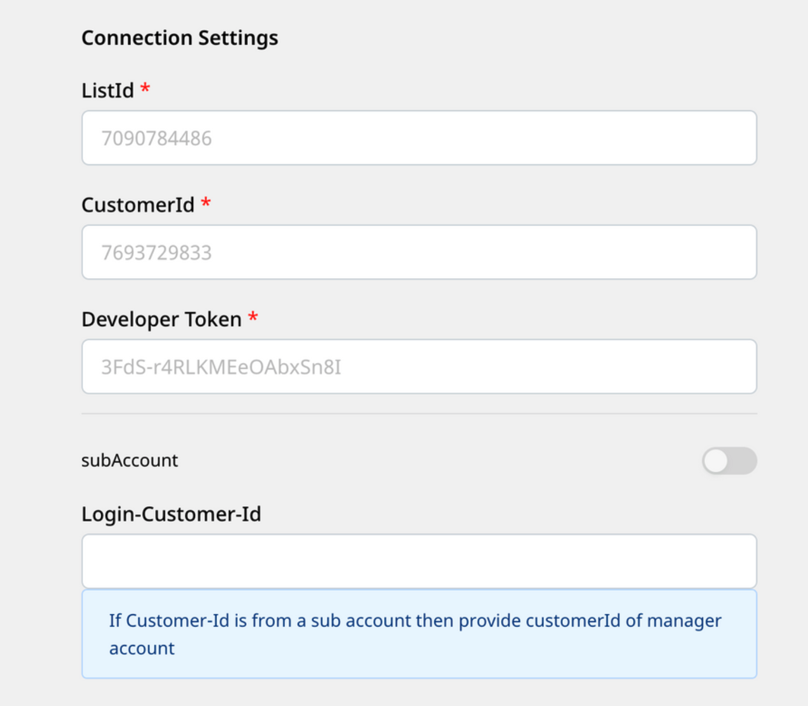
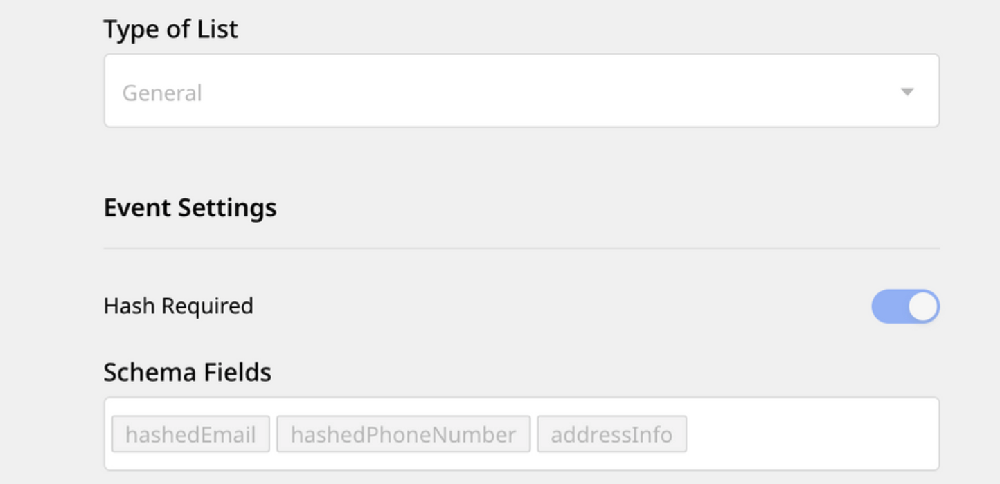
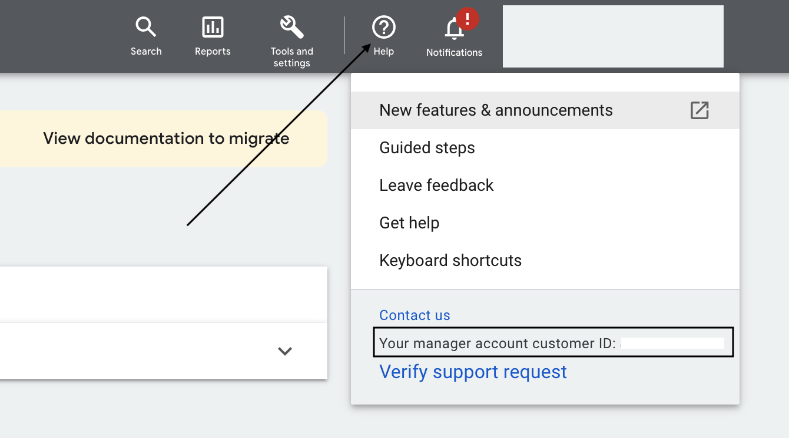

# Google Adwords Remarketing Lists (Customer Match)

Google Adwords Remarketing Lists lets you send a list of users (audience list) to Google Adwords and run targeted advertising campaigns without having to update the user list manually.

RudderStack supports Google Adwords Remarketing Lists as a destination to which you can send your audience list.

## Getting started

Before configuring Google Adwords Remarketing Lists as a destination in RudderStack, verify if the source platform is supported by referring to the table below:

| **Connection Mode** | **Web**         | **Mobile**   | **Server**        |
| :-------------------| :-------------- | :----------- | :-----------------|
| **Device mode**     | -               | -            | -                 |
| **Cloud mode**      | -               | -            |  **Supported**    |

<div class="infoBlock">

To know more about the difference between cloud mode and device mode in RudderStack, refer to the <a href="https://rudderstack.com/docs/connections/rudderstack-connection-modes/">RudderStack Connection Modes</a> guide.
</div>

Once you have confirmed that the source platform supports sending events to Google Adwords Remarketing Lists, follow these steps:

1. From your [RudderStack dashboard](), add the source. Then, from the list of destinations, select **Google Adwords Remarketing Lists (Customer Match)**.

<div class="infoBlock">

Follow our guide on <a href="https://rudderstack.com/docs/connections/adding-source-and-destination-rudderstack/">Adding a Source and Destination in RudderStack</a> for more information.
</div>

2. Assign a name to your destination and click on **Next**.

### Connection settings

To successfully configure Google Adwords Remarketing Lists as a destination, you will need to configure the following settings:




- **List ID**: To get your Google Ads list ID, go to your Google Ads account and navigate to **Tools & settings** > **Audience Manager**.
- **Customer ID**: Enter the ID associated with your Google Ads account. You can find it by clicking on the **Help** option in your dashboard.

<div class="infoBlock">

For more information on obtaining the customer ID, refer to the <a href="https://support.google.com/google-ads/answer/1704344?hl=en">Google Ads Help Center</a> page.
</div>

<div class="warningBlock">

Do not include the dash(-) between the numbers in your customer ID. For example, if your customer ID is <code class="inline-code">123-456-7890</code>, then enter <code class="inline-code">1234567890</code> in this field.
</div>

- **Subaccount**: Enable or disable this setting if you are using a Google Ads subaccount.

<div class="infoBlock">

For more information on subaccounts, refer to the <a href="https://support.google.com/campaignmanager/answer/2829448?hl=en#zippy=%2Cwhat-are-subaccounts">Google Ads Help Center</a> page.
</div>

- **Login-customer-ID**: Enter the customer ID of the parent account (associated with the subaccount).

<div class="infoBlock">

This field is required only when you want to send data to a customer list of a subaccount.
</div>

- **Type of List**: Select the type of list that you want to create.

<div class="infoBlock">

You can create three types of list via this setting:
<ul>
<li><strong>General</strong>: You can send email, phone number, and address information in this list. RudderStack will hash this data and send it to Google Adwords Remarketing Lists depending on the <strong>Hash Required</strong> setting.</li>
<li><strong>UserId</strong>: You can send third party user IDs in this list.</li>
<li><strong>Mobile Device ID</strong>: You can send mobile device IDs in this list.</li>
</ul>
</div>

- **Hash Required**: If enabled, RudderStack will hash the `email`, `phone`, `firstName`, and `lastName` fields in the SHA-256 format.
- **Schema Fields**: If you have select **General** as the list type, you will need to choose your schema fields (at least one) from the available options. The options are `hashedEmail`, `hashedPhoneNumber`, and `addressInfo`.

<div class="warningBlock">

RudderStack expects the user events to consist of all the schema fields listed here.
</div>

## `audiencelist` event structure

<div class="infoBlock">

The Google Adwords Remarketing Lists destination supports only <code class="inline-code">audiencelist</code> calls. You can send up to 100000 user records in one call.
</div>

<div class="warningBlock">

RudderStack currently supports only addition into a user list.
</div>

The following code snippet shows a sample `audienceList` call:

```json
{
    "userId": "user1",
    "anonymousId": "anon-id-new",
    "event": "event1",
    "type": "audienceList",
    "properties": {
        "listData": {
            "create": [{
                    "email": "alex@company.com",
                    "phone": "9876543210"
                },
                {
                    "email": "emily@company.com",
                    "phone": "9786543210"
                },
            ]
        },
        "enablePartialFailure": true
    },
    "context": {
        "ip": "1.2.3.40",
        "library": {
            "name": "http"
        }
    },
    "timestamp": "2020-02-02T00:23:09.544Z"
}
```


### Supported schema mapping

The following table details the mapping of the schema fields specified in the RudderStack dashboard and Google Adwords Remarketing Lists, along with the relevant guidelines:

| RudderStack schema field | Google Adwords Remarketing Lists field | Guidelines |
| :-----| :--------| :------|
| `email` | `hashedEmail` | Include a domain name for all the email addresses. Remove any spaces in between the addresses. |
| `phone` | `hashedPhone` | Format the phone number using the [E.164 format](https://en.wikipedia.org/wiki/E.164). Include the country code as well. |
| `firstName` | `hashedFirstName` | Do not include any prefixes (e.g., `Mrs.`). | 
| `lastName` | `hashedLastName` | Do not include any suffixes (e.g., `Sr.`). |
| `country` | `countryCode` | Use the ISO two-letter/three-letter [country codes](https://developers.google.com/google-ads/api/reference/data/codes-formats#expandable-16). Include the country code even if all your users belong to the same country. | 
| `postalCode` | `postalCode` | Both the US and international zip and postal codes are allowed. For the US, 5 digit codes followed by 4 digit extensions are also allowed. For the rest of the countries, do not include the postal code extensions.
| `mobileId` | `mobileId` | Only include the mobile device ID. No other data types are accepted.
| `thirdPartyUserId` | `thirdPartyUserID` | Do not include any numbers. Only a string is accepted. |

## FAQs

### Where can I find my Google Adwords customer ID?

To get the customer ID associated with your Google Ads account, click on the **Help** option in your Google Ads dashboard. You will find the customer ID in the resulting pop-up, as shown:



### How do I create a Google Ads customer list?

To create a customer list in Google Ads, follow these steps:

1. Open your Google Ads account.
2. Go to **Tools and settings**.
3. Under **Shared Library**, go to **Audience Manager**.
4. Click on the + button and select **Customer list**.
    - In **Segment name**, assign a name to the list.
    - From the dropdown, select the list type of data to upload.
    - Upload the CSV containing the user data. You can also download the template and upload the data.
    - Finally, click on **UPLOAD AND CREATE**.

## Contact us

For queries on any of the sections covered in this guide, you can [**contact us**](mailto:%20docs@rudderstack.com) or start a conversation in our [**Slack**](https://rudderstack.com/join-rudderstack-slack-community) community.
